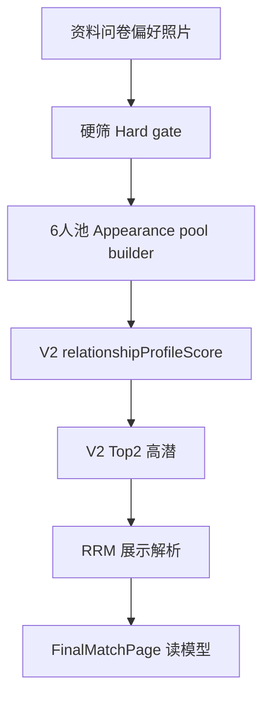

# M6.0-J1C — Matching Pipeline V2 Responsibility Alignment

> **依据**：**`docs/M6/M6.0-j1b-relationship-profile-score-v2-formula-design.md`**（V2 公式）、**`docs/M6/M6.0-j-relationship-profile-score-v2-product-requirements.md`**（V2 产品要求）、**`docs/M6/M6.0-g3-30-canonical-answer-pattern-regression.md`**（G3）、**`docs/M6/M6.0-q2-promote-q29-q30-canonical.md`**（30 canonical）、**`docs/M6/M6.0-a2-scoring-v2-product-logic-plan.md`**（v2 产品逻辑）。  
> **代码现状索引**（**本轮不改**）：worker **`batch-match.processor.ts`** + **`matching-score.ts`**（**`computeFinalScoreV1`** 混权）、**`preview-pool.service.ts`**、**`matching/*`**（含 **`matching-result-display.ts`**、RRM Top2 元数据）、**`packages/shared/types/match-p1.ts`**。  
> **本轮**：**只写链路职责与顺序**，**不**改实现。

---

## 1. 一句话结论

**M6 后的新匹配体系不是单一 `legacy finalScore` v1`，而是分层链路：**  
**硬筛（资格） → 长相 / 外在吸引力 / 外在偏好（6 人池） → `relationshipProfileScore` V2（20 维 G1-R 基础适配指数） → RRM（Top2 / 高潜上的展示与节奏二次判断） → Final 展示（读模型）**。  
**各层不得混用职责**：**预览池分 / 风格分** 是 **「愿不愿意先看到」** 与 **池内排序参考**，**不是** **V2 主分**；**RRM** **不得** 把 **V2 很低** 的候选 **系统性顶到主视觉**；**`MatchResult` 胜者行** 仍以既有 **`candidateUserId` / `finalScore`** 为真源直至另有迁移任务。

---

## 2. 当前 legacy v1 的问题

- **`computeFinalScoreV1`**（`matching-score.ts`）将 **`previewPoolScore`**、**`preferenceScore`**、**`styleScore`**、**`profileScore`**（v1 画像相似）**加权合成** **`finalScore`**。  
- **`previewPoolScore`** 来自 **池条目的 `baseScore`**（与 **「先入池的外在吸引力 / 展示价值」** 强相关），**`preferenceScore`** 与 **用户偏好命中** 相关，**`styleScore`** 与 **图片风格标签** 相关。  
- **后果**：当 **preview / preference / style** 在多数样本上 **接近拉满** 时，**`finalScore` v1** 易被 **锁在 ~0.88–0.90** 窄带（**G3** 已观测）。  
- **同时**：**`relationshipProfileScore`（v1）** 与 **`profileScore`** 同源，**对问卷五态的区分度** 已 **优于 `finalScore` v1**，但 **0–1 映射到 100** 仍 **偏温和**，不足以支撑 **「用户可见基础适配指数」** 的全区间产品目标（见 **M6.0-J**、**J1B**）。  
→ **因此单独设计 V2**（**加权 + penalty + cap + `displayScore100`**），并在 **链路上** 与 **池生成 / RRM** **解耦**。

---

## 3. 新链路总览

### 3.1 文字箭头

```text
用户资料 / 偏好 / 照片 / 问卷（G1-R 20 维）
        ↓
      硬筛（资格：城市、年龄、取向/性别、关系目标、基础偏好、资料完整度等）
        ↓
长相 / 基础吸引力 / 外在偏好 → 生成 active「6 人」预览池（preview pool）
        ↓
relationshipProfileScore V2：仅对池内候选人，用双方 UserProfile 20 维算 displayScore100 / band
        ↓
取 V2 Top2 或「高潜」子集（产品定义阈值，见 §8）
        ↓
RRM：在子集上做节奏/风险/展示位二次判断 → displayCandidateUserId / displaySourceType
        ↓
FinalMatchPage：主视觉以 V2 为主；legacy v1 与池分项进折叠/解释区
```

### 3.2 流程图（逻辑等价）



---

## 4. 各阶段职责表

| 阶段 | 输入 | 输出 | 是否参与用户主分数（目标态） | 能否改 `candidateUserId` | 能否改 `displayCandidateUserId` | 说明 |
|------|------|------|-------------------------------|----------------------------|-----------------------------------|------|
| **硬筛（hard gate）** | 用户与候选的 **资料 / 偏好 / 合规** 字段 | **布尔资格**（进/不进更大候选集合或池构建） | **否**（**不应** 大幅进入「基础适配分」） | **否** | **否** | **若某维已用于硬筛，则 legacy `preferenceScore` 不应再以高权重重复「当主分」**（迁移期见 **§5**）。 |
| **长相 / 6 人池（appearance & pool）** | 硬筛后的用户 + 候选 **照片、风格、外在信号** 等 | **active 预览池条目**、**`baseScore` / 槽位**、**排序** | **否**（目标：**池生成分**） | **否** | **否** | **对应** legacy **`previewPoolScore` / `styleScore`** 的**产品语义**应收敛为 **「愿不愿意先看到」** 与 **tie-breaker**，**不是** **V2 主分**（**§6**）。 |
| **`relationshipProfileScore` V2** | 池内每对 **viewer/candidate `UserProfile`**（20 维 G1-R） | **`displayScore100`**、**`band`**、shadow JSON（**J1B**） | **是**（**用户主候选：基础适配指数**） | **否** | **否** | **公式**见 **J1B**；**先 shadow**，**不等于** **`finalScore` v1**。 |
| **RRM（Top2 读模型）** | **V2 Top2 / 高潜** + 既有 RRM 输入（会话/元数据等按 M5 文档） | **`displayCandidateUserId`**、**`displaySourceType`**、解释文案 | **否**（**不重新定义** 基础适配数值） | **否** | **是**（**仅读路径**） | **只在 V2 之后**；**不能把 V2 极低者系统性推为主展示**（门槛 **§8**）。 |
| **FinalMatchPage / resolver** | **`MatchResult`** 行 + **池 + RRM 元数据** + **V2 shadow（未来）** | **UI 主视觉 + 折叠区** | **展示层聚合** | **否** | **否**（**仅消费** API 已解析字段） | **主视觉未来**：**`displayScore100`**；**legacy** 进 **技术折叠**（**§9**）。 |

---

## 5. 硬筛职责

- **只回答**：该用户与该候选 **是否有资格** 进入「可被池化 / 可被匹配看见」的范围。  
- **典型维度**：**城市**、**年龄**、**性别 / 取向**、**关系目标**、**基础偏好**（与合规相关的硬条件）、**资料完整度**（如必填字段、问卷是否完成等，产品定义为准）。  
- **不应**：以 **硬筛等价物** 占 **最终基础适配分** 的大权重；否则 **「资格」与「适配」** 混为一谈。  
- **与 legacy 的冲突点（迁移意识）**：若 **偏好命中** 已作为 **硬筛**，则 **`preferenceScore`（当前 v1 占 0.3）** 在 **未来主叙事** 中 **不应再承担「主适配」**，至多保留为 **技术解释 / tie-breaker**（**§6**）。

---

## 6. 长相 / 6 人候选池职责

- **只回答**：在 **有资格** 的人里，**用户愿不愿意先看到这 6 人**；可综合 **照片质量、外貌吸引力、风格偏好、基础展示价值** 等（具体特征以 **preview-pool** 实现与产品为准）。  
- **可以**：强烈影响 **池内排序**、**槽位类型**（如 visual / preference / backup）、**`baseScore` → `previewPoolScore`**。  
- **不是**：**关系画像适配** 的主体；**不是** **`relationshipProfileScore` V2** 的输入替代。  
- **legacy 字段定位（目标态）**：  
  - **`previewPoolScore`**、**`styleScore`**：**池生成分 / 展示顺序参考 / tie-breaker / 技术解释项**。  
  - **不得** 再作为 **V2 主分数核心** 或 **「关系合不合适」** 的唯一叙事依据。

---

## 7. `relationshipProfileScore` V2 职责

- **真正的** **基础关系画像适配指数**（用户向 **0–100**）：**`displayScore100`** + **`band`**。  
- **输入**：**双方** **`UserProfile`** 的 **G1-R 二十维**（**30 canonical** 问卷产物，见 **Q2 / G3**）。  
- **方法**（**J1B**）：**核心轴权重**、**`penalty`**、**`cap`**、**`rawCompatibilityScore`**、**分段映射** → **`displayScore100`**。  
- **边界**：**不改** RRM；**不等于** **`legacy finalScore` v1**；**先 shadow** 写入 **`matchInsights`** 路径（**J3**），**不改变** worker **胜者**逻辑。

---

## 8. RRM 职责

- **工作位置**：**仅在 V2 之后**；输入应为 **V2 Top2** 或 **「高潜」候选子集**（与 **M5.6 / RRM** 既有文档一致处从之，此处只固定 **职责边界**）。  
- **不能做**：在 **V2 基础适配极低** 的前提下，**仅靠 RRM** 把该候选 **系统性展示为主关系位**；**RRM 不是「救分器」**。  
- **建议门槛（RRM v2 可配置，实现前在专文冻结数值）**：  
  - **两候选** **`displayScore100` 均 ≥ 65 或 ≥ 70** 才进入 **「展示位竞争」**；或  
  - **限定为 V2 排名 Top2**；或  
  - **两者分差 ≤ 8–10 分** 才启动「节奏/风险」微调展示；**具体组合** **G4 / RRM 专文** 定稿。  
- **RRM 只影响**：**`displayCandidateUserId`**、**`displaySourceType`**、**展示解释**（读路径）。  
- **RRM 不影响**：**`candidateUserId`**、**`MatchResult.finalScore`**、**`relationshipProfileScore` V2** 数值本身、**worker 胜者**（与 **M5** 不变量一致）。

---

## 9. FinalMatchPage 展示策略（目标态）

| 区域 | 内容 |
|------|------|
| **主视觉** | **`relationshipProfileScore` V2 · `displayScore100`** + **`band`** 对应主文案 |
| **次级解释** | **`rawCompatibilityScore`**（cap 前/后按 **J2** 固定）、**penalty / cap 摘要**、**核心/强/红线冲突计数**（可读性裁剪） |
| **技术折叠区** | **`legacy finalScore` v1**、**`scoreBreakdown`**（**previewPoolScore / preferenceScore / styleScore / profileScore v1**）、**RRM `displaySourceType`**、**调试 id 类信息（脱敏）** |

---

## 10. 与 M6.0-J2 的关系

| 文档 / 里程碑 | 职责 |
|----------------|------|
| **J1C（本文）** | **只定** 全链路 **阶段、顺序、边界**；**不写代码**。 |
| **J2** | **只实现** **`computeRelationshipProfileScoreV2`** 纯函数 + **单测**（**J1B** 公式）。 |
| **J3** | **worker** 将 V2 写入 **shadow**（**`matchInsights`**）。 |
| **J4** | **API / 前端技术区** 暴露 V2（**不改变** 既有契约默认路径可先并行）。 |
| **G4** | **回归样本** + **验收**（**J1B §13.1** 类清单扩展）。 |
| **H** | **主视觉切换方案**（依赖 **G4** 证据）。 |
| **I** | **low-effort detection**（与 V2 **正交**，可后置）。 |

---

## 11. 不变量（本轮与迁移前）

- **本轮（J1C）**：**不改代码**、**不改 worker**、**不改 API**、**不改 FinalMatchPage**、**不改 questionnaire**、**不改 Prisma schema**、**不新增 migration**、**不做 low-effort detection**。  
- **迁移完成前（持续）**：**不改** **`MatchResult.finalScore`**、**不改 worker 胜者**、**不改** **`candidateUserId`**、**不改 RRM resolver 语义**（**`displayCandidateUserId` / `displaySourceType`** 仍为 **读路径** 聚合）；**V2** **先 shadow**。

---

## 12. 下一步

1. **M6.0-J2**：**`computeRelationshipProfileScoreV2(viewerProfile, candidateProfile)`** + 单测。  
2. **M6.0-J3**：worker 写 **V2 shadow**。  
3. **M6.0-J4**：API / 前端 **技术区** 展示 V2。  
4. **M6.0-G4**：V2 **+ G3 对照** 回归。  
5. **M6.0-H**：主视觉切换 **方案**。  
6. **M6.0-I**：low-effort detection（**与 V2 并行规划即可**）。

---

## 13. 修订记录

| 版本 | 说明 |
|------|------|
| **v1.0** | **M6.0-J1C**：Matching pipeline **V2 职责对齐**（硬筛 → 6 人池 → V2 → RRM → Final）。 |
