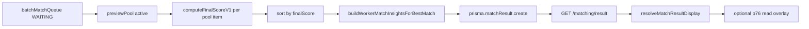

# P7.10-r3 — P7.6 Canonical Writer Design

## 1. Status

**This is design doc only.**

- No code change.
- No DB migration.
- No API change.
- No worker change.
- No frontend change.
- No env alias implementation.
- No canonical writer implementation.
- No legacy removal.
- No production / percent rollout.

**Conclusion:**

```text
P7_10_R3_CANONICAL_WRITER_DESIGN_ONLY
```

**Upstream milestones (current):**

| Milestone | Status |
|-----------|--------|
| P7.10-r1 | `AUDIT_COMPLETE_LEGACY_REMOVAL_NOT_STARTED` |
| P7.10-r2 | `TERMINOLOGY_PLAN_READY_NO_RENAME_IMPLEMENTED` |
| P7.10-r2a | `P7_10_R2A_DOCS_ARTIFACTS_WORDING_CLEANUP_COMPLETE` |
| P7.6-r9e3 | `NEED_MORE_PROD_REVERIFY` |
| P7.6-r9f percent | **blocked** |
| Production rollout | **blocked** |
| Legacy removal | **blocked** |

**Related docs (read-only inputs):**

- [P7.10-r1](./P7.10-r1-legacy-photo-matching-dependency-audit-and-replacement-strategy.md)
- [P7.10-r2](./P7.10-r2-legacy-terminology-replacement-plan.md)
- [P7.10-r2a](./P7.10-r2a-docs-artifacts-wording-cleanup-closeout.md)
- [P7.6-r8 allowlist apply design](./P7.6-r8-allowlist-only-apply-design.md)
- [P7.6-r8h read path display resolver design](./P7.6-r8h-read-path-display-resolver-design.md)

---

## 2. Why canonical writer is needed

Today, **production `MatchResult` rows are still created by the legacy batch-match worker path** that reads an active `PreviewPool`, scores candidates with `computeFinalScoreV1` (which includes `computeStyleScore` / photo `styleTags`), and calls `prisma.matchResult.create` with `candidateUserId`, `finalScore`, and `matchInsights`.

P7.6 work to date adds:

- **Shadow / audit** pipelines (`p76-photovisual-first-pool-shadow`, `p76-20d-bidirectional-ranking-shadow`, `p76-rrm-top2-final-selector-shadow`, `p76-end-to-end-funnel-shadow`) — all explicitly set `appliedToMatchResult: false`.
- **Allowlist sidecar writer** (`p76-allowlist-apply-writer` → `P76AllowlistApplyMeta`) — writes audit sidecar only; **forbids** `appliedToMatchResult=true`.
- **Read path display overlay** (`p76-read-path-display-resolver` via `resolveMatchResultDisplay`) — may change `displayCandidateUserId` / `displaySourceType` for allowlisted viewers; **does not** write `MatchResult`, **does not** change `finalScore`, **does not** change worker ranking.

To **retire Category A legacy photo matching** (PreviewPool-driven production writer, `computeStyleScore` dependency) **without** deleting generic result infrastructure (`MatchResult`, `finalScore`, `GET /matching/result/:userId`, `FinalMatchPage`, `resolveMatchResultDisplay`), we need a **P7.6 canonical writer** — a future production writer that **formally owns** `MatchResult` / `matchInsights` / score / provenance for the P7.6 main chain.

**Boundaries (this round — design only):**

| Concept | Is canonical writer? |
|---------|---------------------|
| P7.6 canonical writer (future) | **Yes** — future production `MatchResult` writer |
| `p76-allowlist-apply-writer` | **No** — sidecar only |
| `p76-read-path-display-resolver` | **No** — read overlay only |
| Admin review UI / `p76-admin-allowlist-apply-meta` | **No** — review / ops surface |
| Shadow funnel / RRM / 20D audit CLIs | **No** — compare / artifact only |

---

## 3. Current writer map

Evidence gathered from workspace search (`apps/`, `packages/database/prisma/schema.prisma`, `packages/shared/types/match-p1.ts`, `docs/P7/`, `artifacts/p76/`).

### 3.1 Path inventory

| Area | Key files | Role |
|------|-----------|------|
| **A. Production writer** | `apps/worker/src/jobs/batch-match.processor.ts` | Loads active `previewPool`, scores pool items, creates `MatchResult` |
| | `apps/worker/src/jobs/matching-score.ts` | `computeFinalScoreV1`, `computeStyleScore`, weights `W_PREVIEW`/`W_STYLE`/… |
| | `apps/worker/src/jobs/batch-match-match-insights.ts` | `buildWorkerMatchInsightsForBestMatch` → `matchInsights` JSON |
| | `apps/api/src/modules/preview-pool/*` | Preview pool CRUD / generation (feeds worker) |
| **B. P7.6 sidecar writer** | `apps/api/src/modules/matching/p76-allowlist-apply-writer.ts` | Writes `P76AllowlistApplyMeta`; P0 forbids `appliedToMatchResult` |
| | `apps/api/src/modules/matching/p76-allowlist-apply-meta.types.ts` | Sidecar contract |
| | `packages/database/prisma/schema.prisma` (`P76AllowlistApplyMeta`) | DB sidecar; comment: not MatchResult / display / worker |
| **C. Read path overlay** | `apps/api/src/modules/matching/matching-result-display.ts` | `resolveMatchResultDisplay` core priority |
| | `apps/api/src/modules/matching/p76-read-path-display-resolver.ts` | Allowlist overlay → `p76_allowlist_sidecar_readonly` |
| | `apps/api/src/modules/matching/p76-read-path-env.ts` | `PEIMA_P76_READ_PATH_*` gates |
| **D. Shadow / non-canonical** | `p76-end-to-end-funnel-shadow*.ts`, `p76-rrm-top2-final-selector-shadow.ts`, `p76-20d-bidirectional-ranking-shadow.ts`, `p76-photovisual-first-pool-shadow.ts` | `appliedToMatchResult: false` |
| | `matching-decision-comparison.service.ts`, `matching-rrm-ranking-proposal.service.ts` | Proposal / compare only |
| **Generic read API** | `apps/api/src/modules/matching/matching.service.ts` | `GET /matching/result` uses `resolveMatchResultDisplay` |
| **Shared types** | `packages/shared/types/match-p1.ts` | `matchInsights` key contract (shadow blocks) |
| **Schema** | `packages/database/prisma/schema.prisma` | `MatchResult`, `P76AllowlistApplyMeta` |

**Not found as separate production writer in this workspace:** dedicated `resultSource` / `pipelineVersion` columns on `MatchResult` (design-only for r3).

### 3.2 Writer map table

| Path | Writes MatchResult? | Writes finalScore? | Writes sidecar? | Affects read display? | Canonical today? | Notes |
|------|:---:|:---:|:---:|:---:|:---:|-------|
| **batch-match.processor** (`runBatchMatch`) | Yes (`prisma.matchResult.create`) | Yes (`finalScore: best.components.finalScore`) | No | Indirectly (baseline row is source for `match_result_original`) | **Yes (production)** | Requires active `previewPool`; fails `NO_ACTIVE_POOL` / `NO_SCORED_CANDIDATES` |
| **matching-score** (`computeFinalScoreV1`) | No (called by worker) | Computes score only | No | No | N/A | `previewPoolScore` + `preferenceScore` + `styleScore` (`computeStyleScore` on `styleTags`) + `profileScore`; weights 0.35 / 0.3 / 0.15 / 0.2 |
| **preview-pool module** | No | No | No | No | N/A | Feeds `PreviewPool` / pool items used by worker |
| **p76-allowlist-apply-writer** | **No** (forbidden P0) | **No** (forbidden P0) | Yes (`P76AllowlistApplyMeta`) | No (DB); overlay is separate | No | `assertP76AllowlistApplyForbiddenFlagsFalse`; always emits `appliedToMatchResult: false` |
| **p76-read-path-display-resolver** | No | No | No (reads sidecar) | Yes (`displayCandidateUserId`, `p76_allowlist_sidecar_readonly`) | No | Safe fallback to baseline display when stale / rolled back / violation |
| **resolveMatchResultDisplay** (core) | No | No | No | Yes (`match_result_original`, `static_fallback`, RRM meta, pairwise) | No (resolver) | Priority: RRM Top2 → V2 selector readonly → pairwise finalize → `match_result_original` |
| **P7.6 funnel / stage shadows** | No | No | No (artifacts / JSON blocks) | No | No | `appliedToMatchResult: false` in types |
| **Admin allowlist apply meta API** | No | No | Read / review only | No | No | Ops visibility; not a writer |

### 3.3 Production write sequence (today)



---

## 4. Target canonical writer responsibility

Future **P7.6 canonical writer** (implementation deferred) becomes the **sole authorized production writer** for allowlisted / promoted cohorts, eventually replacing PreviewPool-driven `matchResult.create`.

| Responsibility | Required? | Design decision | Notes |
|----------------|:---:|-----------------|-------|
| Create / update `MatchResult` | Yes | Upsert per viewer + batch window per existing schema conventions | Schema allows multiple historical rows per viewer (model comment); implementation must define “current canonical row” selection |
| Choose canonical `candidateUserId` | Yes | From P7.6 funnel output or approved sidecar input, never from stale/violation rows | Must match provenance recorded in `matchInsights` |
| Write `finalScore` (Stage 1) | Yes | Keep field for `FinalMatchPage` / GET compatibility | Not the same as “photo style score”; use P7.6 score version |
| Write `matchInsights` | Yes | Add `p76CanonicalWriter` block (§5.2); preserve existing worker keys until migration | Never omit provenance when writing row |
| Write `reasonSummary` | Yes | Human-readable summary aligned with score version | Follow `formatReasonSummaryV1` pattern but P7.6 wording |
| `resultSource` / `pipelineVersion` / `sourceVersion` | Yes (logical) | Store in `matchInsights.p76CanonicalWriter` first (Option A); optional DB columns later | No schema change in r3 |
| Decision provenance | Yes | `provenance` object with `inputSource`, `auditRunId`, `allowlistApplyMetaId`, `decisionRule` | References only — no raw prompts / full photo features |
| Input snapshot references | Yes | IDs + versions + artifact paths | Not raw sensitive payloads |
| Idempotency | Yes | `@@unique`-style key: viewer + `sourceVersion` / `auditRunId` | Align with `P76AllowlistApplyMeta` `@@unique([viewerUserId, sourceVersion])` pattern |
| Rollback / kill switch | Yes | `rollbackToken`, previous baseline snapshot in meta | Env kill switch stops all writes |
| Dry-run / shadow compare | Yes | `mode: "shadow"` \| `"write_enabled"`, `appliedToMatchResult` in meta | Phase 1–2 before production write |
| GET `/matching/result` compatibility | Yes | Row must be readable via existing handler | r3 does not change GET |
| `FinalMatchPage` compatibility | Yes | `candidateUserId` + `finalScore` remain primary display inputs | UI must not depend on `computeStyleScore` long-term |
| Safe fallback to baseline display | Yes | Canonical write must not remove baseline row without rollback plan | Read path keeps baseline when canonical missing / disabled |

**Explicit non-responsibilities:**

- Not the read-path overlay resolver.
- Not admin UI persistence (except consuming approved apply inputs).
- Not shadow-only audit CLIs (they feed inputs).

---

## 5. Proposed data contract

**r3 does not change Prisma schema or API response shape.**

### 5.1 MatchResult fields to preserve

From `packages/database/prisma/schema.prisma` (`MatchResult`):

| Field | Preserve | Notes |
|-------|:---:|-------|
| `id` | Yes | Primary key |
| `userId` | Yes | Viewer (not renamed to `viewerUserId` in schema today) |
| `candidateUserId` | Yes | Canonical matched user |
| `batchId` | Yes | Links to `MatchBatch` |
| `finalScore` | Yes | **Compatibility field** — keep through Stage 1–2; do not delete in r3/r4 |
| `reasonSummary` | Yes | Optional string |
| `matchInsights` | Yes | JSON contract — additive `p76CanonicalWriter` |
| `status` | Yes | Worker uses `READY` today |
| `createdAt` / `updatedAt` | Yes | Audit |
| Unique constraints | — | **No `@@unique` on `userId`** in current schema; multiple historical rows allowed per model comment |

**Successor score fields** (Stage 2 design only): e.g. `scoreVersion`, `canonicalScore`, `scoreBreakdown` inside `matchInsights` or future additive columns — **projection** into `finalScore` for UI.

### 5.2 matchInsights canonical writer meta

Proposed viewer-safe block (additive JSON under existing `matchInsights`):

```typescript
// Design-only — not implemented in r3
matchInsights.p76CanonicalWriter = {
  schemaVersion: 1,
  sourceType: "p76_canonical_writer",
  sourceVersion: "p7.10-r3-design-p76-canonical-writer-v1",
  pipelineVersion: "p76-canonical-v1",
  generatedAt: "ISO-8601",
  mode: "shadow" | "write_enabled",
  appliedToMatchResult: boolean,
  selectedCandidateUserId: string,
  baselineCandidateUserId: string,
  wouldChangeBaseline: boolean,
  score: {
    finalScore: number,
    scoreVersion: string,
    scoreComponentsSummary: Record<string, number>, // bounded, no raw tags dump
  },
  provenance: {
    inputSource:
      | "p76_funnel"
      | "allowlist_sidecar"
      | "manual_admin_apply"
      | "batch_recompute",
    allowlistApplyMetaId?: string,
    auditRunId?: string,
    decisionRule?: string,
    fallbackPolicy: "safe_fallback_v1",
  },
  guardrails: {
    eligible: boolean,
    reason:
      | "ok"
      | "not_allowlisted"
      | "candidate_missing"
      | "stale_sidecar"
      | "rolled_back"
      | "violation_row"
      | "env_disabled"
      | "exception",
  },
  rollback?: {
    rollbackToken: string,
    previousMatchResultId?: string,
    previousCandidateUserId?: string,
    previousFinalScore?: number,
  },
};
```

**Payload rules:**

- Do **not** store raw LLM prompts, full photo feature vectors, or sensitive full text.
- Keep JSON bounded (follow existing `matchInsights` patterns in `packages/shared/types/match-p1.ts`).
- **Candidate IDs:** viewer-safe ID handling follows existing `MatchResult` / GET response policy (same redaction / exposure as today’s `candidateUserId` on GET).

**Distinction from sidecar:** `P76AllowlistApplyMeta` remains audit/rollback oriented; canonical writer may **read** an approved sidecar row as **input**, but writes **`MatchResult`** + `p76CanonicalWriter` meta.

### 5.3 Optional future columns / tables

| Option | Pros | Cons | r3 recommendation |
|--------|------|------|-------------------|
| **A — `matchInsights` JSON only** | No migration; fast shadow iteration | Hard to query/audit at scale | **Start here** (shadow + local design) |
| **B — `p76_canonical_writer_meta` table** | Auditable, rollback rows, admin joins | Migration + dual-write complexity | Evaluate before Phase 3 production write |
| **C — Additive `MatchResult` columns** (`resultSource`, `pipelineVersion`, …) | Simple read path filters | Schema + backfill cost | Defer until Option A proven |

**Recommendation:** Option A for Phase 1–2; re-evaluate Option B before allowlist-only canonical writes (Phase 3). **No migration in r3.**

---

## 6. Candidate selection source priority

Future canonical writer **input priority** (aligned with [P7.10-r2](./P7.10-r2-legacy-terminology-replacement-plan.md) safe fallback terminology):

| Priority | Source | Writable to MatchResult? |
|:---:|--------|:---:|
| 1 | P7.6 canonical funnel result (end-to-end shadow promoted) | Yes, when gates pass |
| 2 | P7.6 **approved** allowlist sidecar (`P76AllowlistApplyMeta`, signoffs, `applied=true`, not `rolledBack`) | Yes, only after explicit promotion — sidecar alone is **not** canonical today |
| 3 | Admin-approved manual apply (ops workflow) | Yes, with audit trail |
| 4 | Existing stable baseline `MatchResult` | **Read-only fallback** — not a writer input for new canonical row |
| 5 | `matching_pending` | **GET contract only** — writer does not create pending rows |
| 6 | `no_result` | **GET contract only** — writer does not create placeholder MatchResult |

**Guardrails — never write canonical `MatchResult` when:**

- Sidecar `rolledBack === true`
- Admin `violation` row (see `deriveP76SidecarStatus` / violation checks in read resolver)
- `stale_source_version` (sidecar `sourceVersion` ≠ env)
- `candidate_missing` / empty `selectedCandidateId`
- `env_disabled` / kill switch / dry-run (unless shadow-only meta)
- `appliedToMatchResult` on sidecar must remain **false** until canonical writer promotion explicitly sets canonical meta on **MatchResult**, not sidecar flags

**Read path vs write path:** GET may eventually **prefer** canonical provenance (§10); writer only emits **ready** outcomes.

---

## 7. Score strategy

**Clarification:** `finalScore` on `MatchResult` is **generic display score** for the product surface, not synonymous with “legacy photo matching.” **Today**, production values are still computed via `computeFinalScoreV1`, which **includes** `previewPoolScore` and `computeStyleScore` (`styleTags` on viewer preference + candidate image) — see `apps/worker/src/jobs/matching-score.ts`.

### Stage 1 — compatibility (first implementation)

- Canonical writer **still writes `finalScore`**.
- Use a new **`scoreVersion`** string (e.g. `p76-canonical-score-v1`) in `matchInsights.p76CanonicalWriter.score`.
- Scoring function **replaces** PreviewPool/style dependency with P7.6 funnel score components (20D + RRM + photovisual pool outputs) — **design in r5+; not implemented in r3**.
- `reasonSummary` references P7.6 version, not “previewPoolScore/styleScore” unless shadow-compare documents delta.

### Stage 2 — successor score

- Add `scoreBreakdown` / `canonicalScore` in meta (or optional columns).
- `finalScore` = **display projection** for `FinalMatchPage` (e.g. map from `canonicalScore`).
- UI and tests must **not** depend on `computeStyleScore` or PreviewPool `styleTags` long-term.

**r3:** no scoring code changes. **Explicit sunset:** `computeStyleScore` / PreviewPool `styleTags` are **not** long-term dependencies for canonical writer.

---

## 8. Idempotency and write semantics

**Unit of canonical write (design):** one logical result per `(viewerUserId, sourceVersion)` or `(viewerUserId, auditRunId)` — mirror sidecar uniqueness `@@unique([viewerUserId, sourceVersion])` on `P76AllowlistApplyMeta`.

| Scenario | Expected behavior |
|----------|-------------------|
| **First write** | Create `MatchResult` + full `p76CanonicalWriter` meta; `appliedToMatchResult: true` only when `mode=write_enabled` and all guardrails pass |
| **Repeat write, same input** | No duplicate rows; update meta timestamp or no-op if candidate + `scoreVersion` unchanged |
| **Changed candidate** | Blocked in shadow until promotion gate; if write enabled, require explicit apply + rollback token; store `wouldChangeBaseline: true` |
| **Candidate missing** | No write; `guardrails.reason = candidate_missing` |
| **Stale sidecar** | No write; reason `stale_sidecar` |
| **Rolled back sidecar** | No write; reason `rolled_back` |
| **Violation row** | No write; reason `violation_row` |
| **Env disabled / kill switch** | No write; reason `env_disabled` |
| **Exception** | No partial `MatchResult` without provenance; log; GET continues to serve baseline |
| **Rollback requested** | Restore `previousCandidateUserId` / `previousFinalScore` from meta or re-point GET to baseline row; mark meta `rolled_back` |

**Invariants:**

- Never partially persist `MatchResult` without `matchInsights.p76CanonicalWriter` provenance.
- Writer failure **must not** break GET read path (baseline + safe fallback).
- Shadow mode: `appliedToMatchResult: false` in meta; optional compare artifact only.

---

## 9. Env flags and modes

**Design only — not implemented in r3.**

**Naming recommendation:** Use **`PEIMA_P76_*`** for runtime (P7.10 is a deprecation milestone label, not a long-lived env prefix). Do **not** introduce `PEIMA_P710_*` for production toggles.

| Env (proposed) | Purpose | Default |
|----------------|---------|---------|
| `PEIMA_P76_CANONICAL_WRITER_ENABLED` | Master enable for writes | `false` / unset |
| `PEIMA_P76_CANONICAL_WRITER_DRY_RUN` | Compute + meta without `MatchResult` create | `true` when testing |
| `PEIMA_P76_CANONICAL_WRITER_SHADOW_COMPARE` | Emit compare artifacts vs baseline | `true` in Phase 1–2 |
| `PEIMA_P76_CANONICAL_WRITER_ALLOWLIST_ONLY` | Restrict writes to allowlist viewers | `true` |
| `PEIMA_P76_CANONICAL_WRITER_KILL_SWITCH` | Emergency stop (overrides enabled) | `false` |

**Mode matrix:**

- Production write requires: `ENABLED=true` AND `KILL_SWITCH=false` AND `DRY_RUN=false` AND allowlist match AND signoffs (if required) AND guardrails `ok`.
- Default posture: **all disabled**; dry-run / shadow first.

**Interaction with existing read-path env** (`PEIMA_P76_READ_PATH_*` per `p76-read-path-env.ts`): canonical writer env is **orthogonal** — writer flags must not be confused with `PEIMA_P76_READ_PATH_FALLBACK_LEGACY` (baseline display fallback per P7.10-r2).

---

## 10. Read path interaction

**r3 does not change:** GET handler, `resolveMatchResultDisplay`, `p76-read-path-display-resolver`, `FinalMatchPage`, or enum values.

**Future preference order (after Phase 4):**

1. P7.6 canonical `MatchResult` with `matchInsights.p76CanonicalWriter.appliedToMatchResult === true`
2. P7.6 approved sidecar display overlay (current `p76_allowlist_sidecar_readonly`) if no canonical row
3. Stable baseline display (`match_result_original`, `static_fallback`, RRM/pairwise as today)
4. `matching_pending` (explicit GET contract — **P7.10-r4**)
5. `no_result`

**Existing `displaySourceType` values** (from `matching-result-display.ts`):

- `match_result_original`
- `static_fallback`
- `pairwise_final`, `static_final`, RRM types, `p76_allowlist_sidecar_readonly`, …

**Do not rename enums in r3.** Optional **additive** field in a future API revision (r4+ design):

```typescript
displaySourceCategory?: "p76_canonical" | "p76_sidecar" | "safe_baseline" | "finalize" | "pending" | "no_result";
```

Maps cleanly to P7.10-r2 terminology without breaking clients that still read `displaySourceType`.

**Violation guard:** If sidecar row has `appliedToMatchResult === true`, read resolver already returns fallback reason `main_chain_flag_match_result` (`p76-read-path-display-resolver.ts`) — canonical writer promotion must coordinate this flag semantics in implementation phase.

---

## 11. Migration plan

| Phase | Title | Scope | MatchResult write? |
|:---:|-------|-------|:---:|
| **0** | **r3 design only** | This document | No |
| **1** | Shadow writer implementation | Compare artifacts / optional shadow block in meta; `appliedToMatchResult=false` | No |
| **2** | Dual-write compare | Dedicated meta table or JSON; diff vs legacy baseline | No (or dry-run only) |
| **3** | Limited allowlist canonical write | Allowlisted viewers only; PM/Ops signoff; rollback token | Yes (cohort) |
| **4** | Read path prefer canonical | GET prefers canonical provenance; sidecar overlay retained | N/A (read) |
| **5** | Disable old PreviewPool writer | Worker stops `previewPool` + `computeStyleScore` production path | Legacy off |
| **6** | Legacy removal | Delete Category A per P7.10-r1 gates | P7.6 only |

**Blocked until:** r9e3 reverify, percent rollout gates, and §12 deletion gates pass.

---

## 12. Deletion gates updated

Extends [P7.10-r1 §9](./P7.10-r1-legacy-photo-matching-dependency-audit-and-replacement-strategy.md):

| # | Gate | r3 status |
|---|------|-----------|
| 1 | P7.6 **canonical writer design** complete | **PASS (this doc)** |
| 2 | P7.10-r4 **safe fallback API contract** complete | Pending |
| 3 | Canonical writer **shadow** implementation PASS | Pending |
| 4 | **Dual-write compare** PASS | Pending |
| 5 | Allowlist **canonical write rehearsal** PASS | Pending |
| 6 | **Rollback rehearsal** PASS | Pending |
| 7 | GET / **FinalMatchPage** compatibility PASS | Pending |
| 8 | Old PreviewPool writer **disable rehearsal** PASS | Pending |
| 9 | P7.7 regression pack PASS | Pending |
| 10 | Staging prod-like reverify PASS (if rollout resumes) | Blocked (`NEED_MORE_PROD_REVERIFY`) |
| — | r1 gates #3–#9 (infra preservation, terminology, etc.) | Still required |

**Legacy removal remains BLOCKED.**

---

## 13. Risk register

| ID | Risk | Mitigation |
|----|------|------------|
| R1 | Canonical writer writes wrong `candidateUserId` | Allowlist-only Phase 3; shadow compare; rollback meta |
| R2 | `finalScore` semantic shift breaks UI/tests | Stage 1 projection; keep field; versioned `scoreVersion` |
| R3 | `matchInsights` too large or leaks sensitive data | Bounded `scoreComponentsSummary`; no raw prompts |
| R4 | Sidecar mistaken for canonical source | Separate meta keys; sidecar `appliedToMatchResult` stays false until coordinated promotion |
| R5 | Stale / rolled-back sidecar promoted to MatchResult | Reuse read-path guard reasons; writer refuses write |
| R6 | Rollback cannot restore baseline | Store `previousMatchResultId` / candidate / score in meta |
| R7 | Dual-write vs read overlay inconsistency | Phase 4 single preference doc; r4 GET contract |
| R8 | `no_result` surge when PreviewPool disabled | Phase 5 only after GET pending/no_result contract |
| R9 | Old worker still writes while canonical writes | Phase 5 gate; monitor duplicate rows per viewer |
| R10 | Env names confuse `FALLBACK_LEGACY` vs canonical | P7.10-r2 terminology; `P76_` prefix; r2b alias later |

---

## 14. Test and verification plan for future implementation

**Not executed in r3** — checklist for implementation milestones.

### API / service

- Canonical writer disabled → no `MatchResult` write
- Dry-run → no persist (or shadow meta only)
- Shadow compare → artifact / meta only, `appliedToMatchResult=false`
- Allowlist-only guard rejects non-allowlisted viewer
- `candidate_missing`, `stale_sidecar`, `rolled_back`, `violation_row` → blocked
- Repeat idempotent write → no duplicate
- Changed candidate blocked unless explicit apply flag
- Rollback restores baseline candidate/score

### Worker

- `batch-match` behavior unchanged until Phase 5 gate
- Canonical writer exception does not fail batch queue for non-allowlisted users

### Read path

- After Phase 4: canonical row preferred; sidecar overlay still works when canonical absent
- Baseline `match_result_original` / safe fallback unchanged for non-allowlisted
- `matching_pending` / `no_result` per r4 contract

### Frontend

- `FinalMatchPage` still consumes `finalScore` + `candidateUserId`
- No copy dependency on legacy photo pool strings

### Example commands (future)

```bash
pnpm --filter @peima/api test -- p76-canonical-writer
pnpm --filter @peima/worker test -- batch-match
pnpm --filter @peima/api run build
pnpm --filter @peima/worker run build
```

---

## 15. PASS / BLOCK

### PASS (P7.10-r3)

```text
P7_10_R3_CANONICAL_WRITER_DESIGN_ONLY
```

- [x] Canonical writer boundary documented (§2, §4)
- [x] Current writer map documented (§3)
- [x] Target MatchResult / matchInsights / score / provenance contract documented (§5, §7)
- [x] Idempotency / rollback design documented (§8)
- [x] Env / mode design documented (§9)
- [x] Safe fallback interaction documented (§6, §10)
- [x] Migration plan documented (§11)
- [x] Deletion gates updated (§12)

### BLOCK (unchanged)

- No code implementation
- No env implementation
- No schema migration
- No `MatchResult` writes
- No worker / read path / FinalMatchPage change
- No legacy removal
- No production / percent rollout

---

## 16. Next recommended step

| Option | Milestone | Scope | Risk |
|--------|-----------|-------|------|
| **A (recommended)** | **P7.10-r4 — Safe fallback API contract** | Design-only: `GET /matching/result` expression of `ready` / `matching_pending` / `no_result` / safe baseline | Low |
| **B** | **P7.10-r2b — Env alias implementation** | Code: `SAFE_FALLBACK` alias + deprecated `FALLBACK_LEGACY`; tests + smoke | Medium |

**Recommendation:** Proceed with **P7.10-r4** first. Canonical writer output (§5–§6) must align with an explicit GET contract before any write implementation.

**After r4:** P7.10-r5 (PreviewPool bridge sunset plan) → shadow canonical writer (Phase 1) → dual-write (Phase 2).

---

## Appendix A — Search evidence index

| Symbol / term | Example locations |
|---------------|-------------------|
| `MatchResult.create` | `apps/worker/src/jobs/batch-match.processor.ts` ~346 |
| `computeFinalScoreV1` / `computeStyleScore` | `apps/worker/src/jobs/matching-score.ts` |
| `previewPool` | `batch-match.processor.ts`, `apps/api/src/modules/preview-pool/` |
| `P76AllowlistApplyMeta` | `schema.prisma` ~765; `appliedToMatchResult @default(false)` |
| `assertP76AllowlistApplyForbiddenFlagsFalse` | `p76-allowlist-apply-writer.ts` |
| `resolveMatchResultDisplay` | `matching-result-display.ts` |
| `p76_allowlist_sidecar_readonly` | `p76-read-path-display-resolver.ts` |
| `appliedToMatchResult: false` | `p76-end-to-end-funnel-shadow.types.ts`, `p76-rrm-top2-final-selector-shadow.ts`, `p76-photovisual-first-pool.types.ts` |
| `matchInsights` contract | `packages/shared/types/match-p1.ts` |

**Paths not present as standalone production writer:** `resultSource` column on `MatchResult` — **not found in this workspace** (use meta JSON until Option C).
