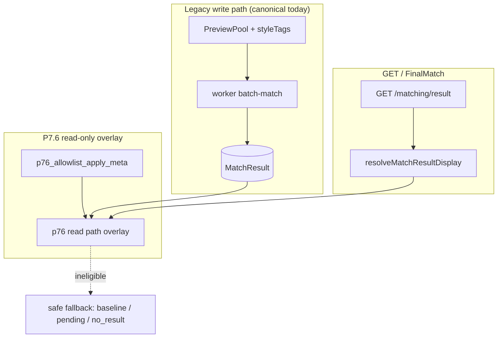
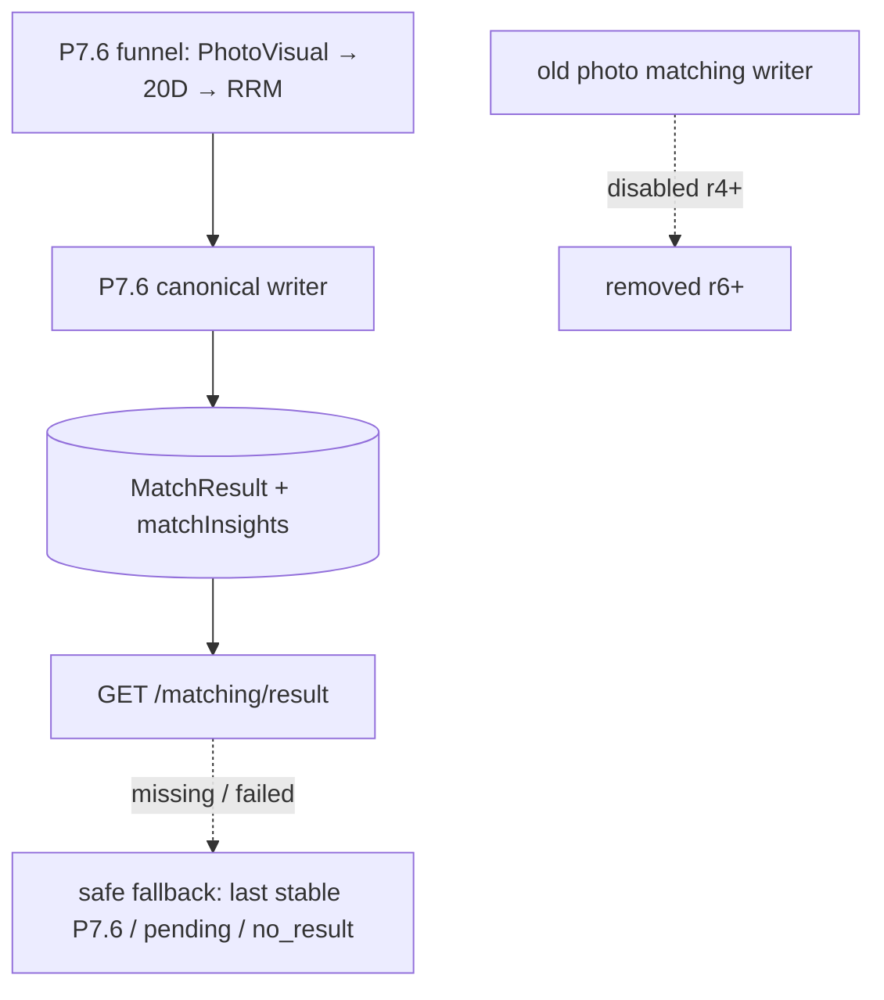

# P7.10-r3 — P7.6 Canonical Writer Design

> **状态**：**P7.10-r3 P7.6 canonical writer design · DESIGN ONLY · not implemented**  
> **结论**：**`P7_10_R3_CANONICAL_WRITER_DESIGN_ONLY`**  
> **前置**：[P7.10-r1](./P7.10-r1-legacy-photo-matching-dependency-audit-and-replacement-strategy.md) · [P7.10-r2](./P7.10-r2-legacy-terminology-replacement-and-safe-fallback-plan.md) · [P7.10-r2c](./P7.10-r2c-baseline-display-rename-and-safe-fallback-compat-closeout.md) · [P7.10-r7](./P7.10-r7-canonical-write-readiness-design.md)（readiness 并行轨道）  
> **性质**：docs only — **无**代码 · **无** DB migration · **无** MatchResult write · **无** worker 变更 · **无** legacy 删除

---

## 1. 一句话结论

P7.10-r3 设计 P7.6 如何从 **sidecar / read-path overlay** 升级为 **canonical writer**：未来由 P7.6 正式写入 `MatchResult` / `matchInsights` / display 所需 provenance，使**旧照片匹配 writer** 可以在后续里程碑中关闭。本轮**仅设计**，不实现、不写 DB、不改 worker、不删 legacy。

---

## 2. 前置状态

| 项 | Status |
|----|--------|
| [P7.10-r1](./P7.10-r1-legacy-photo-matching-dependency-audit-and-replacement-strategy.md) audit | **PASS** |
| [P7.10-r2](./P7.10-r2-legacy-terminology-replacement-and-safe-fallback-plan.md) + [r2a](./P7.10-r2a-docs-artifacts-wording-cleanup-closeout.md) / [r2b](./P7.10-r2b-safe-fallback-env-alias-implementation-closeout.md) / [r2c](./P7.10-r2c-baseline-display-rename-and-safe-fallback-compat-closeout.md) | Safe fallback 语义与 `baselineDisplay` rename **DONE** |
| P7.6 sidecar + read path overlay | **Implemented** — `p76_allowlist_apply_meta` · `p76-read-path-display-resolver` |
| P7.6 shadow / rehearsal | **Local PASS** — `p76_canonical_writer_rehearsal_meta` · r6f insert-only |
| P7.6 **canonical writer** | **Not** production writer today |
| `MatchResult` writer today | **Legacy** `batch-match` + `PreviewPool` + `computeFinalScoreV1` |
| Legacy photo matching writer | **Still on** — not disabled in r3 |
| r9e3 real prod reverify | **`NEED_MORE_PROD_REVERIFY`** |
| r9f / production rollout | **blocked** |
| legacy removal | **blocked** |

**Infrastructure preserved (≠ legacy photo matching):** `MatchResult` · `finalScore` · `GET /matching/result` · `FinalMatchPage` · `resolveMatchResultDisplay` ([r1 §6](./P7.10-r1-legacy-photo-matching-dependency-audit-and-replacement-strategy.md)).

---

## 3. 当前链路 vs 目标链路

### 3.1 当前（production today）



| Layer | Behavior |
|-------|----------|
| Write | `batch-match.processor` → `prisma.matchResult.create` (`candidateUserId`, `finalScore`, `matchInsights`) |
| P7.6 | Shadow / funnel audits · allowlist **sidecar** · read path **display overlay** only |
| Fallback | **Not** legacy photo matching — [safe fallback stack](./P7.10-r2-legacy-terminology-replacement-and-safe-fallback-plan.md) §6 |

### 3.2 目标（after full program)



| Transition | Rule |
|------------|------|
| Canonical success | GET reads **P7.6 canonical** `MatchResult` |
| Canonical missing | `matching_pending` or `no_result` |
| Canonical failed | Last **stable P7.6** result → else pending → else no_result |
| **Forbidden** | Fallback to old photo pool / `computeStyleScore` / PreviewPool regeneration |

---

## 4. Canonical writer 写入范围

### 4.1 `MatchResult`（主链列）

| Field | Canonical writer writes? | Notes |
|-------|:---:|-------|
| `userId` | Yes | Viewer |
| `candidateUserId` | Yes | P7.6 `selectedCandidateId` |
| `finalScore` | Yes (Stage 1) | 通用展示分；**不等于** photo style score — 使用 P7.6 `scoreVersion` |
| `reasonSummary` | Yes | P7.6 决策摘要 |
| `matchInsights` | Yes | 含 `p76CanonicalWriter` 块（§8） |
| `batchId` | Yes | 对齐现有 batch 语义 |
| `status` | Yes | e.g. `active` / `READY` 约定 |
| `createdAt` / `updatedAt` | Yes | 审计 |
| `sourceType` / `sourceVersion` (columns) | **No** (r3) | 首期写入 `matchInsights` JSON；可选列后续 |

**不单独写 `displayCandidateUserId` 列** — schema 无此列；display 由 read path 从 canonical `candidateUserId` + provenance **推导**。

### 4.2 `matchInsights`（canonical evidence）

| Block | Content |
|-------|---------|
| `p76CanonicalWriterMeta` | schemaVersion · sourceType · sourceVersion · mode · guardrails · rollback |
| Stage summaries | stage1 PhotoVisual · stage2 20D · stage3 RRM（引用 ID / 版本，无原始 prompt） |
| `finalSelectedCandidateId` | 与 `candidateUserId` 一致 |
| `safeFallbackMeta` | policyVersion · reason · eligibility |
| Audit flags | eligible · violation · rolledBack · signoffs |
| `schemaVersion` / `sourceVersion` | 冻结 cohort |

**Preserve:** 现有 worker 写入的 keys 在迁移期**保留**于 JSON，直至 [r6 legacy removal](./P7.10-r1-legacy-photo-matching-dependency-audit-and-replacement-strategy.md) 门禁通过。

### 4.3 Display（read path）

| Item | Design |
|------|--------|
| `displayCandidateUserId` | **Derived** from canonical row + resolver — not a separate DB write |
| `displaySourceType` | From canonical source enum family; **forbid** `production_apply` / `percent_rollout` |
| Read overlay | Phase 4+ may **prefer** canonical provenance over sidecar-only overlay |

---

## 5. Storage 设计选项

| Option | Mechanism | Pros | Cons | r3 |
|--------|-----------|------|------|-----|
| **A** | 直接写 `MatchResult` | 最接近现有 GET | 写错即影响主链 | Promotion **after** B |
| **B** | `p76_canonical_match_result_meta` sidecar → promotion | 可审计 · rollback · dry-run | 多一层 | **Recommended first** |
| **C** | 仅 `p76_allowlist_apply_meta` | 已有 | **无法**关闭旧 writer | **不推荐** |

**Recommendation:** **先 B，后 A promotion.**

| Phase | Storage |
|-------|---------|
| r3a–r3d | Dry-run artifacts + existing `p76_canonical_writer_rehearsal_meta` (rehearsal, `appliedToMatchResult=false`) |
| r3b+ | Design `p76_canonical_match_result_meta` (§12) — **no migration in r3** |
| Promotion | Admin/Ops gated apply → `MatchResult` update ([P7.10-r7b](./P7.10-r7b-admin-apply-canonical-write-design.md) design only) |

---

## 6. Canonical writer gate

**Env gates (design — not implemented in r3):**

| Env | Purpose | Default |
|-----|---------|---------|
| `PEIMA_P76_CANONICAL_WRITER_ENABLED` | Master write enable | `0` |
| `PEIMA_P76_CANONICAL_WRITER_DRY_RUN` | Build payload only | `1` |
| `PEIMA_P76_CANONICAL_WRITER_ALLOWLIST_VIEWER_IDS` | Cohort blast radius | empty |
| `PEIMA_P76_CANONICAL_WRITER_SOURCE_VERSION` | Freeze label | `p7.10-r3-canonical-writer-v1` |
| `PEIMA_P76_CANONICAL_WRITER_REQUIRE_PM_SIGNOFF` | PM gate | `1` |
| `PEIMA_P76_CANONICAL_WRITER_REQUIRE_OPS_SIGNOFF` | Ops gate | `1` |
| `PEIMA_P76_CANONICAL_WRITER_SAFE_FALLBACK_ENABLED` | Align read fallback | `1` |
| `PEIMA_P76_CANONICAL_WRITER_KILL_SWITCH` | Emergency stop | `1` (fail-closed) |

**Default posture:** `enabled=0` · `dryRun=1` · **no production write** · allowlist empty · safe fallback on.

**Orthogonal to:** `PEIMA_P76_READ_PATH_*` (read overlay) · `PEIMA_P76_CANONICAL_WRITE_*` ([r7](./P7.10-r7-canonical-write-readiness-design.md) Admin Apply track).

---

## 7. Writer input contract

**Must come from:**

| Source | Use |
|--------|-----|
| P7.6 stage1 PhotoVisual pool output | Candidate set |
| P7.6 stage2 20D bidirectional ranking | Top-N / scores |
| P7.6 stage3 RRM final selector | `selectedCandidateId` |
| PM/Ops approved `sourceVersion` | Cohort freeze |
| Eligibility checks | allowlist · signoffs · not rolledBack · no violation |
| `p76_allowlist_apply_meta` (approved) | Optional promotion input — **not** canonical alone |

**Must NOT come from:**

| Forbidden | Reason |
|-----------|--------|
| Legacy `PreviewPool` / `computeStyleScore` | Category A — sunset |
| Onboarding photo preview v1 `pickByStyleScore` | Category A |
| Random / unverifiable fallback candidate | Safety |
| Unapproved artifact path | Audit |

**Guardrail blockers (no write):** `rolled_back` · `violation_*` · `stale_source_version` · `candidate_missing` · `env_disabled` · `exception`.

---

## 8. Writer output contract

```typescript
/** Design-only — P7.10-r3 */
type P76CanonicalWriterOutputV1 = {
  schemaVersion: 1;
  sourceType: "p76_canonical_writer";
  sourceVersion: string; // e.g. "p7.10-r3-canonical-writer-v1"
  pipelineVersion: string;
  mode: "dry_run" | "sidecar" | "canonical";
  viewerUserId: string;
  selectedCandidateId: string;
  score: number | null;
  scoreVersion: string;
  reasonSummary: string | null;
  stageSummary: {
    stage1?: { sourceVersion: string; candidateCount: number };
    stage2?: { sourceVersion: string; top2Ids: string[] };
    stage3?: { sourceVersion: string; decisionRule: string };
  };
  safeFallbackMeta: {
    policyVersion: "safe_fallback_v1";
    eligible: boolean;
    reason: string;
  };
  appliedToMatchResult: boolean;
  appliedToFinalScore: boolean;
  appliedToWorkerRanking: boolean;
  createdAt: string; // ISO-8601
};
```

| Mode | `appliedToMatchResult` | Persistence |
|------|:---:|-------------|
| `dry_run` | **false** | Artifact / log only |
| `sidecar` | **false** | `p76_canonical_match_result_meta` or rehearsal table |
| `canonical` | **true** | `MatchResult` update — **only** after signoff + gates ([r7](./P7.10-r7-canonical-write-readiness-design.md)) |

**r3 rule:** **Do not** change worker ranking in this milestone.

**Aligns with:** `buildP76CanonicalWriterShadowPayloadV1` (`p76-canonical-writer-shadow.types.ts`) — shadow already uses `appliedToMatchResult: false`.

---

## 9. Safe fallback behavior after canonical writer

| Situation | GET / display behavior |
|-----------|------------------------|
| P7.6 canonical row exists + eligible | Read **canonical** `MatchResult` (`resultState=ready`) |
| Canonical missing (not run yet) | `matching_pending` if queued · else `no_result` |
| Canonical failed / ineligible | Last **stable P7.6** `MatchResult` if exists |
| No stable row | `matching_pending` → `no_result` |

**Explicit prohibitions:**

- No fallback to **old photo matching** algorithm
- No regeneration of **PreviewPool**
- No writing **legacy photo matching** results as fallback
- No product copy calling safe fallback「旧照片匹配兜底」

**Contract:** [P7.10-r4](./P7.10-r4-safe-fallback-api-contract.md) · [r4a](./P7.10-r4a-result-state-api-minimal-implementation-closeout.md) (`matching_pending` / `no_result` partial).

---

## 10. Interaction with old photo matching writer

| Phase | Old writer | Canonical writer |
|-------|------------|------------------|
| **r3 (this doc)** | **Unchanged** — still writes `MatchResult` | Design only |
| **r3a–r3d** | Unchanged | Dry-run / sidecar meta only |
| **[P7.10-r4](./P7.10-r5-legacy-pool-bridge-sunset-plan.md)** | **Disable plan** — default off | Can become primary for allowlist |
| **r5+** | Off for new cohorts | Primary + safe fallback |

**Before r4:** no production canonical apply · no percent · old writer remains safety net for non-allowlist viewers.

---

## 11. API / UI compatibility

### GET `/matching/result`

| Rule | r3 |
|------|-----|
| Keep `candidateUserId` · `finalScore` | Yes |
| Optional additive `sourceVersion` / `sourceType` in meta | Future |
| `resultState`: `ready` \| `safe_fallback` \| `matching_pending` \| `no_result` | [r4a](./P7.10-r4a-result-state-api-minimal-implementation-closeout.md) |
| `displaySourceType` enum values **unchanged** | `match_result_original` · `static_fallback` · `p76_allowlist_sidecar_readonly` |
| Forbidden names | `production_apply` · `percent_rollout` |

### FinalMatchPage

| Requirement |
|-------------|
| Handle `matching_pending` |
| Handle `no_result` |
| No dependency on legacy photo pool UX strings |
| Safe fallback ≠ legacy photo matching |

### Admin

| r3 scope |
|----------|
| View canonical dry-run / sidecar / rehearsal (existing read-only) |
| View promotion readiness |
| **No** write / Apply in r3 ([r7b](./P7.10-r7b-admin-apply-canonical-write-design.md) separate) |

---

## 12. Data model 设计

**Future table (Option B) — `p76_canonical_match_result_meta`**

| Field | Type | Notes |
|-------|------|-------|
| `id` | cuid | PK |
| `viewerUserId` | string | |
| `matchResultId` | string? | Baseline row reference |
| `selectedCandidateId` | string | |
| `sourceType` | string | `p76_canonical_writer` |
| `sourceVersion` | string | |
| `schemaVersion` | int | |
| `pipelineVersion` | string | |
| `mode` | enum | dry_run \| sidecar \| canonical |
| `score` | float? | |
| `reasonSummary` | text? | |
| `stageSummary` | json | Bounded |
| `safeFallbackMeta` | json | |
| `pmSignoffStatus` | string | |
| `opsSignoffStatus` | string | |
| `appliedToMatchResult` | bool | CHECK false until promotion |
| `appliedToFinalScore` | bool | default false |
| `appliedToWorkerRanking` | bool | default false |
| `dryRun` | bool | |
| `rolledBack` | bool | |
| `rollbackToken` | string? | |
| `supersededAt` | datetime? | |
| `createdAt` / `updatedAt` | datetime | |

**Existing rehearsal table:** `p76_canonical_writer_rehearsal_meta` — compare-only; CHECK `appliedToMatchResult=false` ([r6e1](./P7.10-r6e1-rehearsal-sidecar-migration-implementation-closeout.md)).

**r3:** **no** Prisma migration · **no** new table deploy.

---

## 13. Testing strategy

**Future implementation checklist (not run in r3):**

| Area | Cases |
|------|-------|
| Writer | dryRun → no `MatchResult` write |
| | sidecar meta only |
| | canonical write allowlist + signoff only |
| | `candidateUserId` / `finalScore` correct |
| Safe fallback | `matching_pending` · `no_result` |
| | last stable P7.6 result |
| Guards | non-allowlist · rolledBack · violation · stale `sourceVersion` |
| | exception does not bubble |
| Legacy off | old writer disabled → GET stable |
| Regression | `FinalMatchPage` pending / no_result |
| | `displaySourceType` API values unchanged |
| | `MatchResult.candidateUserId` unchanged on read overlay paths |

**Commands (future):**

```bash
pnpm --filter @peima/api test -- p76-canonical-writer
pnpm --filter @peima/api test -- p76-read-path-display-resolver
pnpm --filter @peima/worker test -- batch-match
```

---

## 14. Rollout stages

| Stage | Milestone | Type | Status |
|-------|-----------|------|--------|
| **r3** | Canonical writer design (this doc) | Docs | **DONE** |
| **r3a** | Dry-run payload builder | Code (no DB write) | Planned — [r7a](./P7.10-r7-canonical-write-readiness-design.md) ref |
| **r3b** | Sidecar schema + writer design | Docs + migration later | Partial — rehearsal table exists |
| **r3c** | Dry-run audit | CLI / artifacts | Partial — r6a/r6b |
| **r3d** | Sidecar write smoke | Local | Partial — r6f3 |
| **r4** | Old photo matching writer **disable** plan | Docs | [r5 sunset](./P7.10-r5-legacy-pool-bridge-sunset-plan.md) |
| **r5** | Safe fallback implementation | Code + GET | [r4 contract](./P7.10-r4-safe-fallback-api-contract.md) partial |
| **r6** | Legacy photo matching **removal** | Code delete | **BLOCKED** |
| **r7** | Canonical **write readiness** gates | Docs | [P7.10-r7](./P7.10-r7-canonical-write-readiness-design.md) — gates 12–20 blocked |
| **r8** | Canonical write **implementation** | Code | **BLOCKED** |
| **r9** | Canonical write regression closeout | Docs + CI | **BLOCKED** |

**Note:** P7.10 **r6** prefix also used for shadow/rehearsal implementation — different meaning from legacy **r6 removal** row above.

**Blocked by:** r9e3 · percent · §12 deletion gates in [r1](./P7.10-r1-legacy-photo-matching-dependency-audit-and-replacement-strategy.md).

---

## 15. PASS / BLOCK

### PASS — P7.10-r3 DESIGN

```text
P7_10_R3_CANONICAL_WRITER_DESIGN_ONLY
```

- [x] Canonical writer target clear (§3–§4)
- [x] Storage option selected — **B then A** (§5)
- [x] Env gate defined (§6)
- [x] Input / output contract defined (§7–§8)
- [x] Safe fallback after canonical defined (§9)
- [x] Old writer interaction defined (§10)
- [x] No code / DB change in r3

### BLOCK

| Block | Reason |
|-------|--------|
| Direct `MatchResult` write without dry-run / sidecar gate | §5 |
| Remove old writer before safe fallback + GET contract | §9–§10 |
| Delete `MatchResult` / `finalScore` | r1 §6 |
| No `pending` / `no_result` plan | §9 |
| Old photo matching as fallback | Product decision |
| Production / percent in r3 | Scope |
| Enable canonical write without [r7](./P7.10-r7-canonical-write-readiness-design.md) gates 12–20 | Readiness |

---

## 16. 边界确认

| 项 | r3 |
|----|-----|
| Docs only | **yes** |
| No code change | **yes** |
| No DB migration | **yes** |
| No MatchResult write | **yes** |
| No finalScore behavior change | **yes** |
| No worker change | **yes** |
| No old writer disable | **yes** |
| No production / percent | **yes** |
| No legacy removal implementation | **yes** |

---

## 17. 下一步

| Priority | Milestone | Notes |
|----------|-----------|-------|
| **1** | **P7.10-r3a** — Canonical writer dry-run payload builder | Code allowed; no `MatchResult` write |
| **2** | **P7.10-r4** — Old photo matching writer disable plan | [P7.10-r5](./P7.10-r5-legacy-pool-bridge-sunset-plan.md) |
| **3** | **P7.10-r5** — Safe fallback full implementation | Builds on [r4](./P7.10-r4-safe-fallback-api-contract.md) |
| **4** | **P7.7-r1** — Safe fallback negative regression pack | Extend as GET evolves |
| **Ops** | **P7.6-r9e3c** | After [r9e3b access](./P7.6-r9e3b-real-prod-reverify-access-package-and-ops-handoff.md) GO |

**Do not** start canonical `MatchResult` promotion until [P7.10-r7](./P7.10-r7-canonical-write-readiness-design.md) gates 12–20 have explicit PASS closeouts.

---

## Appendix — Current writer map (evidence)

| Path | Writes `MatchResult`? | Canonical today? |
|------|:---:|:---:|
| `apps/worker/.../batch-match.processor.ts` | Yes | **Yes** |
| `p76-allowlist-apply-writer.ts` | No (forbidden) | No |
| `p76-read-path-display-resolver.ts` | No | No |
| `p76-*-shadow*.ts` | No (`appliedToMatchResult: false`) | No |
| `p76-canonical-writer-rehearsal-writer.ts` | No (rehearsal table only) | No |

See prior detailed inventory in git history of this file (§3 writer tables) and [P7.10-r1](./P7.10-r1-legacy-photo-matching-dependency-audit-and-replacement-strategy.md).
