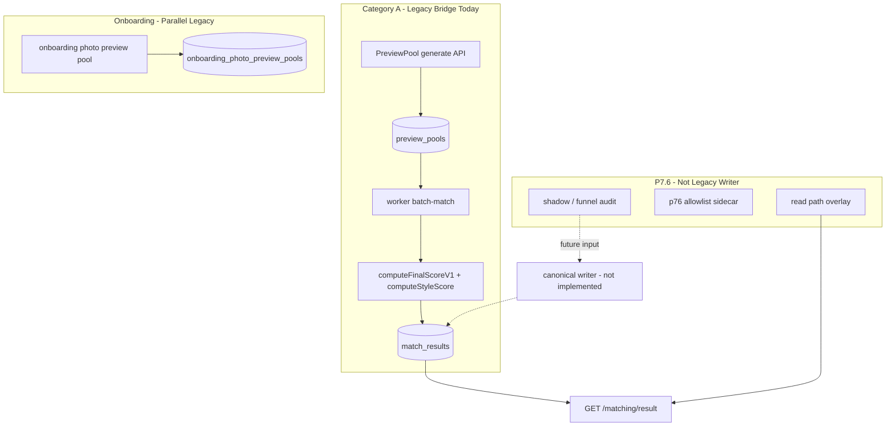

# P7.10-r5 — Legacy Pool Bridge Sunset Plan

## 1. Status

**This is design doc only.**

- No code change.
- No DB migration.
- No API change.
- No worker change.
- No frontend change.
- No tests change.
- No env alias implementation.
- No canonical writer implementation.
- No safe fallback implementation.
- No legacy pool disable implementation.
- No legacy removal.
- No production / percent rollout.

**Conclusion:**

```text
P7_10_R5_LEGACY_POOL_BRIDGE_SUNSET_PLAN_DESIGN_ONLY
```

**Upstream milestones (current):**

| Milestone | Status |
|-----------|--------|
| P7.10-r1 | `AUDIT_COMPLETE_LEGACY_REMOVAL_NOT_STARTED` |
| P7.10-r2 | `TERMINOLOGY_PLAN_READY_NO_RENAME_IMPLEMENTED` |
| P7.10-r2a | `P7_10_R2A_DOCS_ARTIFACTS_WORDING_CLEANUP_COMPLETE` |
| P7.10-r3 | `P7_10_R3_CANONICAL_WRITER_DESIGN_ONLY` |
| P7.10-r4 | `P7_10_R4_SAFE_FALLBACK_API_CONTRACT_DESIGN_ONLY` |
| P7.6-r9e3 | `NEED_MORE_PROD_REVERIFY` |
| P7.6-r9f percent | **blocked** |
| Production rollout | **blocked** |
| Legacy removal | **blocked** |

**Related docs:**

- [P7.10-r1](./P7.10-r1-legacy-photo-matching-dependency-audit-and-replacement-strategy.md)
- [P7.10-r3](./P7.10-r3-p76-canonical-writer-design.md)
- [P7.10-r4](./P7.10-r4-safe-fallback-api-contract.md)

---

## 2. Why this sunset plan is needed

[P7.10-r3](./P7.10-r3-p76-canonical-writer-design.md) defines the future **P7.6 canonical writer** for formal `MatchResult` / provenance writes. [P7.10-r4](./P7.10-r4-safe-fallback-api-contract.md) defines **`resultState`** (`ready` | `safe_fallback` | `matching_pending` | `no_result`) so clients are not left with unexplained `No match result` 404s when the old production path stops.

**This document bridges the gap:** how **Category A** legacy photo infrastructure — `PreviewPool`, onboarding photo preview pool, `computeStyleScore` / `styleTags`, and the worker path that consumes them — is **frozen**, **bridged**, and **retired** without deleting generic result infrastructure.

**Must be explicit:**

| Action | Is legacy pool sunset? |
|--------|------------------------|
| Delete `MatchResult` table / API | **No** |
| Delete `finalScore` field | **No** |
| Delete `GET /matching/result/:userId` | **No** |
| Delete `FinalMatchPage` | **No** |
| Stop using **PreviewPool / photo-style scoring** as **production `MatchResult` input** | **Yes** |
| Keep `MatchResult` as generic result store | **Yes** |

**This round:** design only — no implementation.

---

## 3. Current legacy bridge map

Evidence from workspace search (`apps/`, `packages/database/prisma/schema.prisma`, `docs/P7/`).

### 3.1 A. PreviewPool / `previewPool`

| Aspect | Detail |
|--------|--------|
| **API** | `apps/api/src/modules/preview-pool/` — `preview-pool.controller.ts`: `POST preview-pool/generate`, `GET preview-pool/user/:userId/latest` |
| **Service** | `preview-pool.service.ts` — creates `PreviewPool` + `PreviewPoolItem` (6 slots, `baseScore`, `styleTags`-related layered selection via `preview-pool-layered-selection.ts`) |
| **Web** | `apps/web/src/pages/PreviewPoolPage.jsx` — route `/preview-pool`; router label「正式匹配候选池（旧 /preview-pool）」(`router/index.jsx` L196–197) |
| **Worker** | `batch-match.processor.ts` L192–196: `prisma.previewPool.findFirst({ userId, status: "active" })` — **required** for batch match |
| **Candidate selection** | Pool items → scored by `computeFinalScoreV1` → best `candidateUserId` → `matchResult.create` |
| **Failure** | `NO_ACTIVE_POOL` → queue `failed` (no `MatchResult`) |

### 3.2 B. `computeFinalScoreV1` / `computeStyleScore`

| Aspect | Detail |
|--------|--------|
| **Path** | `apps/worker/src/jobs/matching-score.ts` |
| **Weights** | `W_PREVIEW=0.35`, `W_PREF=0.3`, `W_STYLE=0.15`, `W_PROF=0.2` |
| **`computeStyleScore`** | Intersection of viewer `UserPreference.styleTags` vs candidate `UserImage.styleTags` |
| **Enters `finalScore`** | **Yes** — renormalized when viewer has no style tags |
| **Legacy dependency** | Photo/style signal is **explicit** legacy photo matching weight in production score |

### 3.3 C. Onboarding photo preview pool

| Aspect | Detail |
|--------|--------|
| **Schema** | `OnboardingPhotoPreviewPool`, `OnboardingPhotoPreviewPoolItem`, `OnboardingPhotoPreviewPoolShadow` (`schema.prisma` L77–135) |
| **Service** | `onboarding-photo-preview-pool.service.ts` — uses `computeStyleScore` for v1 aesthetic slots; comment L510: does not touch `preview_pools` |
| **API** | `onboarding.controller.ts`: `POST onboarding/photo-preview-pool/generate`, `GET .../me/latest`, `POST .../acknowledge` |
| **Web** | `OnboardingPhotoPreviewPage.jsx` — `/onboarding/photo-preview`; `OnboardingPhotoPreferencePage.jsx`; `apps/web/src/api/onboarding.ts` |
| **Production MatchResult** | **No** direct write — separate onboarding UX / first-impression pool |
| **P7.5 APPLY** | `p75-r5-c2-apply-writer-signoff-runner.ts`, tests `p75-r5-c1-apply-writer-pool.service.spec.ts` — vision APPLY to onboarding pool (default off) |

### 3.4 D. MatchResult write path (production today)

| Step | Location |
|------|----------|
| Trigger | `batch_match_queue` `waiting` → worker `runBatchMatch()` (`apps/worker/src/main.ts --batch-match`) |
| Pool load | Active `PreviewPool` + items |
| Score | `computeFinalScoreV1` per item (includes `previewPoolScore` + `styleScore`) |
| Insights | `buildWorkerMatchInsightsForBestMatch` (`batch-match-match-insights.ts`) |
| Persist | `prisma.matchResult.create` — `userId`, `candidateUserId`, `batchId`, `finalScore`, `reasonSummary`, `matchInsights`, `status: "ready"` (`batch-match.processor.ts` L346–356) |
| Read | `GET /matching/result/:userId` → `resolveMatchResultDisplay` → optional P7.6 overlay |

**No `p76CanonicalWriter` in code today** (design-only in r3 doc).

### 3.5 E. P7.6 sidecar / shadow (not legacy writer)

| Path | Writes MatchResult? | Role |
|------|:---:|------|
| `p76-allowlist-apply-writer.ts` | **No** (P0 forbidden) | `P76AllowlistApplyMeta` sidecar |
| `p76-read-path-display-resolver.ts` | **No** | Display overlay; `p76_allowlist_sidecar_readonly` |
| `p76-photovisual-first-pool-shadow.ts` | **No** (`appliedToMatchResult: false`) | Audit / funnel input |
| `p76-20d-bidirectional-ranking-shadow.ts` | **No** | Shadow compare |
| `p76-rrm-top2-final-selector-shadow.ts` | **No** | Shadow compare |
| `p76-end-to-end-funnel-shadow*.ts` | **No** | Shadow compare |

These are **replacement inputs** for future canonical writer — **not** legacy pool bridge writers.

### 3.6 Bridge map table

| Area | Current files / modules | Role today | Legacy bridge? | Safe to freeze now? | Notes |
|------|-------------------------|------------|:---:|:---:|-------|
| **PreviewPool API** | `preview-pool/*`, `PreviewPoolPage.jsx` | Generate/read 6-slot pool for worker | **Yes** | Partial (product/docs) | Worker still **requires** active pool |
| **PreviewPool DB** | `PreviewPool`, `PreviewPoolItem` | Worker candidate source | **Yes** | **No** (runtime) | Read-only freeze only after writer cutover |
| **Worker batch-match** | `batch-match.processor.ts` | **Production MatchResult writer** | **Yes** | **No** | Only canonical + gates can replace |
| **computeStyleScore** | `matching-score.ts` | Photo/style in `finalScore` | **Yes** | **No** | Freeze new dependencies first |
| **Onboarding photo pool** | `onboarding-photo-preview-pool.service.ts` | Onboarding UX pool | **Yes** | Partial | Does not write `MatchResult` |
| **Onboarding pool UI** | `OnboardingPhotoPreviewPage.jsx` | First-impression flow | **Yes** | Partial (hide/mark deprecated) | Needs replacement UX before hide |
| **MatchResult** | `schema.prisma`, `matching.service.ts` | Generic result infra | **No** | N/A | **Preserve** |
| **GET result / display** | `matching-result-display.ts` | Baseline + overlays | **No** | N/A | **Preserve** |
| **P7.6 sidecar** | `p76-allowlist-apply-writer` | Audit only | **No** | N/A | Not legacy writer |
| **P7.6 shadows** | `p76-*-shadow.ts` | Compare only | **No** | N/A | Feed canonical writer later |
| **MatchingWaitingPage** | Uses `getLatestPreviewPool` when `ready` | Orchestration bridge to Final | **Yes** (coupling) | Partial | Depends on preview pool for AI sim |



---

## 4. Sunset principles

1. **Preserve generic result infrastructure** — `MatchResult`, `finalScore`, GET, `FinalMatchPage`, `resolveMatchResultDisplay`.
2. **Do not delete** MatchResult / finalScore / GET / FinalMatchPage in sunset phases.
3. **Freeze legacy pool feature growth first** — no new photo-matching product surface on old pools.
4. **Do not disable old writer** before canonical writer shadow + [r4](./P7.10-r4-safe-fallback-api-contract.md) `resultState` implementation pass gates.
5. **Do not remove old tables** before rollback window ends.
6. **Prefer read-only freeze before delete** — Option A (§9).
7. **Keep historical rows readable** — no rewrite of `matchInsights` / artifacts.
8. **Keep old enum values stable** — `static_fallback`, `match_result_original`, etc.
9. **Product fallback** = `safe_fallback` / `matching_pending` / `no_result` — **not** old photo matching.
10. **Every write path** must have provenance + rollback before promotion ([r3](./P7.10-r3-p76-canonical-writer-design.md) §8).

---

## 5. Freeze plan

### 5.1 Product freeze

| Action | Detail |
|--------|--------|
| Stop new legacy photo matching UI | No new routes/features on `/preview-pool` as primary CTA |
| De-emphasize old copy | Router already marks preview-pool as「旧」— extend to onboarding photo preview when replacement exists |
| Onboarding photo preview | Treat as **historical** or hidden route until P7.6 onboarding path replaces first-impression UX |
| New user matching | Direct to P7.6 flow + future canonical writer; queue via `POST /matching/enqueue` without requiring manual PreviewPool for CTA (orchestration may still use pool until Phase 7) |
| Ops / admin | Document that `PreviewPool` generation is **legacy bridge maintenance**, not long-term product |

### 5.2 Runtime freeze

| Action | Detail |
|--------|--------|
| Default: no expand PreviewPool writes | No new automation that **requires** fresh legacy pool for all users |
| No new `styleTags` scoring dependencies | Do not add new callers of `computeStyleScore` outside worker + onboarding pool |
| Vision / onboarding APPLY | `PEIMA_ONBOARDING_VISION_APPLY_TO_POOL` remains non-production result source |
| Scripts | Mark `generatePreviewPool` dev paths deprecated in docs; `p75-r5-c2` onboarding APPLY CLI maintenance-only |
| Worker | **Keep** current path until §7 gates PASS — freeze means **no growth**, not **off** |

### 5.3 Data freeze

| Action | Detail |
|--------|--------|
| Historical `PreviewPool` / `OnboardingPhotoPreviewPool` rows | **Read-only** after Phase 1 product freeze (policy); no row deletes in r5 |
| No migration | r5 / r5 design: **no schema change** |
| No rewrite | Historical `MatchResult`, `matchInsights`, `artifacts/p76/*.json` unchanged |
| Shadow tables | `OnboardingPhotoPreviewPoolShadow` retained for audit |

---

## 6. Bridge states

| State | Meaning | Allowed behavior | Blocked behavior |
|-------|---------|------------------|------------------|
| **1. active_legacy_bridge** | **Today** | Worker may write `MatchResult` from `PreviewPool` + `computeStyleScore`; maintenance fixes; read pools | New photo-matching features; new style scoring consumers |
| **2. frozen_legacy_bridge** | Growth stopped | Read pools; manual pool gen for rollback; worker still runs if pool exists | New product dependency on styleTags; marketing old pool as primary |
| **3. shadow_compare_bridge** | P7.6 canonical shadow | Shadow compare artifacts; `appliedToMatchResult: false`; dual score meta in JSON | Canonical `MatchResult` write; disable worker |
| **4. dual_write_rehearsal** | Compare meta only | Sidecar / `p76CanonicalWriter` meta; GET unchanged default | GET prefer canonical; worker off |
| **5. canonical_preferred** | Read prefers P7.6 | GET priority: canonical → sidecar → baseline ([r4](./P7.10-r4-safe-fallback-api-contract.md) §9) | Legacy writer as default source |
| **6. legacy_writer_disabled** | Worker no longer uses PreviewPool for production `MatchResult` | Canonical or explicit `matching_pending` / `no_result` | Silent 404; pool-required batch without contract |
| **7. removal_ready** | Category A code deletable | Historical `MatchResult` still readable; tables archived read-only | Drop tables without P7.10-r7 closeout |

**State transitions:** 1 → 2 (freeze) → 3 → 4 → 5 → 6 → 7. **Cannot skip 3–4** before 6.

---

## 7. Worker cutover checklist

| Gate | Required before disabling legacy writer? | Status now | Notes |
|------|:---:|:---:|-------|
| P7.10-r3 canonical writer design | Yes (design) | **PASS (design)** | [r3](./P7.10-r3-p76-canonical-writer-design.md) |
| P7.10-r4 safe fallback API contract design | Yes (design) | **PASS (design)** | [r4](./P7.10-r4-safe-fallback-api-contract.md) |
| P7.10-r5 sunset plan design | Yes (design) | **PASS (design)** | This doc |
| `resultState` API implementation | Yes | **Pending** | r4a |
| `matching_pending` / `no_result` typed 200 | Yes | **Pending** | r4a |
| FinalMatchPage handles `resultState` | Yes | **Pending** | |
| MatchingWaitingPage handles `matching_pending` | Yes | **Pending** | |
| `no_result` empty state | Yes | **Pending** | |
| Canonical writer shadow PASS | Yes | **Pending** | r3 Phase 1 |
| Dual-write compare PASS | Yes | **Pending** | r3 Phase 2 |
| Allowlist canonical write rehearsal | Yes | **Pending** | r3 Phase 3 |
| Rollback rehearsal | Yes | **Pending** | |
| Idempotency / no duplicate rows | Yes | **Pending** | |
| No unexpected `no_result` surge (load test) | Yes | **Pending** | |
| Old PreviewPool rows still readable | Yes | **Pending** | Read APIs |
| Non-allowlist users get stable baseline | Yes | **Pending** | |
| Tests all green | Yes | **Pending** | |
| P7.7 negative regression | Yes | **Pending** | |
| Staging prod-like reverify | Yes | **Blocked** | r9e3 `NEED_MORE_PROD_REVERIFY` |
| Env alias (`FALLBACK_LEGACY` → safe) | Recommended | **Pending** | r2b |

**Do not disable legacy worker until all “Yes” rows are PASS (except design rows already PASS).**

---

## 8. Score bridge plan

### Today

- `finalScore` = output of `computeFinalScoreV1` in worker.
- Components: `previewPoolScore` (0.35), `preferenceScore` (0.3), `styleScore` via `computeStyleScore` (0.15), `profileScore` (0.2).
- `reasonSummary` documents v1 breakdown (`formatReasonSummaryV1`).
- `matchInsights` may contain M6 shadows (`scoreShadow`, `scoreShadowV2`, RRM selector shadow) — **do not remove** during bridge.

### Target

- **`finalScore` retained** as `FinalMatchPage` display-compatible projection ([r3](./P7.10-r3-p76-canonical-writer-design.md) §7).
- Canonical writer uses **`scoreVersion`** e.g. `p76-canonical-score-v1` in `matchInsights.p76CanonicalWriter`.
- **PreviewPool / styleTags / `computeStyleScore` not long-term production dependencies.**
- Optional `canonicalScore` / `scoreBreakdown` in `matchInsights` — additive.
- **Historical `finalScore` not recomputed.**

### Stages

| Stage | Title | Scope |
|:---:|-------|-------|
| **0** | Document only | **r5 (this doc)** |
| **1** | Shadow score compare | Log/compare canonical score vs legacy `finalScore`; no write |
| **2** | Dual score meta | `p76CanonicalWriter.score` alongside row; GET still legacy projection |
| **3** | `finalScore` projection from `canonicalScore` | Canonical writer sets both; UI unchanged |
| **4** | Remove `computeStyleScore` from production writer | Worker path uses P7.6 score only |
| **5** | Delete legacy scoring code | After P7.10-r7 gates; tests migrated |

---

## 9. Data / schema strategy

**r5: no schema change.**

| Asset | r5 action |
|-------|-----------|
| `PreviewPool` / `PreviewPoolItem` tables | **Keep** — no drop |
| `OnboardingPhotoPreviewPool*` tables | **Keep** — no drop |
| `MatchResult` / `finalScore` | **Keep** — mandatory |
| Migrations | **None** in r5 |

| Option | Description | When |
|--------|-------------|------|
| **A — Read-only indefinitely** | Lowest risk; APIs become read-only | **Recommend initially** (Phase 8) |
| **B — Archive after canonical stable** | Export + backup + read-only archive DB | After Phase 6–7 stable window |
| **C — Drop tables** | Highest risk | **Only** P7.10-r7 closeout + all gates PASS |

**Do not choose Option C until removal closeout.** Future migration belongs to **P7.10-r6+**, not r5.

---

## 10. API / frontend interaction

**Prerequisite:** [P7.10-r4](./P7.10-r4-safe-fallback-api-contract.md) `resultState` **implementation** before legacy writer disable (Phase 6).

### Future GET priority

1. P7.6 canonical `MatchResult` (`matchInsights.p76CanonicalWriter`)
2. P7.6 approved sidecar display (`p76_allowlist_sidecar_readonly`)
3. Stable baseline display (`match_result_original`, `static_fallback`, RRM/pairwise)
4. `matching_pending`
5. `no_result`

### Frontend (future)

| Page | Role after sunset |
|------|-------------------|
| **FinalMatchPage** | Generic result UI — `ready` / `safe_fallback`; uses `finalScore`, `displayCandidateUserId` |
| **MatchingWaitingPage** | `matching_pending` UX; reduce hard dependency on `getLatestPreviewPool` over time |
| **PreviewPoolPage** | Deprecated / admin-only maintenance |
| **OnboardingPhotoPreviewPage** | Hidden or replaced when P7.6 onboarding UX ready |
| **Copy** | Never「legacy photo fallback」— use safe fallback / baseline ([r2](./P7.10-r2-legacy-terminology-replacement-plan.md)) |

**Today:** `getLatestResultForUser` → 404 if no row; FinalMatch shows error — **gap** documented in r4.

---

## 11. Admin / Ops interaction

| Requirement | Design |
|-------------|--------|
| Result source visibility | Admin UI / meta should show **canonical** vs **sidecar** vs **baseline** vs **legacy bridge** (worker v1) |
| Identify old bridge rows | `matchInsights` without `p76CanonicalWriter`; `reasonSummary` contains `previewPoolScore` / `styleScore` |
| Sidecar apply | Do not manually promote stale / `rolledBack` / violation rows ([r8](./P7.6-r8-allowlist-only-apply-design.md)) |
| Future apply block | Note for P7.7-r3: block apply when canonical writer owns row |
| Kill switch | `PEIMA_P76_CANONICAL_WRITER_KILL_SWITCH` + read-path disable → **safe_fallback** to baseline, or **matching_pending** / **no_result** per queue — not photo pool |

**Existing admin surfaces:** `P76AllowlistApplyMetaPage.jsx`, `p76-admin-allowlist-apply-meta.*`, batch-match trigger (`admin.controller.ts` `POST admin/batch-match/run-once`).

---

## 12. Rollback strategy

| Phase | Rollback method | Risk |
|-------|-----------------|------|
| **Before canonical write** | Disable canonical env; baseline GET unchanged | Low |
| **Shadow compare** | No `MatchResult` write; stop shadow jobs | Low |
| **Dual-write compare** | Ignore canonical meta; read baseline row | Low |
| **Allowlist canonical write** | `rollbackToken` + restore `previousCandidateUserId` / `finalScore` from `p76CanonicalWriter.rollback` ([r3](./P7.10-r3-p76-canonical-writer-design.md)) | Medium |
| **GET prefer canonical** | Flag off → baseline / sidecar overlay only | Medium |
| **Legacy writer disabled** | Re-enable worker PreviewPool path **or** serve `safe_fallback` / `matching_pending` / `no_result` | **High** if `resultState` not implemented |
| **After code removal (r7)** | Git revert + DB archive restore | **Very high** — only post-closeout |

**Critical:** Disabling legacy worker **without** r4a forces reliance on rollback row 6 — must not ship without typed pending/no_result.

---

## 13. Test migration plan

**r5: plan only — no test changes.**

### A. Preserve temporarily (until legacy writer disabled)

- `apps/worker/test/batch-match*.spec.ts` — worker infra + insights
- `apps/api/test/p76-read-path-display-resolver.spec.ts`
- `apps/api/test/p76-allowlist-apply-writer.spec.ts`
- `apps/api/scripts/p76-r9b-http-get-smoke.mjs`, `p76-r8h2-display-smoke.mjs`
- MatchResult / GET display tests

### B. Migrate (before delete)

| From | To |
|------|-----|
| Photo pool candidate selection tests | P7.6 funnel / canonical candidate selection tests |
| `computeStyleScore` unit tests | Canonical score projection tests |
| `onboarding-photo-preview-pool.service.spec.ts` | Onboarding readiness / photo gate tests (non-pool-product) |
| `p75-r5-c1-apply-writer-pool.service.spec.ts` | Archive with Category A |

### C. Delete later (post–removal gates)

- Legacy-only UI tests (`PreviewPoolPage` if removed)
- Old fallback terminology tests after r2b/r2c

### D. New tests needed (implementation milestones)

- `resultState`: `ready`, `safe_fallback`, `matching_pending`, `no_result`
- Canonical writer shadow + idempotency + rollback
- Worker disable: no `previewPool` required for production path
- Duplicate `MatchResult` prevention
- `no_result` surge guard (integration)

---

## 14. Monitoring plan

**Design only — no implementation.**

| Metric (recommended) | Purpose |
|----------------------|---------|
| `legacyBridgeActiveCount` | Viewers still on active_legacy_bridge state |
| `legacyWriterResultCount` | New `MatchResult` rows from worker v1 path |
| `canonicalShadowCompareCount` | Shadow runs |
| `canonicalWouldChangeBaselineCount` | Promotion risk |
| `safeFallbackCount` | `resultState=safe_fallback` or `p76ReadPathMeta.fallbackUsed` |
| `baselineDisplayCount` | `match_result_original` / finalize types |
| `matchingPendingCount` | `resultState=matching_pending` |
| `noResultCount` | `resultState=no_result` |
| `previewPoolWriteCount` | Legacy pool generation rate (should → 0) |
| `computeStyleScoreUsageCount` | Should → 0 in production writer |
| `oldPoolReadOnlyViolationCount` | Writes after read-only freeze |

**Do not add:** `fallbackLegacyCount`, `legacyDisplayCount`, `legacy photo fallback` metrics ([r2a](./P7.10-r2a-docs-artifacts-wording-cleanup-closeout.md)).

**P7.7 naming:** `safeFallback` / `baseline` / `canonical` / `legacyBridge` — align with r2 terminology plan.

---

## 15. Migration phases

| Phase | Title | Deliverable |
|:---:|-------|-------------|
| **0** | **r5 design only** | This document |
| **1** | Freeze legacy feature growth | Product/docs/routing; no new legacy photo features |
| **2** | `resultState` implementation | r4a — typed 200 pending/no_result |
| **3** | Canonical writer shadow | r3 Phase 1 — no `MatchResult` write |
| **4** | Dual-write rehearsal | r3 Phase 2 — meta compare |
| **5** | Allowlist canonical write | r3 Phase 3 — limited cohort |
| **6** | GET prefer canonical | r3 Phase 4 + r4 read priority |
| **7** | **Disable legacy writer** | Worker stops PreviewPool/`computeStyleScore` production path |
| **8** | Archive old pools | Tables/API read-only (Option A) |
| **9** | Legacy code removal | P7.10-r6/r7 — Category A delete after gates |

**Blocked today:** Phases 2–9 implementation; production rollout; legacy removal.

---

## 16. Risk register

| ID | Risk | Mitigation |
|----|------|------------|
| R1 | Disable legacy writer before `resultState` → unexplained 404 | r4a before Phase 7; gate table §7 |
| R2 | `no_result` surge when PreviewPool disabled | Load test; `matching_pending` distinction; queue UX |
| R3 | Canonical not ready but pool frozen early | State machine §6; worker stays until Phase 7 |
| R4 | `finalScore` change breaks FinalMatchPage | Stage 3 projection; keep field |
| R5 | Drop tables while UI/history references pool ids | Option A read-only; no drop in r5–r6 |
| R6 | Delete tests before replacement coverage | §13 B before §13 C |
| R7 | Admin cannot distinguish canonical vs legacy row | §11 provenance + `p76CanonicalWriter` |
| R8 | Rollback cannot restore previous candidate | r3 rollback meta |
| R9 | Dual-write duplicate `MatchResult` rows | Idempotency key ([r3](./P7.10-r3-p76-canonical-writer-design.md) §8) |
| R10 | Sidecar mistaken for canonical | P0 flags; separate `displaySourceCategory` ([r4](./P7.10-r4-safe-fallback-api-contract.md)) |
| R11 | Monitoring still uses `fallbackLegacy` | r2a + P7.7 metric rename |
| R12 | MatchingWaitingPage still requires PreviewPool for `ready` | Decouple orchestration in Phase 1–2 frontend plan |

---

## 17. Future implementation plan

| Option | Milestone | Scope | Risk |
|--------|-----------|-------|------|
| **A** | **P7.10-r4a** — `resultState` minimal API | `PEIMA_P76_RESULT_STATE_CONTRACT_ENABLED`; typed 200 | Medium |
| **B** | **P7.10-r2b** — Env alias | `PEIMA_P76_READ_PATH_SAFE_FALLBACK` alias | Medium-low |
| **C** | **P7.10-r5a** — Legacy feature growth freeze | Hide/deprecate routes; mark scripts; **no worker off** | Medium |

**Recommendation:**

- Before **any code**: confirm pre-existing `apps/api/**` modified files belong to **other tasks** — do not mix into P7.10 PRs.
- **First code milestone:** **r2b** (terminology/env clarity) **or** **r4a** (unblocks writer disable) — team choice.
- **r5a** can parallel docs freeze (router comments, deprecated banners) without worker change.
- **P7.10-r6** legacy removal execution plan — **after** r4a + canonical shadow PASS; not recommended immediately.

---

## 18. PASS / BLOCK

### PASS (P7.10-r5)

```text
P7_10_R5_LEGACY_POOL_BRIDGE_SUNSET_PLAN_DESIGN_ONLY
```

- [x] Legacy bridge map documented (§3)
- [x] Freeze plan documented (§5)
- [x] Bridge states documented (§6)
- [x] Worker cutover checklist documented (§7)
- [x] Score bridge plan documented (§8)
- [x] Data/schema strategy documented (§9)
- [x] API/frontend interaction documented (§10)
- [x] Rollback strategy documented (§12)
- [x] Test migration plan documented (§13)
- [x] Monitoring plan documented (§14)
- [x] Migration phases documented (§15)

### BLOCK

- No code implementation
- No API / frontend / worker change
- No env alias implementation
- No schema migration
- No legacy pool disable
- No legacy removal
- No production / percent rollout

---

## 19. Next recommended step

| Option | Title | Risk | Notes |
|--------|-------|------|-------|
| **A** | **P7.10-r4a** — ResultState API minimal implementation | Medium | Unblocks Phase 7 worker disable |
| **B** | **P7.10-r2b** — Env alias implementation | Medium-low | Clears `FALLBACK_LEGACY` confusion |
| **C** | **P7.10-r5a** — Legacy feature growth freeze | Medium | UI/script deprecation only |

**Recommendation:** **r2b** or **r4a** first (depending on whether env terminology or GET contract is higher priority). **Do not** start worker disable until r4a gates pass. Isolate any pre-existing working tree changes from P7.10 implementation PRs.

**Docs-only alternative:** **P7.10-r6** legacy removal execution plan — only after r4a/r5a progress; early r6 doc is optional and lower priority than r4a/r2b.

---

## Appendix A — Search evidence index

| Term | Example locations |
|------|-------------------|
| `previewPool.findFirst` | `apps/worker/src/jobs/batch-match.processor.ts` L192–196 |
| `matchResult.create` | `batch-match.processor.ts` L346–356 |
| `computeStyleScore` | `apps/worker/src/jobs/matching-score.ts` L164–186 |
| `W_STYLE = 0.15` | `matching-score.ts` L65–68 |
| `PreviewPool` model | `schema.prisma` L193–204 |
| `OnboardingPhotoPreviewPool` | `schema.prisma` L77–135 |
| `preview-pool.controller` | `POST generate`, `GET user/:userId/latest` |
| `onboarding.controller` photo-preview routes | L57–81 |
| `/preview-pool` route | `apps/web/src/router/index.jsx` L253 |
| `/onboarding/photo-preview` | `router/index.jsx` L252 |
| `getLatestPreviewPool` in waiting page | `MatchingWaitingPage.jsx` L373 |
| `No match result` | `matching.service.ts` L133 |
| `p76CanonicalWriter` | **not found in apps/** (r3 design only) |
| `resultState` | **not found in apps/** (r4 design only) |
