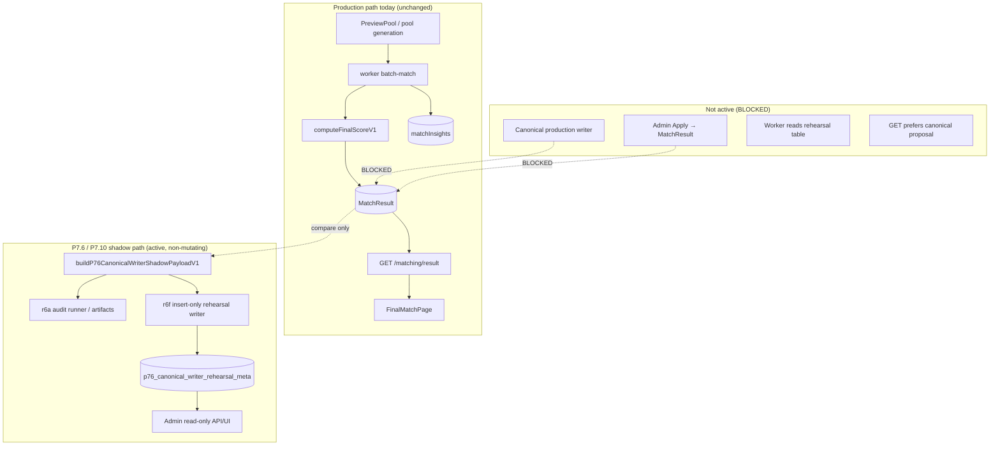

# P7.10-r7 — Canonical Write Readiness Design

## 1. Status

```text
P7_10_R7_CANONICAL_WRITE_READINESS_DESIGN_ONLY
```

说明：

- This is **docs / readiness design only**.
- **No code change.**
- **No Prisma schema change.**
- **No migration.**
- **No DB write.**
- **No MatchResult write.**
- **No matchInsights write.**
- **No worker integration.**
- **No GET behavior change.**
- **No frontend change.**
- **No canonical production write.**
- **No PreviewPool disable.**
- **No legacy removal.**
- **No production / percent rollout.**

---

## 2. Why this design exists

The **P7.10-r6** series completed a local/dev closed loop:

**shadow builder → artifact audit → rehearsal sidecar table → insert-only writer → Admin read-only review.**

The **P7.7-r3** series completed operational review surfaces:

**Admin API → Admin UI → local smoke → dedicated RBAC → Web permission copy alignment.**

That loop proves **compare / rehearsal / read-only insert** safety. It does **not** prove the system is ready to **mutate production match outcomes**.

**Canonical write** is a high-risk phase because it would affect real user-visible matching:

| Surface | Risk if canonical write goes wrong |
|---------|-----------------------------------|
| `MatchResult.candidateUserId` | Wrong displayed / ranked partner |
| `MatchResult.finalScore` | Wrong ordering, analytics drift |
| `matchInsights` provenance | Incorrect explanation of “why this match” |
| Worker `batch-match` output | Wrong winner persisted at source |
| `GET /matching/result` | Wrong API contract for clients |
| FinalMatchPage | Wrong candidate shown to user |
| Legacy PreviewPool writer | Dual-writer race or inconsistent baseline |
| Admin Apply (future) | Irreversible production promotion |

Therefore **P7.10-r7** defines explicit **readiness gates** before any implementation milestone labeled “canonical write,” “production writer,” or “Apply to MatchResult.”

**This document does not authorize implementation.** It defines what must be true first.

---

## 3. Evidence baseline

Evidence from closeouts and artifacts in this workspace (as of 2026-05-18).  
**None of this authorizes canonical production write.**

| Evidence | Status | Key metrics |
|----------|--------|-------------|
| P7.10-r6 shadow builder + unit tests | **PASS** | `appliedToMatchResult` invariant **false** in shadow payload; code: `apps/api/src/modules/matching/p76-canonical-writer-shadow-builder.ts` — [r6 closeout](./P7.10-r6-p76-canonical-writer-shadow-implementation-closeout.md) |
| P7.10-r6a dev audit runner | **PASS** | Read-only Prisma; JSON artifact output — [r6a closeout](./P7.10-r6a-canonical-writer-shadow-dev-audit-runner-closeout.md) |
| P7.10-r6b local DB shadow audit | **PASS** | `totalRows=20`, `eligibleCount=4`, `blockedCount=16`, `wouldChangeCandidateCount=4`, `appliedToMatchResultCount=0` — `artifacts/p76/r6b/`, [r6b closeout](./P7.10-r6b-local-db-canonical-writer-shadow-audit-smoke-closeout.md) |
| P7.10-r6c2a targeted allowlist audit | **PASS** | `sidecarCoverageRate=1.00`, `missingSidecarRate=0.00`, `eligibleCount=4`, `rolled_back=1`, `appliedToMatchResultCount=0` — `artifacts/p76/r6c2a/sidecar-covered-viewer-audit-summary.json` |
| P7.10-r6e1 rehearsal migration | **PASS** | Table `p76_canonical_writer_rehearsal_meta`; CHECK `appliedToMatchResult=false`; CHECK `environment IN ('dev','staging')`; local CHECK probe PASS — [r6e1 closeout](./P7.10-r6e1-rehearsal-sidecar-migration-implementation-closeout.md) |
| P7.10-r6f3 local insert smoke | **PASS** | `insertedCount=5`, `appliedToMatchResultTrueCount=0`, `cleanupDeleted=5`; no MatchResult / matchInsights writes — [r6f3 closeout](./P7.10-r6f3-rehearsal-writer-dev-cli-local-insert-smoke-closeout.md) |
| P7.7-r3.3a manual Admin UI smoke | **PASS** | Rows + detail drawer + export; no write controls; cleanup complete — `artifacts/p76/r3_3a/`, [r3.3a closeout](./P7.7-r3.3a-manual-admin-ui-smoke-completion-closeout.md) |
| P7.7-r3.4 dedicated RBAC | **PASS** | `VIEW_P76_CANONICAL_REHEARSAL` on rehearsal admin API — [r3.4 closeout](./P7.7-r3.4-dedicated-rbac-permission-canonical-rehearsal-closeout.md) |
| P7.7-r3.5 Web permission copy | **PASS** | UI / 403 text aligned to `VIEW_P76_CANONICAL_REHEARSAL` — [r3.5 closeout](./P7.7-r3.5-web-permission-copy-alignment-closeout.md) |

**Interpretation:**

| Proven | Not proven |
|--------|------------|
| Shadow compare logic is test-covered | Production cohort representativeness at scale |
| Rehearsal table insert is gated and reversible locally | Staged write to `MatchResult` is safe |
| Admin can review rehearsal rows read-only | Worker / GET will prefer canonical output correctly |
| `appliedToMatchResult` stays **false** on rehearsal path | PreviewPool can be disabled without regression |
| Sensitive fields stripped in Admin API | Real prod ops reverify complete (`r9e3`) |

---

## 4. Current architecture boundary



| Layer | Current state | Code / doc anchor |
|-------|---------------|-------------------|
| **Active production writer** | `batch-match` + PreviewPool + `computeFinalScoreV1` persists `MatchResult` / `matchInsights` | `apps/worker/src/jobs/batch-match.processor.ts`, `matching-score.ts` |
| **P7.6 allowlist sidecar** | `p76_allowlist_apply_meta`; writer exists for allowlist meta; **not** canonical MatchResult writer | `p76-allowlist-apply-writer.ts`, migration `20260517120000` |
| **P7.10 canonical shadow** | Compare-only payloads; `mode: "shadow"`, `appliedToMatchResult: false` | `p76-canonical-writer-shadow*.ts` |
| **Rehearsal persistence** | Insert-only to `p76_canonical_writer_rehearsal_meta`; env + CHECK enforce non-production | `p76-canonical-writer-rehearsal-writer.ts`, migration `20260518120000` |
| **Admin review** | Read-only; `VIEW_P76_CANONICAL_REHEARSAL`; feature flag `PEIMA_P76_REHEARSAL_ADMIN_ENABLED` | `p76-canonical-rehearsal-admin.controller.ts` |
| **Canonical MatchResult writer** | **not found in this workspace** | Future program per [P7.10-r3](./P7.10-r3-p76-canonical-writer-design.md) |
| **Worker integration** | Worker does **not** read rehearsal table for ranking | No imports of `p76CanonicalWriterRehearsalMeta` in `apps/worker/src` |
| **GET integration** | GET does **not** read rehearsal table for display | [P7.6-r8h](./P7.6-r8h-read-path-display-resolver-design.md) |
| **PreviewPool disable** | **BLOCKED** | [P7.10-r5](./P7.10-r5-legacy-pool-bridge-sunset-plan.md) |
| **Percent rollout** | **BLOCKED** (`r9f`); prod reverify **pending** (`r9e3` = `NEED_MORE_PROD_REVERIFY`) | [P7.6-r9](./P7.6-r9-production-percent-rollout-planning.md), [r9e3](./P7.6-r9e3-real-prod-ops-execution-closeout.md) |

---

## 5. Definition of canonical write

**Canonical write** means any operation that makes the P7.6 canonical proposal **authoritative** for user-visible or worker-visible matching outcomes.

Canonical write includes **one or more** of:

| # | Operation | Example |
|---|-----------|---------|
| 1 | Create / update `MatchResult` from canonical proposal | `prisma.matchResult.update({ candidateUserId, finalScore })` |
| 2 | Set `MatchResult.candidateUserId` from P7.6 canonical selected candidate | Promote `proposedCandidateUserId` → live column |
| 3 | Write `finalScore` / canonical score projection | Overwrite worker-computed score with canonical score |
| 4 | Write `matchInsights.p76CanonicalWriter` (or equivalent provenance block) | New JSON branch consumed by clients |
| 5 | Change worker winner / ranking output | batch-match selects canonical path as source of truth |
| 6 | Make `GET /matching/result` prefer P7.6 canonical result | Resolver returns canonical candidate when flag on |
| 7 | Change FinalMatchPage displayed candidate because of canonical writer | UI shows proposal, not baseline |
| 8 | Admin **Apply** that mutates `MatchResult` | Button triggers production promotion |

**Out of scope until all readiness gates in §6 pass:**

- Any row in the table above
- Relaxing CHECK `appliedToMatchResult=false` on rehearsal table for “production rehearsal” without a separate audited table
- Setting `appliedToMatchResult=true` on allowlist sidecar as a backdoor to main chain

**Still in scope today (not canonical write):**

- Shadow builder (memory / artifact)
- Rehearsal insert (`appliedToMatchResult=false`, `environment=dev|staging`)
- Admin read-only list / aggregate / detail
- Client-side JSON export from Admin UI

---

## 6. Readiness gates

| # | Gate | Required state | Current status |
|---|------|----------------|----------------|
| 1 | Shadow builder PASS | Unit tests + invariants (`mode=shadow`, `appliedToMatchResult=false`) | **PASS** |
| 2 | Repeated artifact audit PASS | r6a runner + artifact safety scripts | **PASS** |
| 3 | Targeted sidecar coverage PASS | Allowlist cohort `sidecarCoverageRate=1.00`, `missingSidecarRate=0.00` | **PASS** (n=5 cohort) |
| 4 | Rehearsal migration PASS | Table + CHECK constraints deployed locally | **PASS** (local/dev) |
| 5 | Insert-only local writer PASS | r6f3 insert + verify + cleanup; no MatchResult writes | **PASS** |
| 6 | Admin read-only API/UI PASS | r3.1–r3.2 implemented | **PASS** |
| 7 | Dedicated RBAC PASS | `VIEW_P76_CANONICAL_REHEARSAL` | **PASS** |
| 8 | P7.7 local smoke PASS | r3.3 / r3.3a automation + browser smoke | **PASS** |
| 9 | MatchResult no-mutation verification PASS | Insert/review paths proven not to touch `MatchResult` | **PASS** (local) |
| 10 | `appliedToMatchResultCount` remains 0 | Audits + DB CHECK on rehearsal table | **PASS** |
| 11 | Sensitive payload checks PASS | Admin sanitize + rehearsal privacy strip | **PASS** |
| 12 | r9e3 real prod reverify resolved | Prod RDS/pod/GET/monitoring evidence | **BLOCKED** — `NEED_MORE_PROD_REVERIFY` |
| 13 | Production/staging environment clarified | Single owner for where canonical write may run | **PENDING** |
| 14 | Rollback plan for MatchResult writes | Token + snapshot + runbook tested | **BLOCKED** |
| 15 | Canonical score strategy finalized | How `finalScore` is computed / merged with worker | **PENDING** — see [P7.10-r3](./P7.10-r3-p76-canonical-writer-design.md) |
| 16 | PM/Ops signoff | Written approval for cohort + blast radius | **PENDING** |
| 17 | PreviewPool disable plan | Sunset order + fallback — [r5](./P7.10-r5-legacy-pool-bridge-sunset-plan.md) | **BLOCKED** |
| 18 | GET / resultState compatibility plan | Safe fallback + contract tests at scale | **PARTIAL** — [P7.7-r1](./P7.7-r1-result-state-safe-fallback-negative-regression-closeout.md), r9b smoke |
| 19 | Monitoring / alerting plan | Dashboards for wrong-candidate / score drift / apply errors | **PENDING** |
| 20 | Staged cohort plan | Allowlist-only → expanded cohort → percent | **BLOCKED** — `r9f` blocked |

**Summary:** Gates **1–11 PASS** (local/dev rehearsal lane). Gates **12–20 BLOCKED / PENDING** (production readiness).

**Gate to enter any canonical-write implementation milestone:** **1–11 remain PASS** and **12–20 have explicit PASS closeouts** (no “TBD” on rollback or monitoring).

---

## 7. Required canonical write contract (design only)

Future production writer must emit an auditable payload **before** mutating `MatchResult`.  
**Not implemented in this workspace.**

```ts
type P76CanonicalWritePayloadV1 = {
  schemaVersion: 1;
  sourceType: "p76_canonical_writer";
  sourceVersion: string; // e.g. "p7.10-r8-canonical-write-v1"
  pipelineVersion: string;
  mode: "allowlist_write" | "staged_write";
  appliedToMatchResult: true; // only true on canonical WRITE path, never on rehearsal table

  target: {
    matchResultId: string;
    viewerUserId: string;
    previousCandidateUserId: string;
    newCandidateUserId: string;
    previousFinalScore: number | null;
    newFinalScore: number | null;
  };

  provenance: {
    rehearsalMetaId: string;
    auditRunId: string;
    allowlistApplyMetaId?: string | null;
    approvedBy?: string | null; // operator user id
    approvedAt?: string | null; // ISO-8601
  };

  rollback: {
    rollbackToken: string;
    previousSnapshotHash: string; // hash of { candidateUserId, finalScore, matchInsights slice }
  };

  guardrails: {
    eligible: boolean;
    reason: "ok" | "rolled_back" | "missing_sidecar" | string;
  };
};
```

**Contract rules (normative for future implementation):**

| Rule | Requirement |
|------|-------------|
| C1 | `appliedToMatchResult: true` only on canonical **write** payload, never on rehearsal row |
| C2 | Rehearsal table CHECK stays `appliedToMatchResult=false` until separate architecture review |
| C3 | Write must be **idempotent** per `(matchResultId, sourceVersion, pipelineVersion)` or use explicit version column |
| C4 | `rollbackToken` must map to restorable snapshot (DB row or object store) |
| C5 | `approvedBy` / `approvedAt` required for `mode: "allowlist_write"` |
| C6 | Privacy: no raw prompts, image URLs, or PII in persisted write payload |
| C7 | Fail-closed if `guardrails.eligible !== true` or `reason !== "ok"` |

---

## 8. Proposed phases (after gates 12–20 PASS)

Design-only sequencing. **No milestone authorized by this doc.**

| Phase | Name | Writes | Read path | Status |
|-------|------|--------|-----------|--------|
| **0** | Shadow + audit (r6/r6a/r6b) | None | Baseline | **DONE** |
| **1** | Rehearsal table insert (r6e/r6f) | Rehearsal meta only | Ignored | **DONE** (local) |
| **2** | Admin read-only (r3) | None | Admin only | **DONE** |
| **3** | Staged canonical write (allowlist cohort) | `MatchResult` + provenance | Still baseline GET until flag | **BLOCKED** |
| **4** | GET / worker integration | N/A | Canonical when flag on | **BLOCKED** |
| **5** | PreviewPool disable + legacy removal | N/A | Canonical only | **BLOCKED** |
| **6** | Percent rollout | N/A | Gradual | **BLOCKED** (`r9f`) |

Phase **3** must not start until §6 gates **12–20** are green.

---

## 9. Environment and flag gates (future canonical write)

When implementation begins, require **all** of:

| Gate | Purpose |
|------|---------|
| `PEIMA_P76_CANONICAL_WRITE_ENABLED=0` default | Fail-closed globally |
| `PEIMA_P76_CANONICAL_WRITE_KILL_SWITCH=1` default | Emergency stop |
| `NODE_ENV=production` + missing allowlist → throw | No silent prod enable |
| Separate permission e.g. `APPLY_P76_CANONICAL_WRITE` | Not `VIEW_P76_CANONICAL_REHEARSAL` |
| Cohort allowlist env (`sourceVersion` / viewer list) | Blast radius cap |
| Audit run id + rehearsal meta id required on every write | Traceability |

Rehearsal writer env (`PEIMA_P76_REHEARSAL_SIDECAR_WRITER_*`) must remain **independent** from canonical write env.

---

## 10. Rollback requirements (design)

Before first canonical write in any environment:

1. **Snapshot** `candidateUserId`, `finalScore`, relevant `matchInsights` JSON before update.
2. **Rollback command** restores snapshot by `rollbackToken` (script or Admin-only tool).
3. **Drill** on staging with at least one allowlist viewer (documented in closeout).
4. **Monitoring** alert if rollback executed or if canonical write error rate &gt; threshold.

Rehearsal cleanup (`deleteMany` by `auditRunId`) is **not** sufficient for MatchResult rollback.

---

## 11. Relationship to existing designs

| Doc | Relationship |
|-----|----------------|
| [P7.10-r3](./P7.10-r3-p76-canonical-writer-design.md) | Production writer phases; r7 gates must PASS before r3 Phase 3+ |
| [P7.10-r6c](./P7.10-r6c-canonical-writer-dual-write-rehearsal-design.md) | Dual-write **rehearsal** (non-MatchResult); largely superseded by r6d/r6f implementation |
| [P7.10-r6d / r6e / r6f](./P7.10-r6d-dedicated-rehearsal-sidecar-schema-design.md) | Implemented rehearsal lane |
| [P7.7-r3](./P7.7-r3-admin-readonly-rehearsal-review-design.md) | Admin review; Apply explicitly deferred |
| [P7.6-r8h](./P7.6-r8h-read-path-display-resolver-design.md) | GET must not read rehearsal without explicit gate |
| [P7.6-r9e3](./P7.6-r9e3-real-prod-ops-execution-closeout.md) | Prod reverify blocker |
| [P7.10-r5](./P7.10-r5-legacy-pool-bridge-sunset-plan.md) | PreviewPool disable after canonical write proven |

---

## 12. PASS / BLOCK

### PASS (readiness design complete)

- Readiness gates documented with current status
- Canonical write definition bounded
- Future write payload contract sketched
- Evidence baseline tied to real artifacts
- Architecture boundary reflects codebase search

### BLOCK (canonical write still forbidden)

| Item | Reason |
|------|--------|
| Canonical production write | Gates 12–20 not satisfied |
| Apply endpoint | No Admin write API |
| Worker integration | No worker reads rehearsal |
| GET integration | GET still baseline / safe-fallback |
| PreviewPool disable | Legacy writer still canonical |
| Legacy removal | [P7.10-r1](./P7.10-r1-legacy-photo-matching-dependency-audit-and-replacement-strategy.md) |
| Production / percent | `r9e3` = `NEED_MORE_PROD_REVERIFY`; `r9f` blocked |

---

## 13. Next recommended steps

| Option | Milestone | Type |
|--------|-----------|------|
| **A** | Resolve **P7.6-r9e3** real prod reverify | Ops / evidence |
| **B** | **P7.10-r6f4** stable local rehearsal seed for Ops demos | Local-only insert without immediate cleanup |
| **C** | **P7.10-r8** canonical write implementation design (narrow) | Docs — writer module boundaries + Prisma surface allowlist |
| **D** | **P7.10-r3** Phase 3 implementation | Code — **only after** r7 gates 12–20 PASS |

**Recommendation:** **Option A** first (prod reverify), then **Option B** for Ops/PM review cadence, then **Option C** before any **Option D** code.

---

## 14. References (workspace)

| Resource | Path |
|----------|------|
| r6c2a targeted audit | `artifacts/p76/r6c2a/canonical-writer-shadow-audit-targeted.json` |
| r6b audit | `artifacts/p76/r6b/canonical-writer-shadow-audit.json` |
| r6f3 smoke | `artifacts/p76/r6f3/rehearsal-writer-insert-smoke-summary.json` |
| r3.3a UI smoke | `artifacts/p76/r3_3a/admin-rehearsal-ui-manual-smoke-summary.json` |
| Shadow builder | `apps/api/src/modules/matching/p76-canonical-writer-shadow-builder.ts` |
| Rehearsal writer | `apps/api/src/modules/matching/p76-canonical-writer-rehearsal-writer.ts` |
| Rehearsal admin API | `apps/api/src/modules/matching/p76-canonical-rehearsal-admin.controller.ts` |
| Worker scoring | `apps/worker/src/jobs/batch-match.processor.ts`, `matching-score.ts` |
| Rehearsal migration | `packages/database/prisma/migrations/20260518120000_p76_canonical_writer_rehearsal_meta/` |
