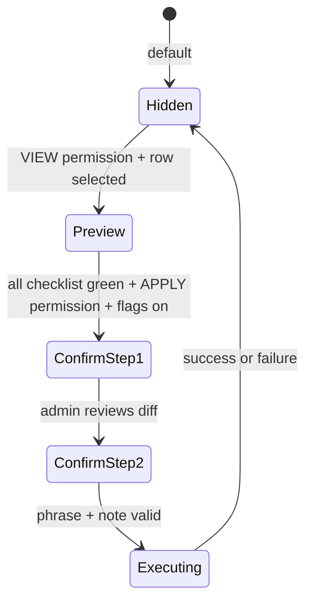

# P7.10-r7b — Admin Apply Canonical Write Design

> **状态**：**P7.10-r7b Admin Apply canonical write design**  
> **结论**：**`P7_10_R7B_ADMIN_APPLY_CANONICAL_WRITE_DESIGN_ONLY`**  
> **前置**：[P7.10-r7](./P7.10-r7-canonical-write-readiness-design.md) · [P7.7-r3](./P7.7-r3-admin-readonly-rehearsal-review-design.md) · [P7.6-r9e3a](./P7.6-r9e3a-real-prod-reverify-evidence-attempt-closeout.md) · [P7.6-r9e3b](./P7.6-r9e3b-real-prod-reverify-access-package-and-ops-handoff.md)  
> **性质**：docs / design only — **无**代码 · **无** Apply 实现 · **无** MatchResult write

---

## 1. Status

```text
P7_10_R7B_ADMIN_APPLY_CANONICAL_WRITE_DESIGN_ONLY
```

**Scope confirmation（本轮未做）：**

- Docs only
- No code change
- No Admin Apply implementation
- No MatchResult write
- No worker / GET integration
- No production / staging smoke
- No percent
- No PreviewPool disable
- No legacy removal
- **No r9e3c** execution in this milestone

---

## 2. Why this design exists

[P7.7-r3](./P7.7-r3-admin-readonly-rehearsal-review-design.md) delivered **read-only** rehearsal review:

- `GET /admin/p76/canonical-rehearsal` (+ aggregate, `:id`)
- Web page `/admin/p76/canonical-rehearsal` with list, detail drawer, export
- Permission `VIEW_P76_CANONICAL_REHEARSAL`
- **No Apply button** — explicitly deferred

[P7.10-r6](./P7.10-r6-p76-canonical-writer-shadow-implementation-closeout.md)–[r6f3](./P7.10-r6f3-rehearsal-writer-dev-cli-local-insert-smoke-closeout.md) proved **shadow compare + rehearsal insert** with `appliedToMatchResult=false` on `p76_canonical_writer_rehearsal_meta`.

[P7.10-r7](./P7.10-r7-canonical-write-readiness-design.md) gates **1–11 PASS** (local rehearsal lane); gates **12–20 BLOCKED** (production readiness). **r9e3** remains **`NEED_MORE_PROD_REVERIFY`**.

**Gap:** PM/Ops can *see* a proposal but cannot *promote* it. Before any **Apply** code ships, engineering must design:

| Question | r7b answer location |
|----------|---------------------|
| Who may Apply? | §4 permissions |
| When may Apply? | §3 blockers, §7 preconditions |
| What diff is shown? | §5 UX |
| How is human error prevented? | §6 two-step confirmation |
| How is rollback possible? | §9 rollback UX |
| What is audited? | §11 audit log |
| What is monitored post-Apply? | §12 monitoring |
| What is never allowed? | §10 forbidden |

**This document does not authorize Apply implementation or production write.**

---

## 3. Apply remains blocked

**Admin Apply → `MatchResult` remains BLOCKED** until **all** of the following have explicit PASS closeouts:

| # | Prerequisite | Owner | Notes |
|---|--------------|-------|-------|
| 1 | **P7.10-r7a** dry-run canonical write payload builder | Eng | Code allowed; **no DB write** |
| 2 | Rollback snapshot + `rollbackToken` storage design implemented and drilled | Eng + Ops | [P7.10-r7 §10](./P7.10-r7-canonical-write-readiness-design.md) |
| 3 | Local allowlist write smoke (MatchResult mutation in **dev only**) | Eng | Phase 4 in §13 |
| 4 | Rollback smoke restores baseline | Eng | Phase 5 |
| 5 | **P7.6-r9e3c** prod/staging-prod-like read-only evidence (or approved staging-like label) | Ops | [r9e3b access package](./P7.6-r9e3b-real-prod-reverify-access-package-and-ops-handoff.md) |
| 6 | PM/Ops written signoff for cohort + blast radius | PM/Ops | Per viewer / `sourceVersion` |
| 7 | Monitoring + kill switch ready | Ops | Grafana P0 routes |
| 8 | [P7.10-r7](./P7.10-r7-canonical-write-readiness-design.md) gates **12–20** PASS | Program | No partial prod Apply |

**Environment rule:**

| r9e3 state | Apply allowed environment |
|------------|---------------------------|
| `NEED_MORE_PROD_REVERIFY` | **local/dev only** (if gates 1–4 PASS) |
| `REVERIFY_EVIDENCE_COLLECTED_PENDING_PM_OPS_REVIEW` | staging-prod-like **proposal** only — still no customer prod without gate 12 PASS |
| Gate 12 PASS + PM signoff | allowlist cohort production **proposal** — separate milestone |

**Still blocked regardless of r7b:**

- Canonical production write at scale
- Worker integration
- GET prefers canonical proposal
- PreviewPool disable
- Percent rollout (`r9f`)
- Legacy removal

---

## 4. Future permission model

### 4.1 Current (implemented)

| Permission | Scope |
|------------|-------|
| `VIEW_P76_CANONICAL_REHEARSAL` | List / aggregate / detail rehearsal rows; export JSON |

Feature flag: `PEIMA_P76_REHEARSAL_ADMIN_ENABLED` (read path).

### 4.2 Future (design only — **not implemented**)

| Permission | Scope | Must not imply |
|------------|-------|----------------|
| `APPLY_P76_CANONICAL_REHEARSAL` | `POST` Apply one rehearsal row → `MatchResult` | View-only access |
| `ROLLBACK_P76_CANONICAL_WRITE` | `POST` rollback by `rollbackToken` | Apply permission |

**RBAC rules (normative):**

| Rule | Requirement |
|------|-------------|
| R1 | `VIEW_*` alone **cannot** call Apply or Rollback |
| R2 | Apply and Rollback are **separate** permissions (separation of duties) |
| R3 | Prefer different operators for Apply vs Rollback in production |
| R4 | Future env `PEIMA_P76_CANONICAL_WRITE_ENABLED=0` default; kill switch `PEIMA_P76_CANONICAL_WRITE_KILL_SWITCH=1` default ([r7 §9](./P7.10-r7-canonical-write-readiness-design.md)) |

**Implementation note:** Add constants in `packages/shared/constants/p5-rbac.ts` only in a future code milestone — **not** in r7b.

---

## 5. Apply UX design

Extend the existing Admin rehearsal detail experience (`P76CanonicalRehearsalPage` pattern). **Apply controls default hidden.**

### 5.1 Detail panel — required fields (read before Apply)

Map from rehearsal row + live baseline fetch (read-only API):

| UI section | Field | Source |
|------------|-------|--------|
| Baseline | `baseline.candidateUserId` | Shadow / `MatchResult` snapshot |
| Proposed | `proposal.selectedCandidateUserId` | Shadow |
| Change | `comparison.wouldChangeCandidate` | Shadow |
| Scores | `baseline.finalScore` → `proposal.score` | Shadow |
| Band | `comparison.scoreDeltaBand` | `none` \| `small` \| `medium` \| `large` |
| Guardrail | `guardrails.reason` (display as **guardrailReason**) | Must show `ok` for Apply |
| Eligible | `guardrails.eligible` | Boolean badge |
| Version | `sourceVersion`, `pipelineVersion` | Row + shadow |
| Trace | `auditRunId`, `rehearsalMetaId` | Row ids |
| Rollback preview | Restorable `candidateUserId`, `finalScore`, snapshot hash | From dry-run builder (r7a) |
| Safety checklist | See §5.2 | All green required |

**Candidate change display example (no PII expansion):**

```text
Baseline:  <viewer-safe id prefix>… → Proposed: <prefix>…
Score:     0.72 → 0.75 (band: small)
Guardrail: ok · Eligible: yes
```

### 5.2 Safety checklist (all must be green to reveal Apply)

| Check | Pass condition |
|-------|----------------|
| Rehearsal row valid | exists, not deleted, not superseded |
| Rehearsal invariant | `appliedToMatchResult === false` |
| Guardrail | `eligible === true` && `guardrailReason === "ok"` |
| Proposal | `proposedCandidateUserId` non-null |
| Baseline match | Live `MatchResult` matches `previousSnapshotHash` |
| Read path | `resultState === "ready"` (not `safe_fallback` / `matching_pending`) |
| Kill switch | `PEIMA_P76_CANONICAL_WRITE_KILL_SWITCH` off (0) |
| Global write flag | `PEIMA_P76_CANONICAL_WRITE_ENABLED=1` (explicit opt-in) |
| Signoff | PM + Ops signoff refs present for `sourceVersion` |
| Rollback | `rollbackToken` generated and persisted (dry-run proves) |
| Environment | Matches approved tier (dev / staging-like / prod allowlist) |
| r9e3 | If **production**: gate 12 PASS; else Apply button **hidden** |

### 5.3 Apply button visibility



| State | Apply button |
|-------|--------------|
| Default | **Hidden** (not disabled — hidden) |
| Checklist incomplete | Hidden + banner: which gate failed |
| Read-only viewer | Hidden |
| Staging/prod without r9e3 | Hidden + link to r9e3b checklist |

**No batch Apply UI.** One row, one explicit flow.

---

## 6. Two-step confirmation

### Step 1 — Preview diff

Modal or drawer section showing:

- Side-by-side baseline vs proposed (candidate + score)
- `scoreDeltaBand`, `guardrailReason`
- `rollbackToken` (masked: show last 4 chars + copy for Ops ticket only — **not** in client export JSON)
- Warning banner: *This will mutate MatchResult. Worker and GET are unchanged until separate gates.*

Admin must click **Continue to confirmation** (no mutation yet).

### Step 2 — Typed confirmation + note

| Field | Rule |
|-------|------|
| Confirmation phrase | Exact: `APPLY P76 CANONICAL WRITE` (case-sensitive) |
| Admin note | Required, min length 20 chars; stored in audit log |
| Cohort ack | Checkbox: “I confirm viewer is in approved allowlist cohort for `sourceVersion`” |

**Submit disabled until:** phrase exact match + note non-empty + checkbox checked.

**API (future):** `POST /admin/p76/canonical-rehearsal/:id/apply` with body `{ confirmationPhrase, adminNote, expectedSnapshotHash }` — **not implemented in r7b**.

---

## 7. Apply preconditions

Server-side gate (future Apply service) must evaluate **all**; any failure → `409` / `422` with reason code.

| # | Precondition | Failure code (suggested) |
|---|--------------|--------------------------|
| 1 | Rehearsal row exists | `rehearsal_not_found` |
| 2 | `deletedAt` null | `rehearsal_deleted` |
| 3 | `supersededAt` null | `rehearsal_superseded` |
| 4 | `appliedToMatchResult === false` | `already_applied` |
| 5 | `eligible === true` | `not_eligible` |
| 6 | `guardrailReason === "ok"` | `guardrail_blocked` |
| 7 | `proposal.selectedCandidateUserId` present | `missing_proposal` |
| 8 | Baseline `MatchResult` matches `previousSnapshotHash` | `baseline_stale` |
| 9 | `resultState === "ready"` for viewer | `result_not_ready` |
| 10 | Safe fallback not active on read path | `safe_fallback_active` |
| 11 | `PEIMA_P76_CANONICAL_WRITE_KILL_SWITCH` off | `kill_switch_on` |
| 12 | `PEIMA_P76_CANONICAL_WRITE_ENABLED=1` | `canonical_write_disabled` |
| 13 | PM/Ops signoff record exists for `sourceVersion` | `signoff_missing` |
| 14 | `rollbackToken` generated and snapshot stored | `rollback_not_ready` |
| 15 | Operator has `APPLY_P76_CANONICAL_REHEARSAL` | `forbidden` |
| 16 | Environment tier allowed | `environment_blocked` |
| 17 | r9e3: production requires gate 12 PASS | `prod_reverify_blocked` |

**Re-read before write:** Preconditions 8–10 must be re-fetched inside a transaction immediately before `UPDATE MatchResult`.

---

## 8. Apply payload preview

Future writer emits **`P76CanonicalWritePayloadV1`** (extends [P7.10-r7 §7](./P7.10-r7-canonical-write-readiness-design.md)) immediately before mutation.

```ts
type P76CanonicalWritePayloadV1 = {
  schemaVersion: 1;
  sourceType: "p76_canonical_writer";
  sourceVersion: string;
  pipelineVersion: string;
  mode: "allowlist_write"; // first production mode
  appliedToMatchResult: true; // only on this path

  matchResultId: string;
  viewerUserId: string;
  previousCandidateUserId: string;
  newCandidateUserId: string;
  previousFinalScore: number | null;
  newFinalScore: number | null;

  rehearsalMetaId: string;
  auditRunId: string;
  rollbackToken: string;
  previousSnapshotHash: string;

  adminUserId: string;
  adminNote: string;
  approvedAt: string; // ISO-8601

  guardrails: {
    eligible: true;
    reason: "ok";
  };

  pmSignoffRef?: string;
  opsSignoffRef?: string;
};
```

**Dry-run (r7a):** Same shape with `mode: "dry_run"` and `appliedToMatchResult: false` written to artifact JSON only — **no Prisma `matchResult.update`**.

| Field | Purpose |
|-------|---------|
| `previousSnapshotHash` | Detect baseline drift between review and Apply |
| `rollbackToken` | Idempotent rollback key |
| `rehearsalMetaId` / `auditRunId` | Traceability to shadow audit |
| `adminUserId` / `adminNote` | Human accountability |

**Privacy:** No raw prompts, image URLs, or full phone/email in payload ([r6 privacy strip](./P7.10-r6f1-rehearsal-writer-dry-run-implementation-closeout.md)).

---

## 9. Rollback UX

Separate Admin surface or detail sub-panel: **Rollback canonical write** (not rehearsal delete).

### 9.1 Permission

`ROLLBACK_P76_CANONICAL_WRITE` only.

### 9.2 Display

| Field | Source |
|-------|--------|
| `rollbackToken` | Apply audit record |
| Previous snapshot | `candidateUserId`, `finalScore`, provenance slice |
| Applied at | timestamp + `adminUserId` |
| Current live row | read-only fetch — highlight drift if differs |

### 9.3 Confirmation

| Field | Rule |
|-------|------|
| Phrase | Exact: `ROLLBACK P76 CANONICAL WRITE` |
| Admin note | Required |

### 9.4 Behavior (design)

| Rule | Requirement |
|------|-------------|
| Idempotent | Second rollback with same token → no-op success |
| Scope | Restore snapshot only; do not delete rehearsal row |
| Side effects | **No** worker trigger; **no** PreviewPool disable |
| Rehearsal meta | Set `rolledBackAt` / link on apply meta table (future) — not `appliedToMatchResult=true` on rehearsal table |

**Future API:** `POST /admin/p76/canonical-write/rollback` with `{ rollbackToken, confirmationPhrase, adminNote }`.

---

## 10. Explicitly forbidden actions

| Forbidden | Rationale |
|-----------|-----------|
| Batch apply (multi-select) | Blast radius; no UI or API |
| Percent apply | Use `r9f` program — separate gate |
| Worker / batch-match trigger on Apply | Worker integration gate blocked |
| PreviewPool disable on Apply | [P7.10-r5](./P7.10-r5-legacy-pool-bridge-sunset-plan.md) |
| Manual `finalScore` edit field | Score must come from canonical pipeline only |
| Manual candidate override text box | Must match shadow proposal |
| Apply when `guardrailReason !== "ok"` | Fail-closed |
| Apply when safe fallback active | User sees baseline; write would surprise |
| Apply when rehearsal `appliedToMatchResult=true` on rehearsal table | CHECK violation |
| Apply when row superseded / deleted | Stale proposal |
| Production Apply when r9e3 unresolved | [r9e3a](./P7.6-r9e3a-real-prod-reverify-evidence-attempt-closeout.md) |
| Apply without `adminNote` | Audit requirement |
| Apply without rollback snapshot | [r7 gate 14](./P7.10-r7-canonical-write-readiness-design.md) |
| Relax rehearsal CHECK to allow `appliedToMatchResult=true` on rehearsal table | Use separate apply meta / audit table |
| GET / worker flag flip in same release as first Apply | Integration gates separate |

---

## 11. Audit log design

Future **`p76_canonical_write_audit_log`** table (or append-only event store) — **not implemented in r7b**.

| Column / field | Required |
|----------------|----------|
| `id` | UUID |
| `action` | `apply` \| `rollback` \| `apply_failed` |
| `adminUserId` | Operator |
| `adminNote` | From confirmation step |
| `timestamp` | ISO-8601 UTC |
| `environment` | `dev` \| `staging` \| `production` |
| `matchResultId` | Target |
| `viewerUserId` | Redacted in exports if needed |
| `previousSnapshot` | JSON: candidate, score, hash |
| `newTarget` | JSON post-apply |
| `rollbackToken` | Unique index |
| `sourceVersion` | Freeze reference |
| `auditRunId` | Shadow audit link |
| `rehearsalMetaId` | Rehearsal row link |
| `pmSignoffRef` | Ticket / doc id |
| `opsSignoffRef` | Ticket / doc id |
| `payloadHash` | SHA-256 of `P76CanonicalWritePayloadV1` |
| `httpRequestId` | Trace |

**Retention:** ≥ 1 year for production; export for PM audit.

**Admin UI:** Read-only audit timeline (future); r7b scope is schema design only.

---

## 12. Monitoring

Post-Apply monitoring (Ops) — aligns with [P7.6-r9e2](./P7.6-r9e2-real-prod-ops-execution-runbook.md) dashboards.

| Signal | Alert if |
|--------|----------|
| `GET /matching/result` candidate | Mismatch vs applied `newCandidateUserId` when canonical read path off (sanity) |
| `resultState` | Unexpected `safe_fallback` spike after Apply window |
| `safeFallback` count | &gt; 0 for allowlist viewers post-Apply |
| Rollback executed | Any `rollback` audit event (P1) |
| `rollbackToken` missing | Apply without token (P0) |
| Unexpected prod Apply | Apply in prod when `PEIMA_P76_CANONICAL_WRITE_ENABLED=0` (P0) |
| `appliedToMatchResult` on rehearsal table | DB CHECK violation (P0) |
| Score drift | `finalScore` ≠ proposal beyond band (P1) |

**Watch window:** 30–60 min after first prod Apply in a cohort ([r9e2 template](../../artifacts/p76/r9e2/prod-monitoring-watch-template.md)).

**Kill switch:** `PEIMA_P76_CANONICAL_WRITE_KILL_SWITCH=1` blocks new Apply; does not auto-rollback — operator uses Rollback UX.

---

## 13. Implementation phases

| Phase | Milestone | Writes | Status |
|-------|-----------|--------|--------|
| **0** | **r7b** Admin Apply design (this doc) | None | **DONE** (design only) |
| **1** | **r7a** dry-run canonical payload builder | Artifact JSON only | **BLOCKED** until r7b accepted |
| **2** | Apply API design + OpenAPI | None | **BLOCKED** |
| **3** | Hidden Apply UI behind `PEIMA_P76_CANONICAL_APPLY_UI_ENABLED=0` | None until flag | **BLOCKED** |
| **4** | **r7c** local allowlist write smoke (dev DB) | `MatchResult` dev only | **BLOCKED** |
| **5** | Rollback smoke | Restore dev snapshot | **BLOCKED** |
| **6** | Staging-prod-like smoke | After r9e3c evidence | **BLOCKED** |
| **7** | PM/Ops signoff | Docs | **PENDING** |
| **8** | Production allowlist proposal | Cohort Apply | **BLOCKED** (r9e3 + gates 12–20) |

**Dependency graph:**

```text
r7b (design) → r7a (dry-run) → API design → UI (hidden) → r7c local write → rollback smoke
                                                                    ↓
                                              r9e3c (read-only) → signoff → prod proposal
```

**Do not parallelize prod Apply with r9e3c.** Read-only reverify first.

---

## 14. PASS / BLOCK

### PASS (r7b design complete)

- Apply UX designed (§5–§6)
- Permission model designed (§4)
- Preconditions documented (§7)
- Rollback UX designed (§9)
- Audit log designed (§11)
- Monitoring designed (§12)
- Forbidden actions enumerated (§10)
- Phases sequenced (§13)

### BLOCK (unchanged)

| Item | Status |
|------|--------|
| Admin Apply implementation | **BLOCKED** |
| Apply API endpoint | **BLOCKED** |
| MatchResult write | **BLOCKED** |
| Worker integration | **BLOCKED** |
| GET integration | **BLOCKED** |
| Production / staging smoke (r9e3c) | **BLOCKED** — access pending |
| Percent rollout | **BLOCKED** |
| PreviewPool disable | **BLOCKED** |
| Legacy removal | **BLOCKED** |
| Canonical production write | **BLOCKED** |

---

## 15. Next recommended step

| Option | Milestone | When |
|--------|-----------|------|
| **A (recommended)** | **P7.10-r7a** — Canonical write dry-run payload builder | **Now** — code allowed, no DB write; builds `P76CanonicalWritePayloadV1` artifacts from rehearsal rows |
| **B** | **P7.10-r7c** — [Admin Apply canonical promotion API design](./P7.10-r7c-admin-apply-canonical-promotion-api-design.md) | **DONE** (design only) |
| **B2** | **P7.10-r7e** (proposed) — Local allowlist write smoke | **Later** — after r7a + r7d API implementation |
| **C** | **P7.6-r9e3c** — Read-only prod/staging smoke | **Only when** [r9e3b checklist](../../artifacts/p76/r9e3b/prod-reverify-access-checklist.md) GO |

**Recommendation:** **Option A (r7a)** first. **Do not start r9e3c** unless Ops has delivered access per r9e3b. **Do not start r7c** before r7a dry-run and rollback snapshot design are implemented.

---

## References

| Resource | Path |
|----------|------|
| Readiness gates | [P7.10-r7](./P7.10-r7-canonical-write-readiness-design.md) |
| Admin read-only | [P7.7-r3](./P7.7-r3-admin-readonly-rehearsal-review-design.md) |
| Shadow types | `apps/api/src/modules/matching/p76-canonical-writer-shadow.types.ts` |
| Rehearsal admin | `apps/api/src/modules/matching/p76-canonical-rehearsal-admin.controller.ts` |
| Web page | `apps/web/src/pages/P76CanonicalRehearsalPage.jsx` |
| r9e3 access | [P7.6-r9e3b](./P7.6-r9e3b-real-prod-reverify-access-package-and-ops-handoff.md) |
| Canonical writer program | [P7.10-r3](./P7.10-r3-p76-canonical-writer-design.md) |
| Promotion API design (r7c) | [P7.10-r7c](./P7.10-r7c-admin-apply-canonical-promotion-api-design.md) |
