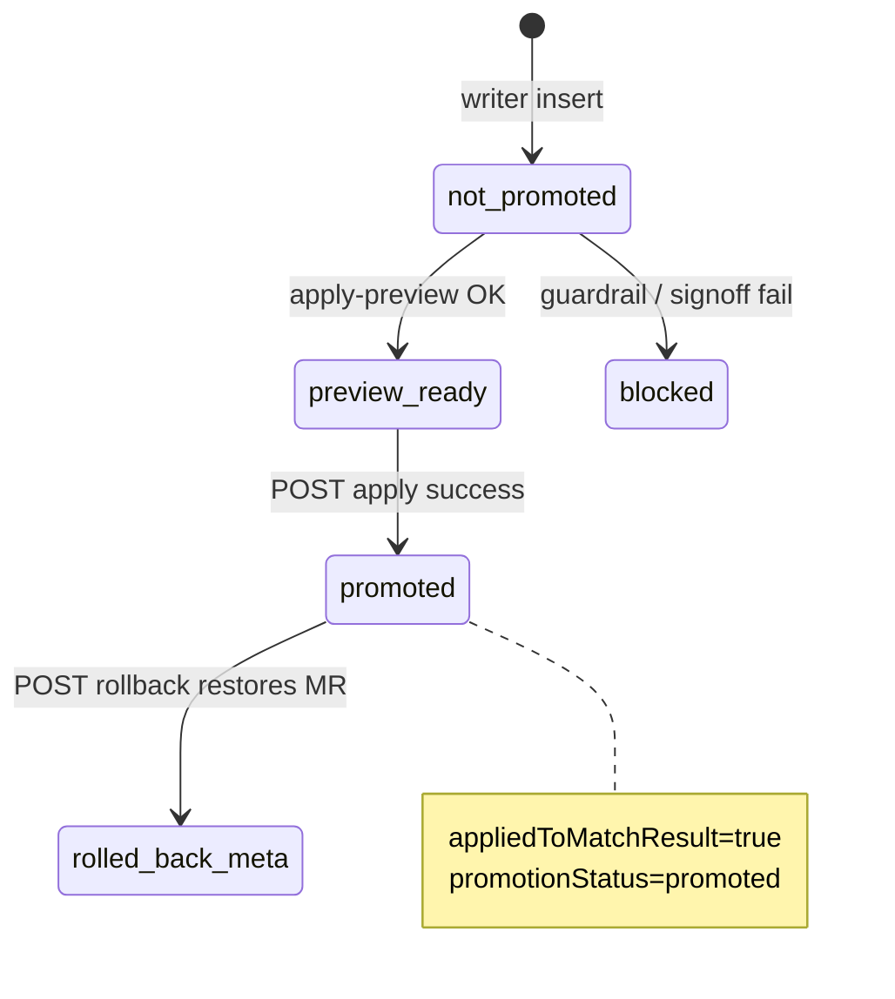

# P7.10-r7c — Admin Apply / Canonical Promotion API Design

> **状态**：P7.10-r7c Admin Apply / canonical promotion API design  
> **结论**：**`P7_10_R7C_ADMIN_APPLY_CANONICAL_PROMOTION_API_DESIGN_ONLY`**  
> **前置**：[P7.10-r7b](./P7.10-r7b-admin-apply-canonical-write-design.md) · [P7.10-r7](./P7.10-r7-canonical-write-readiness-design.md) · [P7.10-r3e](./P7.10-r3e-canonical-match-result-sidecar-migration-implementation-closeout.md) / [r3f3](./P7.10-r3f3-canonical-match-result-sidecar-writer-local-insert-smoke-closeout.md) · [P7.7-r4.1](./P7.7-r4.1-canonical-sidecar-admin-readonly-api-implementation-closeout.md) / [r4.3](./P7.7-r4.3-canonical-sidecar-admin-ui-implementation-closeout.md) · [P7.6-r9e3g](./P7.6-r9e3g-staging-ops-evidence-rollup-and-gate12-review.md) · [r9e3f2](./P7.6-r9e3f2-grafana-physical-import-and-test-alert-evidence-closeout.md)  
> **性质**：docs only · **不实现** API · **不写** DB · **不改** `MatchResult` · **不启** percent · **非** production rollout

---

## 1. Status

```text
P7_10_R7C_ADMIN_APPLY_CANONICAL_PROMOTION_API_DESIGN_ONLY
```

**Scope confirmation（本轮未做）：**

- Docs only — **no** Nest routes · **no** Prisma migration · **no** UI Apply button  
- **No** `POST` handler implementation · **no** staging/prod Apply execution  
- **No** `MatchResult` / `matchInsights` mutation in this milestone  
- **No** worker / GET / percent / PreviewPool / legacy removal  

**Naming note (r7i1b):** [r7b §13](./P7.10-r7b-admin-apply-canonical-write-design.md) uses “r7c” for an older *local write smoke* label. **This document (P7.10-r7c)** is the **HTTP API + promotion state-machine design** only. Canonical Apply: **r7d** DONE · **r7e** DONE · **r7f** READ-ONLY API PASS · **r7g** DRY-RUN BUILDER PASS · **r7h** DESIGN PASS · **r7i** READ-ONLY UI IMPLEMENTED · **r8** NEXT (BLOCKED). **r7i DONE ≠ Apply allowed.**

---

## 2. Why this design exists

| Layer | Status | Gap |
|-------|--------|-----|
| Sidecar writer [r3f1–r3f3](./P7.10-r3f3-canonical-match-result-sidecar-writer-local-insert-smoke-closeout.md) | **DONE** | Inserts `p76_canonical_match_result_meta` only; `promotionStatus=not_promoted`; `appliedTo*=false` |
| Admin read-only [r4.1](./P7.7-r4.1-canonical-sidecar-admin-readonly-api-implementation-closeout.md) / UI [r4.3](./P7.7-r4.3-canonical-sidecar-admin-ui-implementation-closeout.md) | **DONE** | PM/Ops can **review** rows; banner: *no Apply* |
| Apply UX / permissions [r7b](./P7.10-r7b-admin-apply-canonical-write-design.md) | **DONE** (design) | Two-step confirm, RBAC, rollback — targets rehearsal-era narrative; **mapped here to sidecar `id`** |
| Promotion API | **NOT implemented** | No `POST` on `/admin/p76/canonical-sidecar` today (`p76-canonical-sidecar-admin.controller.ts` is **GET-only**) |
| Staging ops [r9e3g](./P7.6-r9e3g-staging-ops-evidence-rollup-and-gate12-review.md) | **Partial** | GET matrix + watch **done**; Grafana **`P7_6_R9E3F2_BLOCKED_BY_MISSING_GRAFANA_ACCESS`** |

**Problem:** A sidecar row proposes `selectedCandidateId` (+ optional `score`) for a `viewerUserId` / `matchResultId`, but production `MatchResult.candidateUserId` remains on the worker baseline until an explicit, gated **promotion** occurs.

**This document defines the future API contract only.** It does **not** authorize Apply.

---

## 3. Apply remains blocked

Admin Apply → `MatchResult` remains **BLOCKED** until explicit PASS closeouts for:

| # | Prerequisite | Evidence / owner |
|---|--------------|------------------|
| 1 | [P7.10-r7](./P7.10-r7-canonical-write-readiness-design.md) gates **12–20** | Program |
| 2 | [r7b](./P7.10-r7b-admin-apply-canonical-write-design.md) accepted + rollback snapshot store design | Eng + Ops |
| 3 | [r7d](./P7.10-r7d-admin-apply-preview-payload-builder-closeout.md) apply preview builder (pure, **no write**) | Eng — **DONE** |
| 4 | [r7e](./P7.10-r7e-canonical-apply-rollback-snapshot-design.md) rollback snapshot design | Eng — **DONE** (design only) |
| 5 | [r7f](./P7.10-r7f-canonical-apply-preview-readonly-api-closeout.md) `GET …/apply-preview` | Eng — **DONE** / **READ-ONLY API PASS** |
| 6 | [r7g](./P7.10-r7g-canonical-apply-rollback-snapshot-builder-closeout.md) snapshot dry-run builder | Eng — **DONE** / **DRY-RUN BUILDER PASS** |
| 7 | [r7h](./P7.10-r7h-admin-apply-review-ui-design.md) Admin apply review UI design | Eng — **DONE** / **DESIGN PASS** |
| 7b | [r7i](./P7.10-r7i-admin-apply-review-ui-readonly-implementation-closeout.md) Admin apply review UI (read-only) | Eng — **DONE** |
| 8 | **r8** Apply + rollback implementation + migration | Eng — **BLOCKED** / **APPLY + ROLLBACK** |
| 9 | Staging promotion smoke (after r9e3e-style gates) | Ops — **BLOCKED** |
| 10 | PM/Ops written signoff per `sourceVersion` / cohort | PM/Ops |
| 11 | Monitoring P0 routes + **physical** Grafana ([r9e3f2](./P7.6-r9e3f2-grafana-physical-import-and-test-alert-evidence-closeout.md)) | Ops — **still pending** |
| 12 | [P7.6-r9e3](./P7.6-r9e3-real-prod-ops-execution-closeout.md) Gate 12 + final signoff (**r9e3h**) | PM/Ops — **not done** |

| Environment | Apply allowed (future) |
|---------------|------------------------|
| `dev` / local | After **r8** + gates 1–4, 9–12 PASS (r7d/r7e alone **do not** authorize Apply) |
| `production-like-staging` | After staging smoke + env flags; **not** customer prod |
| Customer production | After Gate 12 PASS + signoff + cohort lock |

**Still blocked regardless:** percent (`r9f`) · production rollout · PreviewPool disable · legacy removal · GET/worker canonical preference · batch Apply.

---

## 4. Source of truth: `P76CanonicalMatchResultMeta`

Normative schema: `packages/database/prisma/schema.prisma` model `P76CanonicalMatchResultMeta` → table `p76_canonical_match_result_meta`.

| Field | Apply role |
|-------|------------|
| `id` | Sidecar row id — URL param for Apply APIs |
| `viewerUserId` | Must match target `MatchResult.userId` |
| `matchResultId` | Target row (required for promotion) |
| `selectedCandidateId` | **Proposed** `MatchResult.candidateUserId` after promotion |
| `score` | Optional proposed `finalScore` (policy §8) |
| `sourceVersion` | Cohort / pipeline freeze key |
| `guardrails` / `dryRunPayload` | Server re-validates `eligible` + `reason` |
| `promotionStatus` | State machine: `not_promoted` → `promoted` (§6) |
| `appliedToMatchResult` | `false` until successful Apply |
| `appliedToFinalScore` | **Must stay false** on v1 Apply (§10) |
| `appliedToWorkerRanking` | **Must stay false** on v1 Apply |
| `promotionTargetMatchResultId` | Set to `matchResultId` on success |
| `rollbackToken` | Issued at preview; required on Apply |
| `previousSnapshotHash` | Baseline fingerprint before mutation |
| `pmSignoffStatus` / `opsSignoffStatus` | Must be `approved` for production-like tiers |
| `rolledBack` / `supersededAt` / `deletedAt` | Hard block if set |

**Writer invariant (implemented):** insert-only writer rejects `promotionStatus !== "not_promoted"` and any `appliedTo*=true` ([`p76-canonical-match-result-sidecar-writer.ts`](../../apps/api/src/modules/matching/p76-canonical-match-result-sidecar-writer.ts)).

---

## 5. Proposed API surface (future — not implemented)

**Base:** `/admin/p76/canonical-sidecar` (extends existing read-only controller namespace).

| Method | Route | Purpose | Permission (future) |
|--------|-------|---------|---------------------|
| `GET` | `/admin/p76/canonical-sidecar` | List (exists) | `VIEW_P76_CANONICAL_REHEARSAL` |
| `GET` | `/admin/p76/canonical-sidecar/aggregate` | Aggregate (exists) | same |
| `GET` | `/admin/p76/canonical-sidecar/:id` | Detail (exists) | same |
| `GET` | `/admin/p76/canonical-sidecar/:id/apply-preview` | Dry-run diff + precondition matrix | `VIEW_*` or `APPLY_*` |
| `POST` | `/admin/p76/canonical-sidecar/:id/apply` | Execute promotion (transaction) | `APPLY_P76_CANONICAL_REHEARSAL` |
| `POST` | `/admin/p76/canonical-write/rollback` | Restore by `rollbackToken` | `ROLLBACK_P76_CANONICAL_WRITE` |

**Feature flags (future, default fail-closed):**

| Env | Purpose |
|-----|---------|
| `PEIMA_P76_CANONICAL_WRITE_ENABLED=0` | Global write gate |
| `PEIMA_P76_CANONICAL_WRITE_KILL_SWITCH=1` | Emergency stop |
| `PEIMA_P76_CANONICAL_APPLY_API_ENABLED=0` | Route registration gate |
| `PEIMA_P76_CANONICAL_SIDECAR_ADMIN_ENABLED` | Existing read path ([r4.1](./P7.7-r4.1-canonical-sidecar-admin-readonly-api-implementation-closeout.md)) |

**HTTP semantics:**

| Code | When |
|------|------|
| `200` | Preview success |
| `201` | Apply success (idempotent replay → `200` with same body) |
| `403` | Missing permission |
| `404` | Feature off or row not found |
| `409` | Precondition failed (stale baseline, already promoted) |
| `422` | Validation (phrase, note, body) |
| `503` | Kill switch on |

---

## 6. Promotion state machine (sidecar row)



| `promotionStatus` | `appliedToMatchResult` | Meaning |
|-------------------|------------------------|---------|
| `not_promoted` | `false` | Default after writer insert |
| `promoted` | `true` | MatchResult updated; sidecar records promotion |
| (rollback) | `true` → row may set `rolledBack=true` | MatchResult restored; sidecar audit only |

**Forbidden transitions:** `appliedToMatchResult=true` while `promotionStatus !== "promoted"` (Admin aggregate already surfaces as P0 violation).

---

## 7. `GET …/apply-preview` (dry-run)

**Purpose:** Power [r7b](./P7.10-r7b-admin-apply-canonical-write-design.md) §5–6 UI without mutation.

**Inputs:** sidecar `id`; optional `If-Match` header with `expectedSnapshotHash`.

**Server steps (read-only + hash generation):**

1. Load sidecar row + live `MatchResult` by `matchResultId`.  
2. Evaluate precondition matrix (§9) → `preconditions[]` with `{ id, pass, reasonCode }`.  
3. Build `baseline` / `proposal` / `comparison` (no raw PII expansion beyond existing Admin detail).  
4. **[r7f]** Return [r7d](./P7.10-r7d-admin-apply-preview-payload-builder-closeout.md) `P76CanonicalApplyPreviewPayloadV1` — **read-only**; `rollbackTokenPreview: "redacted"` only.  
5. **Token mint / persist** — future **r7g** `POST create-rollback-snapshot` per [r7e](./P7.10-r7e-canonical-apply-rollback-snapshot-design.md); **not** in r7d preview builder.  
6. **MatchResult mutation** — future **r8** only, after snapshot row exists.

**Response shape (design):**

```ts
type P76CanonicalApplyPreviewV1 = {
  schemaVersion: 1;
  sidecarId: string;
  preconditions: { id: string; pass: boolean; reasonCode?: string }[];
  allPreconditionsPass: boolean;
  baseline: { candidateUserId: string; finalScore: number | null };
  proposal: { selectedCandidateId: string; score: number | null };
  comparison: {
    wouldChangeCandidate: boolean;
    scoreDeltaBand: "none" | "small" | "medium" | "large";
  };
  guardrails: { eligible: boolean; reason: string };
  rollback: {
    rollbackTokenMasked: string; // last 4 chars only in UI
    previousSnapshotHash: string;
  };
  payloadPreview: P76CanonicalWritePayloadV1; // appliedToMatchResult: false
};
```

**Privacy:** Same sanitization as [r4.1 detail](./P7.7-r4.1-canonical-sidecar-admin-readonly-api-implementation-closeout.md) — strip forbidden JSON keys from nested blobs.

---

## 8. `POST …/apply` (promotion execution — future)

**Body:**

```ts
type P76CanonicalApplyRequestV1 = {
  confirmationPhrase: string; // exact: APPLY P76 CANONICAL WRITE
  adminNote: string; // min 20 chars
  expectedSnapshotHash: string;
  rollbackToken: string;
  cohortAck: boolean;
  pmSignoffRef?: string;
  opsSignoffRef?: string;
};
```

**Transactional steps (normative):**

1. Re-validate all §9 preconditions inside `SERIALIZABLE` or `SELECT … FOR UPDATE` on `MatchResult`.  
2. Abort if `previousSnapshotHash` ≠ live baseline hash (**409 `baseline_stale`**).  
3. Insert audit row (future `p76_canonical_write_audit_log` per [r7b §11](./P7.10-r7b-admin-apply-canonical-write-design.md)).  
4. `UPDATE MatchResult SET candidateUserId = selectedCandidateId` (+ optional `finalScore` per policy below).  
5. **Do not** update `matchInsights` in v1 unless separate gate — default **candidate only**.  
6. `UPDATE p76_canonical_match_result_meta SET promotionStatus='promoted', appliedToMatchResult=true, promotionTargetMatchResultId=…, rollbackToken, previousSnapshotHash, updatedAt=now()`.  
7. **Do not** set `appliedToFinalScore` / `appliedToWorkerRanking` in v1.  
8. Commit; return `P76CanonicalApplyResultV1`.

**`finalScore` policy (v1 recommendation):**

| Option | Rule |
|--------|------|
| **A (safer)** | Promotion changes **`candidateUserId` only**; `finalScore` unchanged |
| **B** | If sidecar `score` non-null and guardrails OK, set `finalScore = score` with delta band check |

Default design choice: **Option A** until PM signs Option B — aligns with “no manual score edit” spirit in [r7b §10](./P7.10-r7b-admin-apply-canonical-write-design.md).

**Response:**

```ts
type P76CanonicalApplyResultV1 = {
  schemaVersion: 1;
  sidecarId: string;
  matchResultId: string;
  promotionStatus: "promoted";
  appliedToMatchResult: true;
  rollbackToken: string;
  appliedAt: string; // ISO-8601
  payload: P76CanonicalWritePayloadV1; // appliedToMatchResult: true
};
```

**Idempotency:** Same `(sidecarId, rollbackToken)` replay with unchanged baseline → `200` no double mutation.

---

## 9. Server-side preconditions (canonical)

Extends [r7b §7](./P7.10-r7b-admin-apply-canonical-write-design.md) for **sidecar row** (`:id` = `P76CanonicalMatchResultMeta.id`).

| # | Precondition | Failure code |
|---|--------------|--------------|
| 1 | Sidecar row exists | `sidecar_not_found` |
| 2 | `deletedAt` null | `sidecar_deleted` |
| 3 | `supersededAt` null | `sidecar_superseded` |
| 4 | `rolledBack === false` | `sidecar_rolled_back` |
| 5 | `promotionStatus === "not_promoted"` | `already_promoted` |
| 6 | `appliedToMatchResult === false` | `already_applied` |
| 7 | `guardrails.eligible === true` | `not_eligible` |
| 8 | `guardrails.reason === "ok"` | `guardrail_blocked` |
| 9 | `selectedCandidateId` present | `missing_proposal` |
| 10 | `matchResultId` present | `missing_match_result` |
| 11 | Live `MatchResult.userId === viewerUserId` | `viewer_mismatch` |
| 12 | `previousSnapshotHash` matches live baseline | `baseline_stale` |
| 13 | `GET /matching/result` `resultState === "ready"` (read-only probe) | `result_not_ready` |
| 14 | P7.6 read path not showing unexpected safe fallback for viewer | `safe_fallback_active` |
| 15 | `PEIMA_P76_CANONICAL_WRITE_KILL_SWITCH` off | `kill_switch_on` |
| 16 | `PEIMA_P76_CANONICAL_WRITE_ENABLED=1` | `canonical_write_disabled` |
| 17 | `pmSignoffStatus` / `opsSignoffStatus` `approved` (tier-dependent) | `signoff_missing` |
| 18 | `rollbackToken` matches preview-issued token | `rollback_token_invalid` |
| 19 | Operator has `APPLY_P76_CANONICAL_REHEARSAL` | `forbidden` |
| 20 | `environment` tier allowed | `environment_blocked` |
| 21 | Production: r9e3 Gate 12 + final signoff | `prod_reverify_blocked` |

**Re-fetch 11–14 immediately before `UPDATE`** inside the transaction.

---

## 10. Rollback API (future)

**Route:** `POST /admin/p76/canonical-write/rollback` ([r7b §9](./P7.10-r7b-admin-apply-canonical-write-design.md)).

| Field | Rule |
|-------|------|
| Body | `{ rollbackToken, confirmationPhrase, adminNote }` |
| Effect | Restore `MatchResult` snapshot; **do not** delete sidecar row |
| Sidecar | Set `rolledBack=true` on linked meta; keep `promotionStatus=promoted` for audit |
| Idempotent | Second call → success no-op |

**No worker trigger** · **no** GET flag flip in same release.

---

## 11. Relationship to existing Admin UI

| Surface | Today | After implementation (future) |
|---------|-------|-------------------------------|
| [P76CanonicalSidecarPage](../../apps/web/src/pages/P76CanonicalSidecarPage.jsx) | Read-only banner | Add Apply hidden behind `PEIMA_P76_CANONICAL_APPLY_UI_ENABLED=0` |
| Detail drawer | Shows `promotionStatus`, `appliedTo*`, sanitized JSON | Add §5 checklist from r7b |
| Rehearsal page | Separate route | **No** Apply on rehearsal table in v1 |

---

## 12. Staging / Gate 12 context (not resolved)

| Item | Status |
|------|--------|
| [r9e3g](./P7.6-r9e3g-staging-ops-evidence-rollup-and-gate12-review.md) | `STAGING_GET_MATRIX_READY_MONITORING_PENDING` |
| [r9e3f2](./P7.6-r9e3f2-grafana-physical-import-and-test-alert-evidence-closeout.md) | `P7_6_R9E3F2_BLOCKED_BY_MISSING_GRAFANA_ACCESS` |
| Physical Grafana + test alert | **Pending** — **do not** treat as PASS in implementation gates |
| Final PM/Ops signoff | **Pending** (r9e3h) |

Staging **may** run Apply smoke only after dedicated milestone with synthetic cohort — **not** authorized by this design doc alone.

---

## 13. Mutation safety (this milestone)

| Class | Executed? |
|-------|-----------|
| API implementation | **no** |
| DB write | **no** |
| MatchResult mutation | **no** |
| Sidecar row mutation | **no** |
| Worker / GET change | **no** |
| percent / production rollout | **no** |
| Admin Apply in UI | **no** |

---

## 14. Implementation phases (canonical roadmap r7d–r8)

| Id | Milestone | Writes DB / MatchResult? | Status |
|----|-----------|--------------------------|--------|
| **r7c** | API + promotion state-machine design (this doc) | **no** | **DONE** (design only) |
| **r7d** | [Apply preview payload builder](./P7.10-r7d-admin-apply-preview-payload-builder-closeout.md) — pure, no API | **no** | **DONE** |
| **r7e** | [Rollback snapshot design](./P7.10-r7e-canonical-apply-rollback-snapshot-design.md) | **no** | **DONE** (design only) |
| **r7f** | [Apply preview API](./P7.10-r7f-canonical-apply-preview-readonly-api-closeout.md) — wires r7d | **no** (read-only HTTP) | **DONE** / **READ-ONLY API PASS** |
| **r7g** | [Snapshot dry-run builder](./P7.10-r7g-canonical-apply-rollback-snapshot-builder-closeout.md) | **no** | **DONE** / **DRY-RUN BUILDER PASS** |
| **r7h** | [Admin apply review UI design](./P7.10-r7h-admin-apply-review-ui-design.md) | **no** | **DONE** / **DESIGN PASS** |
| **r7i** | [Admin apply review UI](./P7.10-r7i-admin-apply-review-ui-readonly-implementation-closeout.md) | **no** | **DONE** / **READ-ONLY UI IMPLEMENTED** |
| **r8** | Apply + rollback + Option B snapshot table migration | **yes** (first write milestone) | **BLOCKED** / **APPLY + ROLLBACK IMPLEMENTATION** until Gate 12 / Grafana / r9e3h |
| — | Staging promotion smoke | — | **BLOCKED** |
| — | Production cohort proposal | — | **BLOCKED** |

```text
r7c (API design)                              [DONE]
  → r7d (preview builder)                       [DONE]
  → r7e (rollback snapshot design)             [DONE]
  → r7f (GET apply-preview)                    [DONE / READ-ONLY API PASS]
  → r7g (snapshot dry-run builder)            [DONE / DRY-RUN BUILDER PASS]
  → r7h (Admin apply review UI design)         [DONE / DESIGN PASS]
  → r7i (review UI impl, read-only only)       [DONE / READ-ONLY UI IMPLEMENTED]
  → r8  (Apply + rollback — MatchResult write) [NEXT (BLOCKED) / APPLY + ROLLBACK]
  → staging promotion smoke → r9e3h → prod proposal
```

**Not in roadmap:** r7d–r7i **do not** execute Apply/rollback or write `MatchResult` / `finalScore` / `promotionStatus`. **r7i** ships read-only UI only (no Apply/Rollback/Promote). **r8** is the first milestone that may write `MatchResult` (still **BLOCKED** until Gate 12 / Grafana / signoff).

---

## 15. PASS / BLOCK

### PASS (r7c)

- Canonical promotion **API contract** defined for `p76_canonical_match_result_meta`  
- Preconditions, preview/apply/rollback routes, and state machine documented  
- Alignment with [r7b](./P7.10-r7b-admin-apply-canonical-write-design.md) UX and [r7](./P7.10-r7-canonical-write-readiness-design.md) gates  

### BLOCK (must not claim)

- Apply **implemented** or **enabled**  
- Grafana / Gate 12 **complete**  
- percent · production rollout · legacy removal · PreviewPool disable  
- Customer production promotion  

---

## 16. Next step

| Priority | Milestone | Notes |
|----------|-----------|-------|
| **DONE** | **P7.10-r7i** — [Admin apply review UI](./P7.10-r7i-admin-apply-review-ui-readonly-implementation-closeout.md) | **READ-ONLY UI IMPLEMENTED** · GET only · no Apply/Rollback/Promote |
| **NEXT (BLOCKED)** | **P7.10-r8** — Apply + rollback | Gate 12 + Grafana + PM·Ops signoff · first `MatchResult` write |
| **Ops** | [r9e3f2](./P7.6-r9e3f2-grafana-physical-import-and-test-alert-evidence-closeout.md) · [r9e3h](./P7.6-r9e3g-staging-ops-evidence-rollup-and-gate12-review.md) | Parallel unblock for r8 |

**r7i DONE ≠ Apply available.** No canonical promotion before **r8** + ops gates PASS. percent / prod rollout / legacy removal remain **BLOCKED**.

---

## Related

- [P7.10-r7d](./P7.10-r7d-admin-apply-preview-payload-builder-closeout.md)  
- [P7.10-r7f](./P7.10-r7f-canonical-apply-preview-readonly-api-closeout.md)  
- [P7.10-r7g](./P7.10-r7g-canonical-apply-rollback-snapshot-builder-closeout.md)  
- [P7.10-r7h](./P7.10-r7h-admin-apply-review-ui-design.md)  
- [P7.10-r7e](./P7.10-r7e-canonical-apply-rollback-snapshot-design.md)  
- [P7.10-r7b](./P7.10-r7b-admin-apply-canonical-write-design.md)  
- [P7.10-r7](./P7.10-r7-canonical-write-readiness-design.md)  
- [P7.7-r4](./P7.7-r4-canonical-sidecar-admin-readonly-api-design.md)  
- [P7.6-r9e3g](./P7.6-r9e3g-staging-ops-evidence-rollup-and-gate12-review.md)
