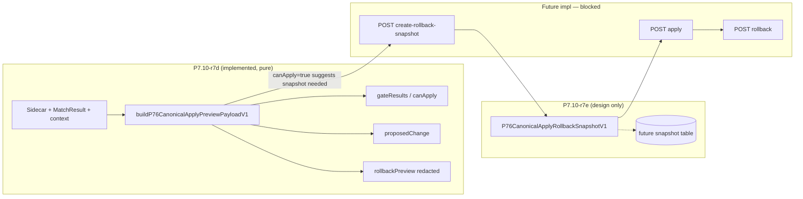

# P7.10-r7e — Canonical Apply Rollback Snapshot Design

> **状态**：P7.10-r7e canonical apply rollback snapshot design  
> **结论**：**`P7_10_R7E_CANONICAL_APPLY_ROLLBACK_SNAPSHOT_DESIGN_ONLY`**  
> **前置**：[P7.10-r7d](./P7.10-r7d-admin-apply-preview-payload-builder-closeout.md) · [P7.10-r7c](./P7.10-r7c-admin-apply-canonical-promotion-api-design.md) · [P7.10-r7b](./P7.10-r7b-admin-apply-canonical-write-design.md)  
> **性质**：docs only · **不实现** rollback · **不写** DB · **不改** `MatchResult` · **不接** controller · **不启** Apply

---

## 1. 一句话结论

**P7.10-r7e** 仅设计 canonical apply 之前必须生成的 **rollback snapshot**。未来任何 `MatchResult` / `finalScore` / `reasonSummary` / `matchInsights` promotion 前，都必须先保存可审计、可回滚、**不可泄露 secret** 的 snapshot。本轮只设计，**不实现**、**不写 DB**、**不执行** rollback。

```text
P7_10_R7E_CANONICAL_APPLY_ROLLBACK_SNAPSHOT_DESIGN_ONLY
```

---

## 2. 前置状态

| Item | Status |
|------|--------|
| [P7.10-r7d](./P7.10-r7d-admin-apply-preview-payload-builder-closeout.md) apply preview builder | **PASS** — `buildP76CanonicalApplyPreviewPayloadV1`, 22 gates, 27/27 tests, `tsc --noEmit` PASS |
| Preview `canApply=true` | **仍不写数据** — no-write invariant |
| [P7.10-r7c](./P7.10-r7c-admin-apply-canonical-promotion-api-design.md) Apply / promotion API | **DESIGN ONLY** — routes not implemented |
| Admin Apply / promotion / `MatchResult` write / rollback exec | **BLOCKED** |
| [P7.6-r9e3g](./P7.6-r9e3g-staging-ops-evidence-rollup-and-gate12-review.md) Gate 12 | `STAGING_GET_MATRIX_READY_MONITORING_PENDING` — **not complete** |
| [P7.6-r9e3f2](./P7.6-r9e3f2-grafana-physical-import-and-test-alert-evidence-closeout.md) Grafana | `P7_6_R9E3F2_BLOCKED_BY_MISSING_GRAFANA_ACCESS` — **pending** |
| percent · production rollout · legacy removal | **BLOCKED** |

---

## 3. Rollback snapshot 目标

Snapshot 必须在不暴露 token / secret / 原始 profile 的前提下回答：

| # | Question | Snapshot field / audit |
|---|----------|------------------------|
| 1 | Apply 前 `MatchResult` 原始状态是什么？ | `before.*` + `baselineFingerprint` |
| 2 | Apply 前 `finalScore` 是多少？ | `before.finalScore` |
| 3 | Apply 前 `candidateUserId` 是谁？ | `before.candidateUserId` |
| 4 | Apply 前 `reasonSummary` / `matchInsights` 是什么？ | `before.reasonSummary`, `before.matchInsightsSummary` (sanitized) |
| 5 | Apply 来源 sidecar 是哪一行？ | `sidecarId`, `sourceVersion`, `auditRunId` |
| 6 | Apply 后如何恢复？ | `before` → restoration target; `rollback.scope` |
| 7 | 谁批准了 apply？ | `approvals.*` + future audit log actor |
| 8 | rollback token 如何生成 / 使用 / 过期？ | §6 — hash in DB, plaintext never persisted |
| 9 | 如何避免 token / secret / raw profile 进入 artifact？ | §6 redaction + §10 no-write |

**Hard rule:** Apply **must not** proceed without a persisted snapshot row (future implementation gate). r7e defines the contract only.

---

## 4. Snapshot payload contract

Normative type: **`P76CanonicalApplyRollbackSnapshotV1`**.

```ts
type P76CanonicalApplyRollbackSnapshotV1 = {
  schemaVersion: 1;
  sourceType: "p76_canonical_apply_rollback_snapshot";
  sourceVersion: "p7.10-r7e-rollback-snapshot-v1";
  mode: "design" | "dry_run" | "snapshot";

  snapshotId: string;           // cuid — primary key in future table
  viewerUserId: string;
  matchResultId: string;
  sidecarId: string;

  before: {
    candidateUserId: string | null;
    finalScore: number | null;
    reasonSummary: string | null;
    matchInsightsSummary: P76MatchInsightsSummaryV1 | null;
    updatedAt: string;          // ISO-8601 from live MatchResult
    baselineFingerprint: string; // SHA-256 of canonical before slice (see §4.1)
  };

  proposedAfter: {
    candidateUserId: string;      // from sidecar selectedCandidateId
    finalScore: number | null;    // policy: v1 candidate-only → null or unchanged
    reasonSummary: string | null;
    sourceVersion: string;
  };

  rollback: {
    rollbackTokenRequired: true;
    rollbackTokenPreview: "redacted"; // never last-4 in API JSON — UI may mask separately
    rollbackExpiresAt: string;        // ISO-8601
    rollbackScope: "match_result_baseline_v1";
    rollbackTokenHash: string | null; // present only in DB row / server memory at mint — NOT in client export
  };

  approvals: {
    pmSignoffStatus: string;
    opsSignoffStatus: string;
    engineeringSignoffStatus: string; // optional eng ack for staging smoke
  };

  safety: {
    writesDb: false;              // true in r7e milestone only
    writesMatchResult: false;
    writesFinalScore: false;
    changesPercent: false;
    triggersWorker: false;
    productionRollout: false;
  };

  capturedAt: string;
  capturedBy: string | null;      // admin operator id — not email in exports
};
```

### 4.1 `matchInsightsSummary` (sanitized)

Do **not** copy full `matchInsights` JSON into snapshot or artifacts.

```ts
type P76MatchInsightsSummaryV1 = {
  schemaVersion: number | null;
  hasPayload: boolean;
  keyCount: number;
  checksum: string;               // hash of normalized JSON — for drift detect
  forbiddenKeysStripped: string[];
};
```

Align with [P7.7-r4.1](./P7.7-r4.1-canonical-sidecar-admin-readonly-api-implementation-closeout.md) sanitization — strip `email`, `phone`, `token`, `password`, raw photo URLs, etc.

### 4.2 `baselineFingerprint` / `previousSnapshotHash`

- **Input slice:** `{ matchResultId, viewerUserId, candidateUserId, finalScore, reasonSummary, matchInsightsSummary.checksum, updatedAt }`.
- **Algorithm:** `SHA-256(JSON.stringify(canonicalSlice))` → hex string.
- **Sidecar link:** On successful Apply (future), copy fingerprint to `p76_canonical_match_result_meta.previousSnapshotHash` ([schema](../../packages/database/prisma/schema.prisma)).
- **Stale detect:** Apply re-validates live `MatchResult` fingerprint === snapshot `before.baselineFingerprint` ([r7c §9 #12](./P7.10-r7c-admin-apply-canonical-promotion-api-design.md)).

### 4.3 Mode semantics

| `mode` | Meaning |
|--------|---------|
| `design` | r7e doc / design-time examples only |
| `dry_run` | Future builder computes snapshot without DB insert |
| `snapshot` | Future persisted row after `POST create-rollback-snapshot` |

---

## 5. Storage options

| Option | Description | Pros | Cons |
|--------|-------------|------|------|
| **A** | JSON blob on `p76_canonical_match_result_meta` (`rollbackSnapshot` column) | No new table | Mixes writer meta with rollback evidence; hard multi-rollback audit |
| **B** | New table `p76_canonical_apply_rollback_snapshot` | Clear audit, independent RBAC, multiple snapshots per sidecar attempt | Requires migration (future) |
| **C** | Artifact file only | Fast for smoke | **Not** authoritative for prod rollback |

### Recommendation

**Option B** as the **future implementation** target. r7e **does not** create migration or Prisma model.

Proposed future table (design sketch — **not applied**):

| Column | Type | Notes |
|--------|------|-------|
| `id` | cuid PK | `snapshotId` |
| `sidecarId` | FK → meta | Required |
| `matchResultId` | string | Indexed |
| `viewerUserId` | string | Indexed |
| `payload` | JSONB | Full `P76CanonicalApplyRollbackSnapshotV1` minus secrets |
| `rollbackTokenHash` | string unique | bcrypt or HMAC-SHA256 with server pepper |
| `rollbackExpiresAt` | timestamptz | |
| `rolledBack` | boolean default false | |
| `rolledBackAt` | timestamptz nullable | |
| `createdBy` | string | admin id |
| `createdAt` | timestamptz | |

Sidecar row keeps **pointers only:** `rollbackToken` (hash), `previousSnapshotHash`, `promotionTargetMatchResultId` — plaintext token **never** on sidecar column (replace current nullable `rollbackToken` string with hash at implementation time).

---

## 6. Rollback token 设计

| Rule | Detail |
|------|--------|
| Generation | `crypto.randomBytes(32)` → base64url; mint server-side at snapshot create |
| Storage | **Hash only** in DB (`rollbackTokenHash`); pepper from `PEIMA_P76_ROLLBACK_TOKEN_PEPPER` |
| Plaintext lifetime | Returned **once** in `POST create-rollback-snapshot` response body to authorized operator; never logged |
| Preview / list APIs | `rollbackTokenPreview: "redacted"` only ([r7d](./P7.10-r7d-admin-apply-preview-payload-builder-closeout.md) already uses this) |
| Expiry | Default **72h** staging, **24h** production-like; `rollbackExpiresAt` on snapshot row |
| Binding | Token valid only for `(snapshotId, matchResultId, sidecarId)` triple |
| Single use | First successful rollback sets `rolledBack=true`; replay → idempotent no-op ([r7c §10](./P7.10-r7c-admin-apply-canonical-promotion-api-design.md)) |
| Apply coupling | `POST apply` body must include `rollbackToken` matching snapshot issued for that preview session |
| Forbidden surfaces | logs · docs · artifacts · Grafana annotations · client export JSON · Sentry breadcrumbs |

**UI (future):** May show last 4 chars in Ops ticket UI only — not in downloadable JSON ([r7b §5](./P7.10-r7b-admin-apply-canonical-write-design.md)).

---

## 7. Rollback execution guard

Future `POST /admin/p76/canonical-write/rollback` ([r7c §10](./P7.10-r7c-admin-apply-canonical-promotion-api-design.md)) **must** satisfy **all** before mutating `MatchResult`:

| # | Guard | Failure code |
|---|-------|--------------|
| 1 | Snapshot row exists | `snapshot_not_found` |
| 2 | `rollbackToken` verifies against hash | `rollback_token_invalid` |
| 3 | `now < rollbackExpiresAt` | `rollback_token_expired` |
| 4 | `rolledBack === false` | `already_rolled_back` |
| 5 | Live `MatchResult` matches **post-apply** state (candidate = sidecar proposal) | `match_result_not_in_applied_state` |
| 6 | `before.baselineFingerprint` still matches pre-apply audit **or** current state proves single promotion | `baseline_ambiguous` |
| 7 | `sidecarId` / `sourceVersion` match snapshot | `sidecar_mismatch` |
| 8 | Sidecar `promotionStatus === "promoted"` | `not_promoted` |
| 9 | No active worker deploy (`workerDeployActive !== true`) | `worker_deploy_active` |
| 10 | `percent === 0` **or** explicit rollback-approved cohort flag | `percent_rollout_active` |
| 11 | PM + Ops signoff `approved` (tier-dependent) | `signoff_missing` |
| 12 | Incident owner acknowledged (if `incidentActive`) | `incident_active` |
| 13 | `PEIMA_P76_CANONICAL_WRITE_KILL_SWITCH` off | `kill_switch_on` |
| 14 | Operator has `ROLLBACK_P76_CANONICAL_WRITE` | `forbidden` |

**Restore scope (v1):** `candidateUserId`, `finalScore`, `reasonSummary`, `matchInsights` from `before` — **no** worker trigger · **no** GET path flag change · **no** percent change.

**Sidecar after rollback:** `rolledBack=true`; keep `promotionStatus=promoted` for audit ([r7c §10](./P7.10-r7c-admin-apply-canonical-promotion-api-design.md)).

---

## 8. Interaction with r7d preview



| Concern | r7d preview | r7e snapshot |
|---------|-------------|--------------|
| `proposedChange` / diff | **Yes** | No — uses `proposedAfter` frozen at capture |
| `gateResults` / `canApply` | **Yes** | No — snapshot assumes gates passed at mint time |
| `rollbackPreview` | **Yes** — `redacted` only | Defines full `before` + restoration target |
| `before` state persistence | **No** | **Yes** (future) |
| Token mint / hash | **No** | **Yes** (future) |
| DB write | **Never** | **Never in r7e** |

**Invariant:** r7d **does not** write snapshot. r7e **does not** execute Apply. Future flow: `apply-preview` (r7f) → operator confirms → `create-rollback-snapshot` (r7g) → `apply` (r8, gated).

---

## 9. Admin UI / API future

| Method | Route | Purpose | r7e |
|--------|-------|---------|-----|
| `GET` | `/admin/p76/canonical-sidecar/:id/apply-preview` | r7d payload via HTTP | Design in [r7c §7](./P7.10-r7c-admin-apply-canonical-promotion-api-design.md); impl **r7f** |
| `POST` | `/admin/p76/canonical-sidecar/:id/create-rollback-snapshot` | Mint snapshot + token hash | Design here; impl **r7g** |
| `POST` | `/admin/p76/canonical-sidecar/:id/apply` | Promotion | [r7c §8](./P7.10-r7c-admin-apply-canonical-promotion-api-design.md); impl **r8** |
| `POST` | `/admin/p76/canonical-write/rollback` | Restore baseline | [r7c §10](./P7.10-r7c-admin-apply-canonical-promotion-api-design.md); impl **r8** |

r7e defines contracts only — **no** Nest routes, **no** UI Apply button ([P7.7-r4.3](./P7.7-r4.3-canonical-sidecar-admin-ui-implementation-closeout.md) remains read-only).

---

## 10. No-write boundary

| Class | r7e executed? |
|-------|----------------|
| Design doc | **yes** |
| DB write / migration | **no** |
| `MatchResult` / `finalScore` / `matchInsights` mutation | **no** |
| Sidecar row mutation | **no** |
| Rollback execution | **no** |
| Worker / GET `/matching/result` | **no** |
| percent / production rollout | **no** |
| PreviewPool disable / legacy removal | **no** |
| Admin Apply enable | **no** |

`safety.*` in payload examples for r7e use **`false`** for all write flags.

---

## 11. Testing strategy for future implementation

When **r7g** (snapshot builder) and **r8** (apply/rollback) ship, require:

| # | Test |
|---|------|
| 1 | Snapshot redacts token in all API responses except one-time mint |
| 2 | Snapshot captures `before` state matching live `MatchResult` |
| 3 | Rejects missing `MatchResult` |
| 4 | Rejects `viewerUserId` mismatch |
| 5 | Rejects already-promoted sidecar |
| 6 | Rollback requires valid token |
| 7 | Rollback cannot run twice (second call no-op) |
| 8 | Rollback restores `candidateUserId` / `finalScore` / `reasonSummary` / `matchInsights` |
| 9 | Rollback does **not** trigger worker |
| 10 | Audit trail: snapshot row + sidecar `rolledBack` + audit log event |

Pattern: mirror [p710-r7d-canonical-apply-preview-builder.spec.ts](../../apps/api/test/p710-r7d-canonical-apply-preview-builder.spec.ts) as pure builder tests before DB integration.

---

## 12. PASS / BLOCK

### PASS (r7e)

- Rollback snapshot contract `P76CanonicalApplyRollbackSnapshotV1` defined  
- Storage **Option B** selected (future table; no migration in r7e)  
- Token hash + redaction policy defined  
- Execution guards enumerated  
- r7d / r7c / r7b interaction documented  
- **No** implementation · **no** write  

### BLOCK (must not claim)

- Rollback **implemented** or executed  
- Apply without snapshot story  
- Plaintext token in DB / logs / artifacts  
- Artifact leaks token, viewer PII, or DB URLs  
- Apply proceeds without snapshot (future code must enforce)  
- Rollback changes worker / percent / production rollout  
- Grafana / Gate 12 **complete**  
- Deletes legacy / enables PreviewPool disable  

---

## 13. Canonical Apply roadmap (r7d–r8)

| Id | Milestone | Writes MatchResult? | Status |
|----|-----------|---------------------|--------|
| **r7d** | [Apply preview builder](./P7.10-r7d-admin-apply-preview-payload-builder-closeout.md) — pure | **no** | **DONE** |
| **r7e** | Rollback snapshot design (this doc) | **no** | **DONE** (design only) |
| **r7f** | [Apply preview API](./P7.10-r7f-canonical-apply-preview-readonly-api-closeout.md) | **no** | **DONE** / **READ-ONLY API PASS** |
| **r7g** | [Snapshot dry-run builder](./P7.10-r7g-canonical-apply-rollback-snapshot-builder-closeout.md) | **no** | **DONE** / **DRY-RUN BUILDER PASS** |
| **r7h** | [Admin apply review UI design](./P7.10-r7h-admin-apply-review-ui-design.md) | **no** | **DONE** / **DESIGN PASS** |
| **r7i** | Admin apply review UI implementation (read-only) | **no** | **NEXT** / **READ-ONLY UI IMPLEMENTATION** |
| **r8** | Apply + rollback + snapshot table migration | **yes** (first write) | **BLOCKED** / **APPLY + ROLLBACK IMPLEMENTATION** |

```text
r7d [DONE] → r7e [DONE] → r7f [READ-ONLY API PASS] → r7g [DRY-RUN BUILDER PASS]
  → r7h [DESIGN PASS] → r7i [NEXT] → r8 [BLOCKED] → staging → r9e3h
```

**r7e/r7f/r7g/r7h do not:** execute Apply · execute rollback · mint tokens in DB · promote `MatchResult`.

## 14. 下一步

| Priority | Milestone |
|----------|-----------|
| **NEXT** | **P7.10-r7i** — read-only Admin apply review UI ([r7h](./P7.10-r7h-admin-apply-review-ui-design.md)) |
| **BLOCKED** | **P7.10-r8** — Apply + rollback |
| **Ops** | [r9e3f2](./P7.6-r9e3f2-grafana-physical-import-and-test-alert-evidence-closeout.md) → [r9e3h](./P7.6-r9e3g-staging-ops-evidence-rollup-and-gate12-review.md) |

---

## Related

- [P7.10-r7d](./P7.10-r7d-admin-apply-preview-payload-builder-closeout.md)  
- [P7.10-r7c](./P7.10-r7c-admin-apply-canonical-promotion-api-design.md)  
- [P7.10-r7b](./P7.10-r7b-admin-apply-canonical-write-design.md)  
- [P7.10-r7](./P7.10-r7-canonical-write-readiness-design.md)  
- [P7.6-r9e3g](./P7.6-r9e3g-staging-ops-evidence-rollup-and-gate12-review.md)
