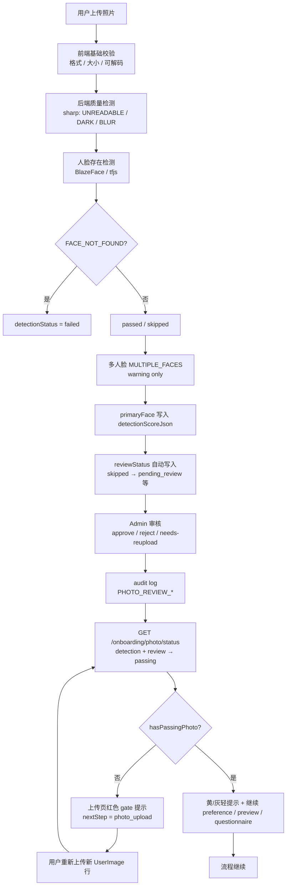

# P7.4-r1 — 照片治理 Final Closeout

> **状态**：P7.4-r1 闭环完成，可作为 **P7.5 视觉风格标签 / 审美排序增强** 之前的稳定基线。  
> **本轮**：仅总收口文档，无代码 / migration / API / 前端 / worker / matching 变更。

---

## 1. 一句话结论

**P7.4-r1 已完成从机器检测到人工审核、再到 onboarding 门禁提示的完整照片治理闭环**：用户上传经前端基础校验与后端质量 / 人脸检测后写入 `detectionStatus` 与 `primaryFace` 等快照；运营通过 Admin 审核 API 与页面维护 `reviewStatus` 并留 audit；`GET /onboarding/photo/status` 将 detection + review 合并为 passing 规则；上传页以中文 banner 引导用户重新上传或继续流程——**不改动匹配打分、PreviewPool 生成或 worker 管线**。

---

## 2. 完整链路图



**文字版（与上图一致）**

1. 用户上传照片  
2. → 前端基础校验（格式、大小、可解码）  
3. → 后端质量检测（sharp：UNREADABLE_IMAGE / TOO_DARK / TOO_BLUR）  
4. → 人脸存在检测（BlazeFace / tfjs 本地）  
5. → 多人脸 **MULTIPLE_FACES**（warning only，不 hard fail）  
6. → **primaryFace** 写入 `detectionScoreJson`  
7. → **reviewStatus** 自动写入（与 `detectionStatus` 分离；如 skipped → pending_review）  
8. → **Admin 审核**（approve / reject / needs-reupload）  
9. → **audit log**（`PHOTO_REVIEW_*`）  
10. → **reviewStatus 接入 onboarding status**（`hasPassingPhoto` / `nextStep` / gate 字段）  
11. → **前端 upload 页提示**（红 / 黄 / 灰 banner）  
12. → 用户 **重新上传** 或 **继续** preference / preview / questionnaire  

---

## 3. 已完成阶段汇总

| 阶段 | 交付概要 | 参考文档 |
|------|----------|----------|
| **P7.4-r1a** | `UserImage.detectionStatus`；质量检测 UNREADABLE_IMAGE / TOO_DARK / TOO_BLUR；sharp 图像质量检测 | `P7.4-r1-photo-detection-design.md` |
| **P7.4-r1b** | BlazeFace / tfjs 本地人脸存在检测；FACE_NOT_FOUND hard fail；MULTIPLE_FACES warning only；冷启动 timeout 修复 | `P7.4-r1b-face-presence-detection-closeout.md` |
| **P7.4-r1c** | 多人脸 warning 策略；primaryFace；areaRatio / centerDistance / primaryScore；`detectionRulesVersion` **p7.4-r1c-v1** | `P7.4-r1c-b-primary-face-score-json-closeout.md` |
| **P7.4-r1d-b** | `reviewStatus` / `reviewReasonCodes` / `reviewedAt` / `reviewedByUserId` / `reviewNote`；detection 与 review **分离**；skipped → pending_review | `P7.4-r1d-photo-review-design.md` |
| **P7.4-r1d-c2** | Admin Photo Review **只读** API（列表 + 详情） | `P7.4-r1d-c2-admin-photo-review-readonly-api-closeout.md` |
| **P7.4-r1d-c3** | **approve** / **reject** / **needs-reupload** 写 API；乐观锁 | `P7.4-r1d-c3-admin-photo-review-actions-api-closeout.md` |
| **P7.4-r1d-c4** | 审核动作 **audit log**（复用 `AuditLog`） | `P7.4-r1d-c4-admin-photo-review-audit-log-closeout.md` |
| **P7.4-r1d-d** | `/admin/photo-review` 运营页面 | `P7.4-r1d-d-admin-photo-review-page-closeout.md` |
| **P7.4-r1d-e** | 设计：detection + review → onboarding gate | `P7.4-r1d-e-review-status-onboarding-gate-design.md` |
| **P7.4-r1d-e2** | 后端 `hasPassingPhoto` / gate 字段 / `nextStep` 数据源 | `P7.4-r1d-e2-review-status-onboarding-backend-closeout.md` |
| **P7.4-r1d-e3** | 上传页中文提示；upload 后重拉 status | `P7.4-r1d-e3-review-status-onboarding-frontend-closeout.md` |
| **P7.4-r1d-e4** | QA checklist；62 单测；staging UI 待签收 | `P7.4-r1d-e4-review-status-onboarding-gate-qa-closeout.md` |

**核心代码锚点**

| 领域 | 路径 |
|------|------|
| 机器检测 / primaryFace | `apps/api/src/modules/images/`（检测 worker 消费侧） |
| review 自动写入 | `user-image-review-status` 等（r1d-b） |
| Admin 审核 | `apps/api/src/modules/admin-photo-review/` |
| Onboarding gate | `apps/api/src/modules/onboarding/onboarding-photo-passing.ts` |
| 用户上传 UI | `apps/web/src/pages/OnboardingPhotoUploadPage.jsx` |
| Gate 文案 | `apps/web/src/utils/onboardingPhotoGateMessages.js` |

---

## 4. 当前核心规则

### 4.1 detectionStatus（机器）

| 值 | 含义 |
|----|------|
| `passed` | 质量 + 人脸检测通过 |
| `failed` | hard fail（如 FACE_NOT_FOUND、质量不达标等） |
| `skipped` | 检测跳过或超时等（可进入人工 pending） |
| `pending` | 检测进行中（遗留/边界） |

### 4.2 reviewStatus（人工 / 运营）

| 值 | 含义 |
|----|------|
| `not_required` | 无需人工（或机器已足够） |
| `pending_review` | 待审（如 skipped 自动进入） |
| `approved` | 人工通过 |
| `rejected` | 人工拒绝 |
| `needs_reupload` | 要求换图 |
| `appealed` / `appeal_approved` / `appeal_rejected` | 申诉相关（字段预留，无用户申诉 UI） |

### 4.3 Onboarding passing（用户维度）

**单张** `isUserImagePassingForOnboarding`：

| 条件 | passing |
|------|---------|
| **approved** / **appeal_approved** | **true**（覆盖机器结论） |
| **rejected** / **needs_reupload** / **appealed** / **appeal_rejected** | **false** |
| **pending_review** + detection **passed/skipped** | **true**（MVP 不阻断） |
| **pending_review** + detection **failed/pending** | **false** |
| **not_required** + detection **passed/skipped** | **true** |
| **not_required** + detection **failed/pending** | **false** |

**用户**：只要有 **≥1 张 passing photo** → `hasPassingPhoto = true`，按审美 / preview 进度继续；否则 `nextStep = photo_upload` 并返回 `photoGateMessageKey` 等。

---

## 5. Admin 审核能力

| 能力 | 说明 |
|------|------|
| `GET /admin/photo-review/items` | 列表（筛选 reviewStatus / detection 等） |
| `GET /admin/photo-review/items/:imageId` | 详情（含 `reviewNote`） |
| `POST .../approve` | 通过 |
| `POST .../reject` | 拒绝（reasonCodes 必填） |
| `POST .../needs-reupload` | 要求重传（reasonCodes 必填） |

**Audit actions**

- `PHOTO_REVIEW_APPROVE`
- `PHOTO_REVIEW_REJECT`
- `PHOTO_REVIEW_NEEDS_REUPLOAD`

**权限**

- `Permission.MANAGE_PHOTO_REVIEW`（`manage_photo_review`）
- 角色：**ADMIN**、**OPERATOR**（见 `packages/shared/constants/p5-rbac.ts`）

**前端**：`/admin/photo-review` — `AdminPhotoReviewPage.jsx`

---

## 6. 用户侧体验

| 状态 / 场景 | 表现 |
|-------------|------|
| **rejected**（且无 passing） | 上传页 **红色** 阻断：「这张照片暂时无法用于匹配…」 |
| **needs_reupload**（且无 passing） | 上传页 **红色** 阻断：「请重新上传一张清晰的本人照片…」 |
| **pending_review**（有 passing） | **黄色** 非阻断：「照片正在审核中，你可以先继续完成资料。」 |
| **partial blocked**（有 passing + 另有 blocked 图） | **灰色** 轻提示：「部分照片未通过审核，但你已有可用照片…」 |
| **reviewNote** | **不展示**给普通用户（仅 Admin 详情） |
| **questionnaire / preference / preview** | 仍按 `getOnboardingPhotoStatus().nextStep` **guard redirect** |
| **登录** | `LoginPage` 按 `nextStep` 分流至 upload / preference / preview / questionnaire |

上传成功后：重新 `GET /onboarding/photo/status`；无 passing 则留页，有 passing 则按 `nextStep` 跳转。

---

## 7. 数据库与字段

**模型**：`UserImage`（`packages/database/prisma/schema.prisma`）

| 字段 | 层 | 说明 |
|------|-----|------|
| `detectionStatus` | 机器 | pending / passed / failed / skipped |
| `detectionReasonCodes` | 机器 | 如 FACE_NOT_FOUND、UNREADABLE_IMAGE 等 |
| `detectionScoreJson` | 机器 | 含 warnings、primaryFace、多人脸分数等 |
| `detectionRulesVersion` | 机器 | 如 `p7.4-r1c-v1` |
| `detectedAt` | 机器 | 检测完成时间 |
| `reviewStatus` | 人工 | not_required / pending_review / approved / … |
| `reviewReasonCodes` | 人工 | 运营 reason 白名单 |
| `reviewedAt` | 人工 | 审核时间 |
| `reviewedByUserId` | 人工 | 审核人 |
| `reviewNote` | 人工 | **仅 Admin**；不经 `UserImagePublicDto` 暴露 |

**原则**

- **detectionStatus** = 机器检测结论；**reviewStatus** = 人工审核结论；**二者不混写**（Admin approve 不改 detection）。
- 用户 API：`toUserImagePublicDto` 剔除 `reviewNote`；`GET /onboarding/photo/status` 不含 `reviewNote`。

---

## 8. 测试结果总览

**最近验证（P7.4-r1d-e4，2026-05-15）**

```bash
pnpm --filter @peima/api test -- "onboarding|user-image-review|admin-photo-review"
# 8 suites, 62 tests passed

pnpm --filter @peima/api run build    # ✓
pnpm --filter @peima/web run build    # ✓
pnpm --filter @peima/worker run build # ✓
```

| 范围 | 说明 |
|------|------|
| 单测 | onboarding gate、admin-photo-review read/write/audit、user-image-review-status 等 |
| 构建 | api / web / worker 均通过 |
| Staging | **浏览器 UI 手测** 仍标为 **待运营签收**（见 `P7.4-r1d-e4-…-qa-closeout.md` §5） |

---

## 9. 明确未改动范围

- 未改 **worker** 匹配 / 仿真消费逻辑（照片检测在 API 上传链路，非 worker 重构）
- 未改 **finalScore**
- 未改 **MatchResult**
- 未改旧 **PreviewPool**
- 未改 **OnboardingPhotoPreviewPool 3+2+1** 生成规则
- 未做 **AI 美化**
- 未做 **AI 头像**
- 未做 **人脸比对**（1:1 身份）
- 未做 **身份认证**
- 未接 **云端视觉 API / GLM-4.5V**
- 未实现 **双向匹配**

---

## 10. 当前限制

| 限制 | 说明 |
|------|------|
| MULTIPLE_FACES | 仍为 **warning only**，不 hard fail，不进入 review gate |
| pending_review | **暂时不阻断** onboarding（有 passed/skipped 即可 passing） |
| Admin 页面 | 已可操作；**staging UI** 需运营按 e4 签收 |
| 申诉 | 无用户 **appeal** 页面；`appealed*` 状态仅数据层预留 |
| reset API | 无「重置审核」专用 API |
| PhotoReviewTask | **无**独立任务表；列表直接查 `UserImage` |
| P7.5 能力 | **无**视觉风格标签增强、审美排序 shadow（下一阶段） |

---

## 11. 下一步建议

**二选一（规划 only，不在 P7.4-r1 实现）：**

### A. P7.5 — 视觉风格标签 / 审美排序增强（设计优先）

- 输入：`primaryFace`、`detectionScoreJson`、用户 `styleTags`、审美偏好
- **不做**：AI 美化、AI 头像、改 finalScore、改 MatchResult
- **建议**：先做 **readonly / shadow**，再考虑接入排序

### B. P7.4-r1 staging signoff — **已完成**

- 见 `P7.4-r1-staging-signoff-closeout.md`（2026-05-15 本地 API + 浏览器签收）
- 生产/预发可选：OPERATOR 账号补点 Admin 弹窗一次

---

## 12. 输出摘要

| 项 | 内容 |
|----|------|
| 新增文件 | `docs/P7/P7.4-r1-photo-governance-final-closeout.md`（本文件） |
| 代码 / API / DB / 前端 / worker / matching | **无变更** |
| 基线意义 | P7.4-r1 照片治理闭环已文档化，可作为 P7.5 前稳定参考 |
