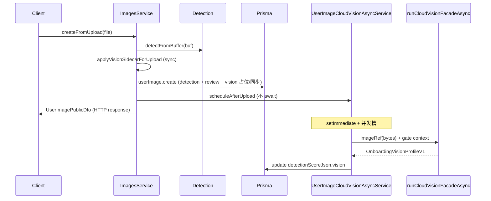

# P7.5-r7-c2 — Cloud Vision Async Upload Sidecar Closeout

> **状态**：**完成**（上传不阻塞 · async `runCloudVisionFacadeAsync` · **默认仍不发**真实 HTTP）  
> **前置**：[P7.5-r7-c1 zhipu adapter](./P7.5-r7-c1-cloud-vision-zhipu-adapter-closeout.md) · [P7.5-r7-c0 HTTP gate](./P7.5-r7-c0-cloud-vision-http-gate-closeout.md) · [P7.5-r7-a design](./P7.5-r7-a-cloud-vision-provider-design.md)

---

## 1. 一句话结论

**P7.5-r7-c2** 在 `createFromUpload` 成功保存 `UserImage`（同步 detection + review）后，经 **`setImmediate`** 调度 **async cloud vision job**：用上传 buffer 构造 **`imageRef`**，调用 **`runCloudVisionFacadeAsync`**，完成后 **Prisma 更新** `detectionScoreJson.vision`；**live zhipu** 上传期先写 **rules 占位**，HTTP 仅在 async 路径；**review 不因 vision 变化**；**默认配置不发真实 HTTP**。

---

## 2. 修改文件列表

### 新增

| 文件 | 说明 |
|------|------|
| `apps/api/src/modules/onboarding/vision/onboarding-vision-upload-persist.ts` | 上传期 persist / defer live cloud / `applyVisionSidecarForUpload` |
| `apps/api/src/modules/onboarding/vision/user-image-cloud-vision-async-job.ts` | 纯函数 async job（facade + merge，可单测） |
| `apps/api/src/modules/images/user-image-cloud-vision-async.service.ts` | Nest 调度、`setImmediate`、并发槽、Prisma update |
| `apps/api/test/onboarding-vision-upload-async.spec.ts` | upload persist + async job 单测 |
| `docs/P7/P7.5-r7-c2-cloud-vision-async-sidecar-closeout.md` | 本文档 |

### 修改

| 文件 | 说明 |
|------|------|
| `apps/api/src/modules/images/images.service.ts` | `createFromUpload`：`forUpload` sidecar + `scheduleAfterUpload` |
| `apps/api/src/modules/images/images.module.ts` | 注册 `UserImageCloudVisionAsyncService` |
| `apps/api/src/modules/images/user-image-vision-sidecar.service.ts` | `applyToDetectionScoreJsonForUpload` |
| `apps/api/test/onboarding-vision-sidecar.spec.ts` | ImagesService 测试补 async provider |
| `apps/api/test/user-image-review-status.spec.ts` | mock `UserImageCloudVisionAsyncService` |

**未改**：`cloud-vision.facade.ts` / adapter registry / zhipu adapter（c1 已有 `runCloudVisionFacadeAsync`）。

---

## 3. 上传异步流程



**步骤说明**

1. 写入磁盘、跑 P7.4 **quality/face detection**（同步，与 r7 前一致）。
2. **`applyVisionSidecarForUpload`**：按 provider / gate 决定上传期 `vision`（见 §4）。
3. **`prisma.userImage.create`**：持久化 `detectionStatus`、`reviewStatus`、`detectionScoreJson`（含 vision 若启用）。
4. **`cloudVisionAsync.scheduleAfterUpload`**：仅 gate 为 **`real-zhipu`** 时入队；**不阻塞**步骤 5 的 API 响应。
5. **`setImmediate`** → 并发限制 → **`runUserImageCloudVisionAsyncJob`** → **`userImage.update`** 仅更新 `detectionScoreJson`（merge `vision` 块）。

---

## 4. 不同 provider 行为表

| `PEIMA_ONBOARDING_VISION_PROVIDER` | Vision 启用 | 上传期 `vision` | Async job | HTTP |
|----------------------------------|-------------|-----------------|-----------|------|
| （默认 / 未设）`rules` | `ENABLED=false` | 无 | 不调度 | 无 |
| `rules` | `ENABLED=true` | rules 同步 | 不调度 | 无 |
| `stub` | `ENABLED=true` | stub 同步 | 不调度 | 无 |
| `cloud` / `zhipu` + **dry-run / mock gate** | `ENABLED=true` | mock cloud **同步**（与 c1 相同） | **不调度** | 无（mock） |
| `cloud` / `zhipu` + **live zhipu gate** | `ENABLED=true` + `CLOUD_ASYNC=true` | **rules 占位**（`ONBOARDING_VISION_SOURCE_RULES_R2`） | **调度** | 仅 async 路径（mocked in tests） |
| `cloud` / `zhipu` + live gate + **`CLOUD_ASYNC=false`** | `ENABLED=true` | 同步 facade：`cloud_live_requires_async` + rules（c1 行为） | 不调度 | sync 仍不发 HTTP |

**`rules` / `stub`**：仍走 `applyVisionSidecarToDetectionScoreJson` / `buildOnboardingVisionProfileForPersist`，**与 r7-c2 前一致**。

---

## 5. Async sidecar 触发条件

`shouldScheduleCloudVisionAsyncJob(env, { imageId, userId })` 为 **true** 当且仅当：

1. `PEIMA_ONBOARDING_VISION_ENABLED=true`
2. `PEIMA_ONBOARDING_VISION_CLOUD_ASYNC=true`（**默认 true**）
3. `PROVIDER ∈ { cloud, zhipu }`
4. `resolveCloudVisionAdapter(env, context).adapter === "real-zhipu"`（与 [c1 §4 live 条件](./P7.5-r7-c1-cloud-vision-zhipu-adapter-closeout.md#4-live-调用条件real-zhipu) 相同：dry-run off、HTTP enabled、vendor=zhipu、apiKey、allowlist 命中等）

**不调度**：mock gate、`real-disabled`、vision 关闭、`CLOUD_ASYNC=false`、`rules`/`stub` provider。

调度时机：**`userImage.create` 之后**（已有 `userImageId`，allowlist 可按 `imageId` 命中）。

---

## 6. imageRef 设计

| 字段 | r7-c2 取值 |
|------|------------|
| `kind` | **`bytes`**（上传内存 buffer，避免 job 再读盘） |
| `mimeType` | 来自 `MemoryUploadedFile.mimetype` |
| `buffer` | `createFromUpload` 中的 `file.buffer` |

- **不**把 base64 / 原始图写入 `detectionScoreJson.vision`（与 c1 prompt 边界一致）。
- **不**在 DB 新增 blob 列；buffer 仅存在于进程内 async 闭包，job 结束即释放。
- facade / zhipu adapter 仍支持 `signedUrl`（c1），本里程碑上传路径 **仅用 bytes**。
- 若行在 job 运行前被删：`findUnique` 无行则 **静默跳过** update。

---

## 7. Gate 行为

- Async job **复用** `resolveCloudVisionAdapter`（[c0 registry](./P7.5-r7-c0-cloud-vision-http-gate-closeout.md)），**不**新增 bypass。
- **上传期** `shouldDeferLiveCloudVisionOnUpload`：在 `CLOUD_ASYNC` + cloud provider 且 registry 已为 `real-zhipu`（用 `{ userId }` 预判；`imageId` 在 create 前不可用）时，persist **rules 占位**。
- **调度期**（create 后）：用 `{ userId, imageId: userImageId }` 再判；仅 `real-zhipu` 才 `setImmediate`。
- **legacy `provider=zhipu`**：与 `cloud` 相同 gate，**不能**绕过 allowlist / HTTP enabled。

---

## 8. Fallback 行为

| 路径 | 行为 |
|------|------|
| 上传期 live defer | rules profile；`provider=rules`；无 HTTP |
| Async `runCloudVisionFacadeAsync` 成功 | merge cloud profile；`sourceVersion` 如 `p7.5-r7-cloud-zhipu-v1` |
| Async facade 内 fallback（refusal / timeout / parse 等） | 与 c1 相同：`fallbackUsed=true` + rules tags；仍 **merge** 进 `detectionScoreJson.vision` |
| Async job 抛错 | `runUserImageCloudVisionAsyncJob` **catch** → `{ scheduled: false, reason: "async_job_exception" }`；**不** throw 到上传 API |
| Prisma update 失败 | `UserImageCloudVisionAsyncService` **warn** 日志；**不**影响已返回的上传响应 |
| Sync 非 upload 路径 | 仍用 `applyVisionSidecarToDetectionScoreJson`（c1 sync live → `cloud_live_requires_async`） |

**不向** `createFromUpload` 调用方 throw vision 错误。

---

## 9. Review / detectionStatus 不变说明

- **`detectionStatus` / `detectionReasonCodes`**：仅来自 P7.4 `UserImageDetectionService.detectFromBuffer`，vision **不参与**。
- **`reviewStatus` / `reviewReasonCodes`**：`resolveUserImageReviewStateFromDetection` 在 **create 时** 根据 **原始 detection** 计算；async 更新 **只写** `detectionScoreJson`，**不改** review 字段。
- 因此：cloud vision 晚到或失败 **不会** 把已通过审核的图片打回 `pending_review`。
- 单测：`user-image-review-status.spec.ts`、`onboarding-vision-sidecar.spec.ts` 覆盖 create 路径。

---

## 10. 测试命令与结果

### 10.1 聚焦 c2 + sidecar + review

```bash
cd "c:\Users\34713\Desktop\peima\apps\api"
pnpm exec jest test/onboarding-vision-upload-async.spec.ts test/onboarding-vision-sidecar.spec.ts test/user-image-review-status.spec.ts --no-cache
```

**结果**：**3 suites passed**，**28 tests passed**。

### 10.2 全量 onboarding-vision

```bash
cd "c:\Users\34713\Desktop\peima\apps\api"
pnpm exec jest test/onboarding-vision --no-cache
```

**结果**：**17 suites passed**，**134 tests passed**。

覆盖要点：`shouldScheduleCloudVisionAsyncJob`、upload rules defer、async merge、`ImagesService.createFromUpload` mock、gate miss 不调度、live-gate / zhipu / registry 回归（c0/c1）。

---

## 11. 明确默认不发真实 HTTP

| 默认 / 常态 | 值 |
|-------------|-----|
| `PEIMA_ONBOARDING_VISION_ENABLED` | **`false`** |
| `PEIMA_ONBOARDING_VISION_CLOUD_DRY_RUN` | **`true`** |
| `PEIMA_ONBOARDING_VISION_CLOUD_HTTP_ENABLED` | **`false`** |
| `PEIMA_ONBOARDING_VISION_CLOUD_VENDOR` | **`mock`** |
| allowlists | **空** → registry **`mock`** → **不调度** async HTTP |

即使误开 live：单测与本地开发应使用 **jest mock `fetch`**（`onboarding-vision-cloud-live-gate.spec.ts`）；**不依赖外网**。

---

## 12. 明确无 DB migration

- **无** Prisma schema 变更。
- **无** 新表 / 新列；`detectionScoreJson` 仍为既有 JSON 字段。
- Async 结果仅 **UPDATE** 既有 `UserImage.detectionScoreJson`。

---

## 13. 明确未改 worker / MatchResult / finalScore / RRM

| 组件 | 状态 |
|------|------|
| `apps/worker` 队列 / 消费逻辑 | **未改** |
| `MatchResult` 写入 | **未改** |
| `finalScore` 计算 | **未改** |
| RRM | **未改** |
| PreviewPool 实际 APPLY 写入 | **未改** |

Vision async 仅影响 **单张 UserImage** 的 `detectionScoreJson.vision` 快照。

---

## 14. 明确未启 APPLY_TO_POOL / percent

- **`PEIMA_ONBOARDING_VISION_APPLY_*`** / allowlist apply writer：**未启用**本里程碑行为变更。
- **Percent 灰度**（[P7.5-r5-d design](./P7.5-r5-d-percent-rollout-design.md)）：**未实现、未开启**。
- Staging 验证 cloud vision **≠** 开启 APPLY_TO_POOL。

**本里程碑亦不做**：AI 美化 / AI 头像；人脸识别（身份）；颜值评分 / 性别判断（parser 仍 strip 敏感字段）；生产默认 live HTTP 全量；upload 路径 **signedUrl** 读盘（留给 r7-c3 backfill）。

**r7-c2 相关 env**

| 环境变量 | 字段 | 默认 | 作用 |
|----------|------|------|------|
| `PEIMA_ONBOARDING_VISION_CLOUD_ASYNC` | `cloudAsync` | **`true`** | 关闭则回 c1 同步 fallback，不调度 upload async |
| `PEIMA_ONBOARDING_VISION_CLOUD_MAX_CONCURRENCY` | `cloudMaxConcurrency` | **`4`** | 进程内并发槽 |
| c0/c1 已有 gate 变量 | — | 见 c0/c1 closeout | 决定 `real-zhipu` vs mock |

---

## 15. 下一步 — P7.5-r7-c3

- **Cloud backfill CLI**：历史 `UserImage` 补跑 `provider=cloud` / vision sidecar（可 `signedUrl` 或读存储路径）。
- **Coverage audit**：staging 小流量统计 `vision` 写入率、fallback 率、latency；仍 **不** 默认开 APPLY_TO_POOL / percent。
- 复用 `runUserImageCloudVisionAsyncJob` 纯函数层，与 upload async 共用 merge 逻辑。

---

## 参考代码入口

| 职责 | 符号 |
|------|------|
| 上传 persist | `applyVisionSidecarForUpload` · `shouldDeferLiveCloudVisionOnUpload` |
| 是否调度 job | `shouldScheduleCloudVisionAsyncJob` |
| Job 体 | `runUserImageCloudVisionAsyncJob` |
| 调度 + DB | `UserImageCloudVisionAsyncService.scheduleAfterUpload` |
| HTTP（仅 async） | `runCloudVisionFacadeAsync` |
| 上传 API | `ImagesService.createFromUpload` |
